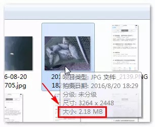
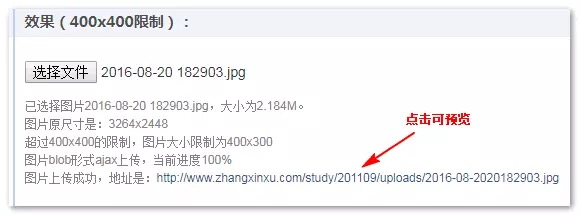
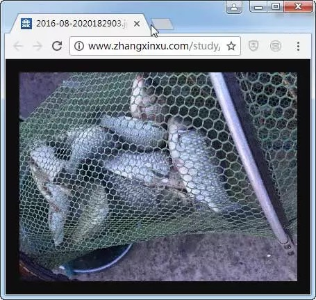
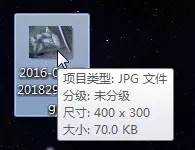

[使用canvas在前端压缩图片并上传demo]: https://link.juejin.im/?target=http%3A%2F%2Fwww.zhangxinxu.com%2Fstudy%2F201707%2Fjs-compress-image-before-upload.html '使用canvas在前端压缩图片并上传demo'

[Canvas API中文文档-drawImage]: https://www.canvasapi.cn/CanvasRenderingContext2D/drawImage 'Canvas API中文文档-drawImage'

[Canvas API中文文档-toDataURL()]: https://www.canvasapi.cn/HTMLCanvasElement/toDataURL 'Canvas API中文文档-toDataURL()'

[Blob文件]: https://www.zhangxinxu.com/wordpress/2013/10/understand-domstring-document-formdata-blob-file-arraybuffer/ 'Blob文件'

[Canvas API中文文档-toBlob()]: https://www.canvasapi.cn/HTMLCanvasElement/toBlob 'Canvas API中文文档-toBlob()'

#### 图片纯前端JS压缩的实现

> 本文删简自：www.zhangxinxu.com/wordpress/?…

1. 功能体验
先看demo：[使用canvas在前端压缩图片并上传demo]

如下截图：


点击文件选择框，我们不妨选一张尺寸比较大的图片，例如下面这种2M多的钓鱼收获照：



于是图片歘歘歘地传上去了：



此时我们点击最终上传完毕的图片地址，会发现原来2M多3000多像素宽的图片被限制为400像素宽了：



图片缩小后在浏览器中的预览效果图

保存到本地会发现图片尺寸已经变成只有70K了：



以上就是图片前端压缩并上传demo的完整演示。

2. 实现原理

- 要想使用JS实现图片的压缩效果，原理其实很简单，核心API就是使用canvas的drawImage()方法。

- Canvas本质上就是一张位图，而drawImage()方法可以把一张大大的图片绘制在小小的Canvas画布上，不久等同于图片尺寸压缩了？

- 对于本案例的压缩，使用的5个参数的API方法：
    ```
    context.drawImage(img, dx, dy, dWidth, dHeight);
    ```
- 各参数具体含义可以参见“[Canvas API中文文档-drawImage]”，这里不展开。

- 举例：
    > 一张图片（假设图片对象是img）的原始尺寸是4000*3000，现在需要把尺寸限制为400*300大小，很简单，原理如下代码示意：
        ```
        var canvas = document.createElement('canvas');
        var context = canvas.getContext('2d');
        canvas.width = 400;
        canvas.height = 300;
        // 核心JS就这个
        context.drawImage(img,0,0,400,300);
        ```
    - 把大图片画在一张小画布上，压缩就这么实现了，是不是简单的有点超乎想象。

1. 如果想要上传或下载？
    - 如果想要上传图片或者下载图片，可以使用canvas.toDataURL()或者canvas.toBlob()方法先进行转换。

    1. canvas.toDataURL()
    语法如下：
    canvas.toDataURL(mimeType, qualityArgument)复制代码
    可以把画布转换成base64格式信息图像信息，纯字符的图片表示法。

    其中：
    mimeType表示canvas导出来的base64图片的类型，默认是png格式，也即是默认值是'image/png'，我们也可以指定为jpg格式'image/jpeg'或者webp等格式。file对象中的file.type就是文件的mimeType类型，在转换时候正好可以直接拿来用（如果有file对象）。
    qualityArgument表示导出的图片质量，只要导出为jpg和webp格式的时候此参数才有效果，默认值是0.92，是一个比较合理的图片质量输出参数，通常情况下，我们无需再设定。

    更多关于toDataURL()方法的信息可以参见“[Canvas API中文文档-toDataURL()]”。

    1. canvas.toBlob()方法
    - 语法如下：
        ```
        canvas.toBlob(callback, mimeType, qualityArgument)
        ```
    - 可以把画布转换成[Blob文件]，通常用在文件上传中，因为是二进制的，对后端更加友好。

    - 和toDataURL()方法相比，toBlob()方法是异步的，因此多了个callback参数，这个callback回调方法默认的第一个参数就是转换好的blob文件信息，本文一开始的demo案例中的文件上传就是将canvas图片转换成二进制的blob文件，然后再ajax上传的，代码如下：
        ```
        // canvas转为blob并上传
        canvas.toBlob(function (blob) {
        // 图片ajax上传
        var xhr = new XMLHttpRequest();
        // 开始上传
        xhr.open("POST", 'upload.php', true);
        xhr.send(blob);
        });
        ```
    - 更多关于toBlob()方法的信息可以参见“[Canvas API中文文档-toBlob()]”。

    - 一旦有了可传输的图像数据，上传下载就好实现了。例如下载前端压缩好的图片，可以参考我上一篇在掘金发布的文章：“纯JS生成并下载各种文本文件或图片”。

2. 总结
- 经过“图片→canvas压缩→图片”三步曲，我们完成了图片前端压缩功能。