参考 ： https://juejin.im/post/5c125800518825229e5a289b

前置知识：

    说到深浅拷贝首先要了解的知识是数据类型，那么js中会有两个数据类型分别是 基本类型 和 引用类型。那么这两种数据类型又有什么区别呢，简单来说他们的区别在于存储的位置，基本类型是在栈里储存而引用类型就是在堆里了，那么堆栈的储存有什么区别呢？这个暂且放在后面讲，那么有的同学可能会问了，常见的 Object Number 不是也是数据类型吗，其实 Object Number 这些数据类型和上面讲的基本类型以及引用类型是包含关系我们用下面的图来做说明。

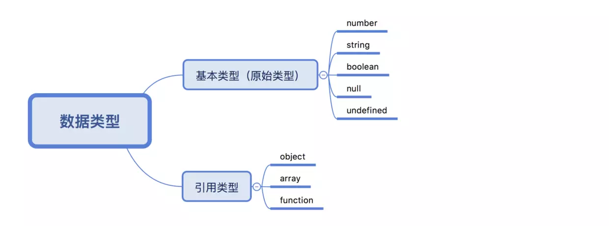

补充一点：基本类型又叫原始类型，可能还会有人会问 NaN 是个啥，NaN 在数据类型上数据 Number，只不过它比较狠，是个特殊的 Number，特殊到他自己都不等于他自己。

那么我们再来看一个问题堆和栈的储存有什么区别？先看下面这段代码的输出:
```
var a = 1
console.log(a)  // 1
var b = a
console.log(b)  // 1
b = 2
console.log(a)  // 1
console.log(b)  // 2
/* b的改变并没有影响到a */

var c = [1,2]
console.log(c)  // [1,2]
var d = c
console.log(d)  // [1,2]
d.push(3)
console.log(c)  // [1,2,3]
console.log(d)  // [1,2,3]
/* d的改变影响到了c */
```
下面我们一步一步分析上面的代码：

var a = 1 这一步会在栈里开辟一个空间 a 空间里面储存值 1

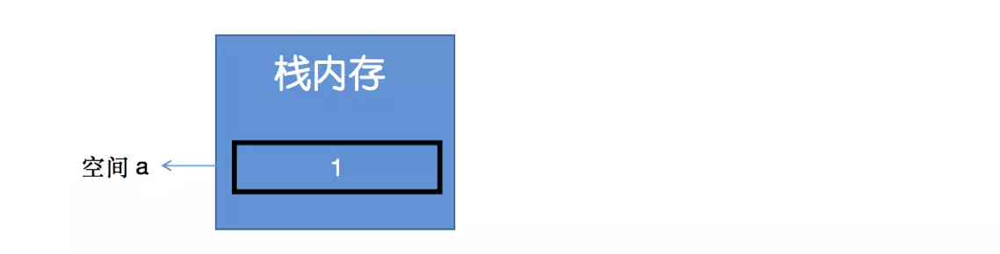

var b = a 这一步会继续在栈里开辟一个空间 b 空间里面储存由 a 复制而来的值

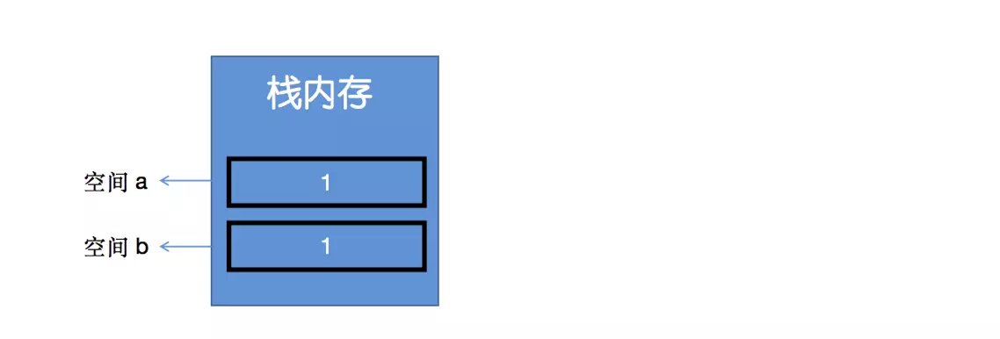

b = 2 这时把b的值进行修改，因为基本数据类型是按值访问的，所以直接修改了空间 b 里面的内容。

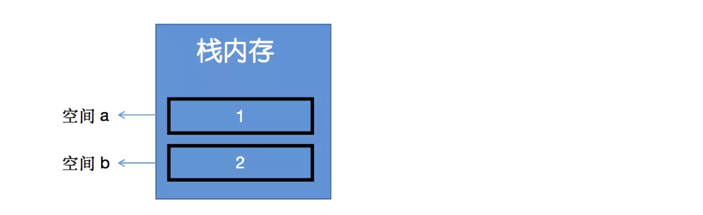

下面我们来创建一个引用类型的值 var c = [1,2] ，我们来分析这一步的过程：首先在栈里开辟一个 c 空间，c 空间储存的不是数据  [1,2] ，而是形如 0x0901 这种格式的地址，这个地址会指向堆里面的一个空间，堆里面的这个空间才会储存实际的数据 [1,2] , 用图表示就是下面这个样子。

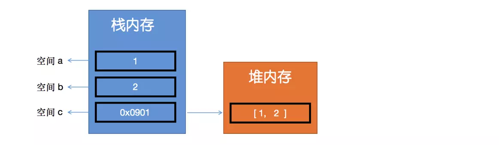

当执行 var d = c 的时候首先在栈里面开辟一个 d 空间，d 空间存放由 c 复制而来的内容，这个时候要注意由 c 复制而来的是地址而不是实体数据。这个时候 c 和 d 里面存放的是同一个地址，指向堆里面共同的区域。

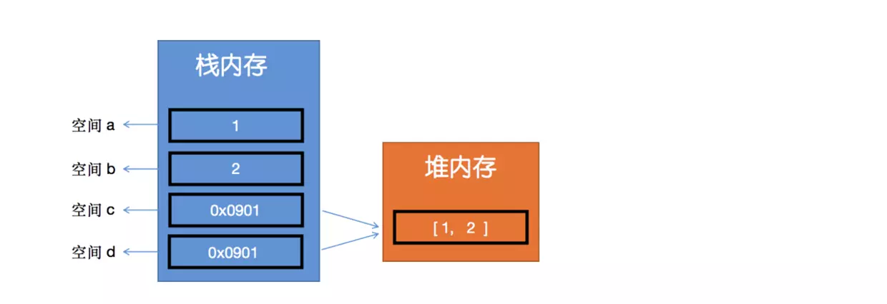

现在执行最后一步 d.push(3) 对 d 进行操作的时候因为 d 是引用类型，所以不会直接操作栈里面的空间 d，而是通过空间 d 里面的地址去找到堆里面储存的数据进行相应的操作，这也就解释了为什么对 d 进行 push 操作的时候 c 会改变了，因为他们通过相同的地址指向相同的空间，引用了相同的数据。

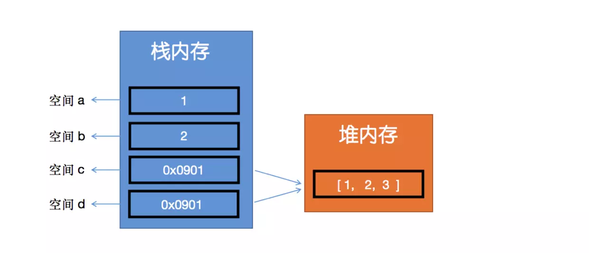

堆栈相关的内容已经叙述完了，我们再来看文章开始讲到的数据类型，null 和 undefined 他俩是属于基本类型，那他俩是用来干什么的，undefined 用于初始化未赋值的变量，null 用来主动释放对象，主动释放的对象无法找回。
有同学会问了为什么要释放对象，还要主动，这里又得引入一个概念垃圾回收机制!
我们来看下面的操作:
```
var a = [1,2,3]
a = [4,5,6]
```
这两句复制语句的运行原理是这样的：

栈中创建一个变量空间 名为a，堆中创建一个储存空间 地址假设为0x0901，栈中变量中存储的，地址是0x0901，堆空间中储存的是实际数据，a变量引用了堆中的一个数组对象

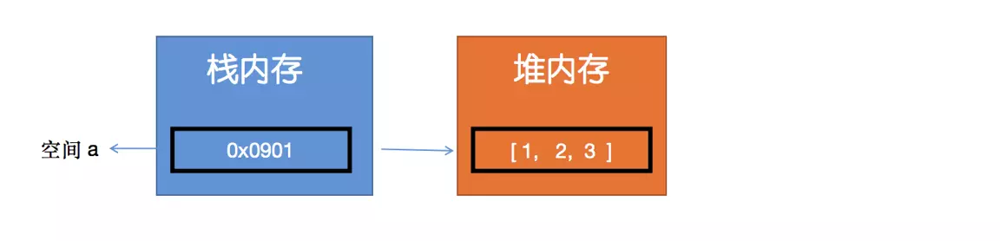

当执行 a = [ 4,5,6 ] 的时候，会在堆中新创建一个数组对象将新对象地址保存到原a变量中替换旧地址，旧数组对象被释放

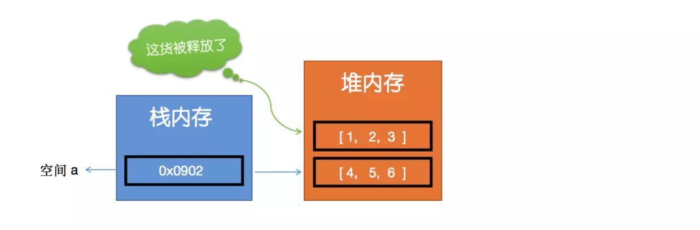

下面这段话引自《JavaScript权威指南（第四版）》

    由于字符串、对象和数组没有固定大小，所有当他们的大小已知时，才能对他们进行动态的存储分配。JavaScript程序每次创建字符串、数组或对象时，解释器都必须分配内存来存储那个实体。只要像这样动态地分配了内存，最终都要释放这些内存以便他们能够被再用，否则，JavaScript的解释器将会消耗完系统中所有可用的内存，造成系统崩溃。

    这段话解释了为什么JavaScript需要垃圾回收，那么JavaScript的解释器可以检测到何时程序不再使用一个对象了，当他确定了一个对象是无用的时候，他就知道不再需要这个对象，可以把它所占用的内存释放掉了。那怎么确定一个对象什么时候无用呢，就是上面提到的“被释放”。要注意的是这个过程是有延时的，也就是说回收要比释放晚。
我们来总结两句废话：

对象在没有变量“引用”的时候会被垃圾回收程序回收

只要对象还有变量“引用”垃圾回收程序就不会回收

好了，上面粗略的介绍了堆栈概念和垃圾回收，现在可以正式引入深拷贝和浅拷贝这两个概念了。
深拷贝与浅拷贝有什么区别？

    简单点来说，就是假设B复制了A，当修改A时，看B是否会发生变化，如果B也跟着变了，说明这是浅拷贝，如果B没变那就是深拷贝。

浅拷贝没什么好展开说的，我们直接来说深拷贝，那么从堆栈储存原理上怎么才能实现深拷贝呢，我们来看下面的图：

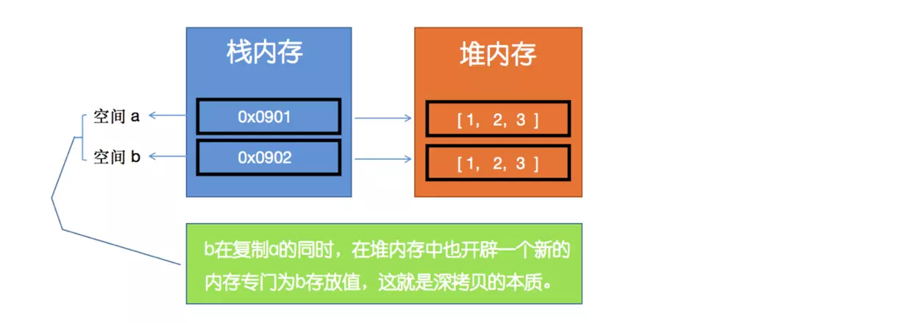

下面我们列举几种常见的对象拷贝方法以及各种方法的特点 ：

1.大家知道数组有很多方法会返回一个新数组，那这些方法是不是可以变相的实现深拷贝呢我们以 slice 为例：

```
var a = [1,2]
var b = a.slice(0,2)
b.push(3)
console.log(a)  // [1,2]
console.log(b)  // [1,2,3]
复制代码看起来可以其实不然，我们接着再看。
var a = [1, [1,2] ]
var b = a.slice(0,2)
b[1].push(3)
console.log(a)  // [1, [1,2,3] ]
console.log(b)  // [1, [1,2,3] ]
```

结局很明朗数组这些方法只能实现一维数组的深拷贝多维数组就无能为力了。

2.Object.assign() 是es6的方法，用来合并对象，详细的用法请各位同学自行查阅文档，我们来看一下用他来实现深拷贝。

```
var a = {name: {myName: 'chuan'}, class:'zhang'}
var b = Object.assign({},a)
a.class = 'zhang2'
a.name.myName = 'chuan2'
console.log(a)  // {name: {myName: 'chuan2'}, class:'zhang2'}
console.log(b)  // {name: {myName: 'chuan2'}, class:'zhang'}
```

结局依然明朗还是无法实现深层的拷贝

3.用 JSON.parse( JSON.stringify( obj ) ) 做深拷贝简单暴力，但是有一个问题就是他不支持function以及一些特殊值的拷贝，比如：

```
var a = { fun: function(){ alert('1') }, a: undefined, c: NaN }
var b = JSON.stringify(a)
console.log(b)     //   { c: null }
```

可以看到只是把 c 的值 NaN 输出成了 null ，undefined 和 function 都被忽略了，这是因为 JSON.stringify 函数会将一个JavaScript对象转换成文本化的JSON。不能被文本化的属性会被忽略。

4.既然上面的方法都不能完成的实现深拷贝，那么可以自己实现一个方法通过循环遍历来实现深拷贝的功能。
```
function deepCopy(obj) {
  let result = obj instanceof Array ? [] : {}  // 判断数据类型
  let keys = Object.keys(obj), key = null, temp = null;
  for (let i = 0; i < keys.length; i++) {
    key = keys[i]
    temp = obj[key]
    result[key] = temp
  }
  return result;
}
```
现在的 deepCopy 函数也只是实现了第一层的拷贝，如果有复杂的数据结构还是无法实现深层的拷贝，那么我们在 result[key] = temp 的时候需要对 temp 做一次判断如果是 object 类型就再去做一次遍历，这样自然的就想到了递归。
```
function deepCopy(obj) {
  let result = obj instanceof Array ? [] : {}
  let keys = Object.keys(obj), key = null, temp = null;
  for (let i = 0; i < keys.length; i++) {
    key = keys[i]
    temp = obj[key]
    if (temp && typeof temp === 'object') {
      result[key] = deepCopy(temp)  // 递归
    } else {
      result[key] = temp
    }
  }
  return result;
}
```
我们看一下现在是不是已经解决了之前深层拷贝的问题，来模拟一个略复杂的 object 结构。
```
var obj = {
  name: {
    myName: 'chuan'
  },
  arr: [1,[2,3]],
  type: undefined,
  empty: null,
  fun: function() {
    console.log('chuan')
  }
}

var obj2 = deepCopy(obj)
obj.name.myName = 'chuan2'
obj.arr.push(5)
obj.arr[1].push(4)
obj.fun = function(){console.log('chuan2') }

console.log(obj2.name.myName) // chuan
console.log(obj2.arr)   // [1,[2,3]]
obj2.fun()  // chuan
```
看似完美其实并没有，如果有一个对象的某个属性引用了这个对象自身呢，这样会不会在递归中死循环下去，我们看下面这个例子:
```
var obj3 = {
    name: 'chuan'
  }
  obj3.obj = obj3
  deepCopy(obj3)
```
华丽的报了一个堆栈溢出的错误

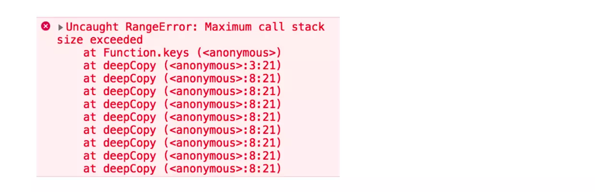

那我们处理一下这个问题简单做一下判断就好
```
function deepCopy(obj) {
    let result = obj instanceof Array ? [] : {}
    let keys = Object.keys(obj), key = null, temp = null;
    for (let i = 0; i < keys.length; i++) {
      key = keys[i]
      temp = obj[key]
      if (temp && typeof temp === 'object') {
        if(temp != obj){  // 解决堆栈溢出
          result[key] = deepCopy(temp)
        }
      } else {
        result[key] = temp
      }
    }
    return result;
  }
```
好了大结局了，简单对堆栈理论和深拷贝做了分析，其实还有很多值的仔细推敲的地方，比如 es6 关于object 的一些新增 api，用 keys 方法做遍历是不是最优的方案，以及es6一些新增数据类型的拷贝也没有做测试，正则表达式的拷贝，是不是可以用 call 来实现继承，数据类型的判断用 instanceof 是不是更好，这些坑就留给大家自己填了。
