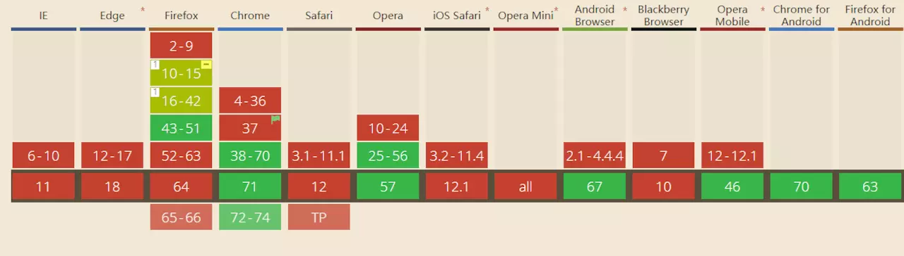

#### battery status
这个API就使用来获取当前的电池状态
- 用法
```
// 首先去判断当前浏览器是否支持此API
if ('getBattery' in navigator) {
    // 通过这个方法来获取battery对象
    navigator.getBattery().then(battery => {
    // battery 对象包括中含有四个属性
    // charging 是否在充电
    // level   剩余电量
    // chargingTime 充满电所需事件
    // dischargingTime  当前电量可使用时间
    const { charging, level, chargingTime, dischargingTime } = battery;
    // 同时可以给当前battery对象添加事件  对应的分别时充电状态变化 和 电量变化
    battery.onchargingchange = ev => {
        const { currentTarget } = ev;
        const { charging } = currentTarget;
    };
    battery.onlevelchange = ev => {
        const { currentTarget } = ev;
        const { level } = ev;
    }
    })
} else {
    alert('当前浏览器不支持~~~')
}
```
- 用处

用来温馨的提示用户当前电量~~~

浏览器支持度

这个浏览器的支持度很低。。。。


