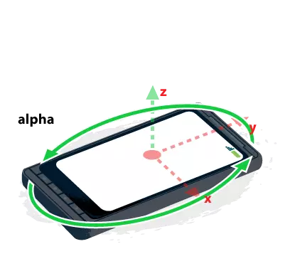
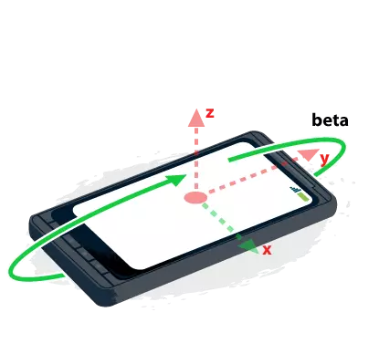
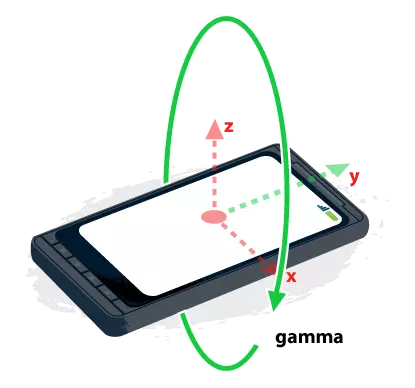
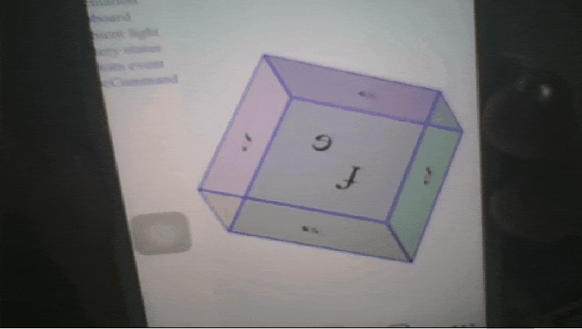
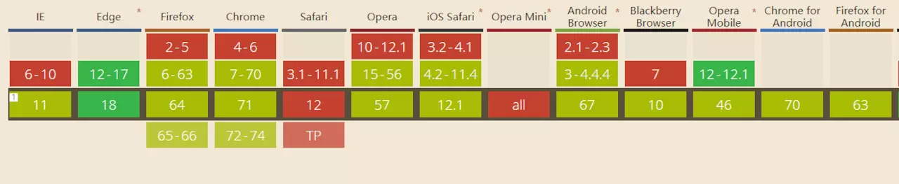

#### device orientation（陀螺仪）

通过绑定事件来获取设备的物理朝向，可以获取到三个数值，分别是：

alpha ：设备沿着Z轴的旋转角度



beta ：设备沿着X轴的旋转角度



gamma ：设备沿着Y轴的旋转角度



- 用法
```
window.addEventListener('deviceorientation',e => {
    console.log('Gamma:',e.gamma);
    console.log('Beta:',e.beta);
    console.log('Alpha:',e.Alpha);
})
```

- 用处
这种自然是web VR 中的使用场景会相对较多。这是我写的一个小demo



浏览器支持度


