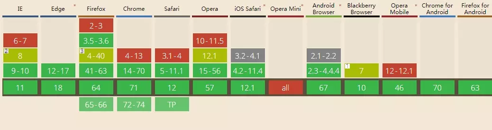

#### online state（网络状态）

这个API就很简单了，就是获取当前的网络状态，同时也有对应的事件去相应网络状态的变化。

- 用法
```
window.addEventListener('online',onlineHandler)
window.addEventListener('offline',offlineHandler)
```
- 用处

比如说我们的网站是视频网站，正在播放的时候，网络中断了，我们可以通过这个API去相应，给用户相应的提示等等。

浏览器支持度

