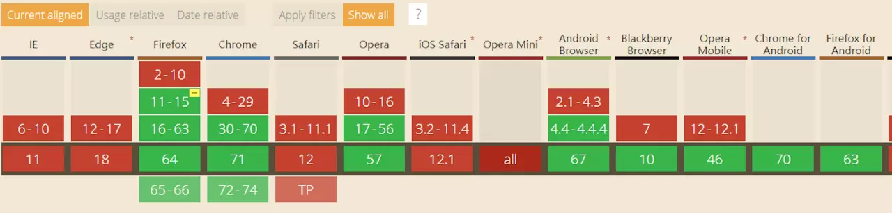

#### Vibration（震动）
让手机震动~~~  嗯，就这么简单。
- 用法
```
// 可以传入一个大于0的数字，表示让手机震动相应的时间长度，单位为ms
navigator.vibrate(100)
// 也可以传入一个包含数字的数组，比如下面这样就是代表震动300ms，暂停200ms，震动100ms，暂停400ms，震动100ms
navigator.vibrate([300,200,100,400,100])
// 也可以传入0或者一个全是0的数组，表示暂停震动
navigator.vibrate(0)
```
- 用处

用来给用户一个提示，比如说数据校验失败，当然震动不止这点作用，大家自己去扩展吧~~~

浏览器支持度


