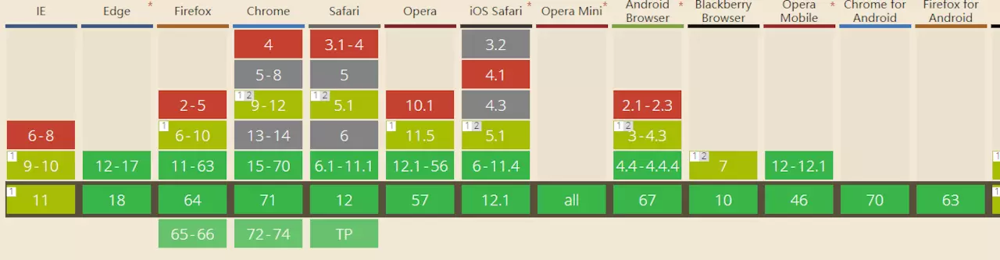

#### CustomEvent （自定义事件）

大家都知道各种事件是如何绑定的，但是有时候这些事件不够用呢，custom event就可以解决这样的问题。

- 用法
```
let dom = document.querySelector('#app');
// 绑定事件， 传递过来的值可以通过ev.detail 来获取
dom.addEventListener('log-in',(ev) => {
    const { detail } = ev;
    console.log(detail);  // hello
})
// 派发事件，需要传入两个参数，一个是事件类型，另外一个是一个对象，detail就是传递过去的值
dom.dispatchEvent(new CustomEvent('log-in',{
    detail:'hello'
}))
```
- 用处

绑定自定义事件，最近很火的框架Omi，其中的自定义事件就是基于customEvent实现的。

浏览器支持度


