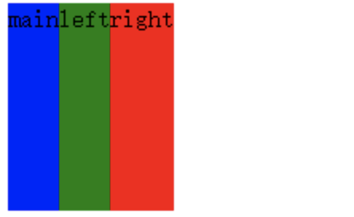
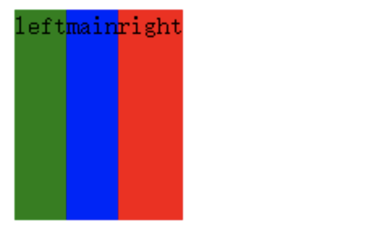
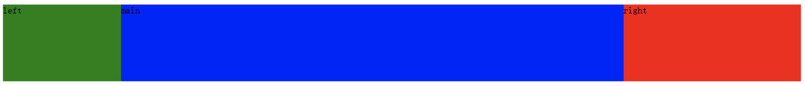
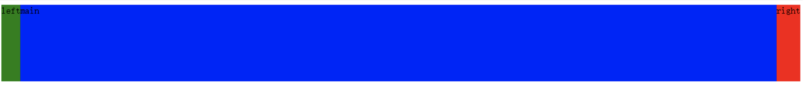

- Flex 是 Flexible Box 的缩写，意为”弹性布局”，用来为盒状模型提供最大的灵活性。
- 任何一个容器都可以指定为 Flex 布局，所以Flex 布局将成为未来布局的首选方案。
　　
1. 首先将container块设置为一个Flex容器
    ```
    .container{
        display: flex;
        min-height: 130px;
    }
    ```
    > 那么container下属的main、left和right这三个子元素自动成为容器成员，称为 Flex 项目（flex item），简称”项目”。
　　
2. 对这三个项目做初始设置
    ```
    .main{
        background-color: blue;
    }
    .left{
        background-color: green;
    }
    .right{
        background-color: red;
    }
    ```
    项目根据内容进行弹性布局：
    

3. 通过order属性设置排列顺序
    > 可以看出三个项目的排序方式不一样了，main排在了第一个，要让main在中间，left在左边，可以通过Flex容器下的项目的属性“order”属性来设置：
    ```
    .left{
        order: -1;
        background-color: green;
    }
    ```
    > 对于order属性：定义项目的排列顺序，越小越靠前，默认为0。
    

4. 通过项目属性flex-grow设置main的放大比例，将空余的空间用main来填充，使三个项目不满一整行；默认为0，也就是对剩余空间不做处理。
    ```
    .main{
        flex-grow:1;
        background-color: blue;
    }
    ```
    

5. 通过项目属性flex-basis 设置left和right的固定宽度
    ```
    .left{
        order: -1;
        flex-basis: 200px;
        background-color: green;
        }
    .right{
        flex-basis: 300px;
        background-color: red;
    }
    ```
    

    > 这样就实现了我们的目标，是不是很简单？这就是flex布局的魅力。。。

6.最后，完整的代码如下：
```
<!DOCTYPE html>
<html>
<head>
    <meta charset="utf-8">
    <title>实现三栏水平布局之Flex布局</title>
    <style type="text/css">
    .container{
        display: flex;
        min-height: 130px;
    }
    .main{
        flex-grow: 1;
        background-color: blue;
    }
    .left{
        order: -1;
        flex-basis: 200px;
        background-color: green;
    }
    .right{
        flex-basis: 300px;
        background-color: red;
    }
    </style>
</head>
<body>
<div class="container">
　　<div class="main">main</div>
　　<div class="left">left</div>
　　<div class="right">right</div>
</div>
</body>
</html>
```