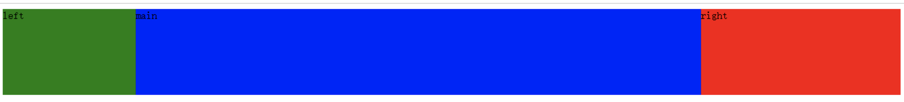

1. 设置基本样式
    ```
    /*3.圣杯布局法*/
    .left, .main, .right {
    min-height: 130px;
    }
    .left {
    background: green;
    width: 200px;
    }
    .main {
    background-color: blue;
    }
    .right {
    background-color: red;
    width: 300px;
    }
    ```
    > 为了高度保持一致给left main right都加上min-height:130px。

    
2. 圣杯布局是一种相对布局，首先设置父元素container的位置：　
    ```
    .container {
    padding: 0 300px 0 200px;
    }
    ```
    > 实现效果是左右分别空出200px和300px区域，效果如图：

    

3. 将主体部分的三个子元素都设置左浮动
    ```
    .left, .main, .right {
    min-height: 130px;
    float: left;
    }
    ```
    > 出现了如下情况，怎么办，别着急慢慢来：

    

4. 设置main宽度为width:100%,让其单独占满一行

    ```
    .main {
    background-color: blue;
    width: 100%;
    }
    ```

    

5. 设置left和right 负的外边距
    - 我们的目标是让left、main、right依次并排，但是上图中left和right都是位于下一行，这里的技巧就是使用负的margin-left:
    ```
    .left {
        margin-left: -100%;
        background-color: green;
        width: 200px;
    }
    .right {
        margin-left: -300px;
        background-color: red;
        width: 300px;
    }
    ```
    - 负的margin-left会让元素沿文档流向左移动，如果负的数值比较大就会一直移动到上一行。关于负的margin的应用也是博大精深，这里肯定是不能详细介绍了。
    - 设置left部分的margin-left为-100%,就会使left向左移动一整个行的宽度，由于left左边是父元素的边框，所以left继续跳到上一行左移，一直移动到上一行的开头，并覆盖了main部分（仔细观察下图，你会发现main里面的字“main”不见了，因为被left遮住了），left上移过后，right就会处于上一行的开头位置，这时再设置right部分margin-left为负的宽度，right就会左移到上一行的末尾。

    

6. 接下来只要把left和right分别移动到这两个留白就可以了。可以使用相对定位移动 left和right部分。
    ```
    .left, .main, .right {
        position: relative;
        min-height: 130px;
        float: left;
    }
    .left {
        left: -200px;
        margin-left: -100%;
        background: green;
        width: 200px;
    }
    .right {
        right: -300px;
        margin-left: -300px;
        background-color: red;
        width: 300px;
    }
    ```

    

- 至此，我们完成了三列中间自适应的布局，也就是传说中的圣杯布局。完整的代码如下:

    ```
    <!DOCTYPE html>
    <html>
    <head>
        <meta charset="utf-8">
        <title>实现三栏水平布局之圣杯布局</title>
        <style type="text/css">
        .container {
            padding: 0 300px 0 200px;
        }
        .left, .main, .right {
            position: relative;
            min-height: 130px;
            float: left;
        }
        .left {
            left: -200px;
            margin-left: -100%;
            background: green;
            width: 200px;
        }
        .right {
            right: -300px;
            margin-left: -300px;
            background-color: red;
            width: 300px;
        }
        .main {
            background-color: blue;
            width: 100%;
        }
        </style>
    </head>
    <body>
    <div class="container">
    　　<div class="main">main</div>
    　　<div class="left">left</div>
    　　<div class="right">right</div>
    </div>
    </body>
    </html>
    ```
