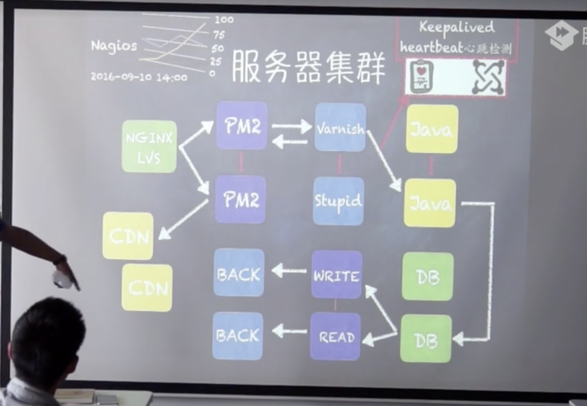

#### 项目问题
1. 静态资源的版本控制不足，无MD5戳（解决缓存问题）
2. ajax后端接口耦合严重（后台传过来巴拉巴拉一大堆几十k，结果就1k有用，可以使用node做中间层）

#### 完备项目
1. 抽象的接口层，必须通过继承实现对应的方法
    1. 如果直接调用父类的function，我们就throw一个error，这样我们就模拟了interface
    2. 比如我们建一个function，function的prototype上有一个getDate，这个时候我们如果直接去new这个父类的话是不让你去new的，必须要把父类的prototype继承过来
2. 可容错可重试HTTP模块
    1. 一个用户的请求过来到了node
    2. node再把这个请求的服务再往后去传
    3. 然后把返回来的结果经过node层处理掉，然后再给前端返回去
    4. 这个时候后端就需要一个可容错的HTTP请求模块
    5. node是一层，java也是一层，如何在这中间相互调用切掉没用的数据
3. 不断提取壮大帮助类文件夹（定位，数据距离处理计算公式，服务器出错短信，用户IP）
4. Control异军突起疯狂的正则验证
    1. Control用来处理用户输入路径，匹配用户输入的路径地址
    2. 搜索引擎很抵触404，500
5. Model发力，异步Model同步Model，职责链模式。所有协议用Unix Domain Socket实现IPC（进程通信） 同时搭载L5动态分配集群IP
    1. Control用来处理用户输入路径，匹配用户输入的路径地址
    2. View是给我们的用户展现html
    3. Model用来跟Java请求数据（分两种方式：1.异步 2.同步）
    4. 这里面就用到了设计模式，职责链模式：一个Control对应四个Model，四个Model实际上就串起来一条职责链
    5. 职责链：每一个Model都有对应的职责，它们共用的连接起来的链条去为这个Control服务
    6. 在同一台服务器中实现两个服务的通信如果走http那很浪费，这里我们就要使用Unix Domain Socket
    7. Unix Domain Socket实现进程通信，node启动一个服务是要占进程的，Java启动一个服务也是要占用进程的
    8. L5动态分配集群IP：如果你一个服务器集群里面的对应着某一个IP的机器挂了，这个时候外部请求这个IP就会出问题，搭载L5动态分配集群的好处是，动态的去分析你这个集群里面对应的当前IP

#### 预备上线
1. 前端工程化的搭载动态文件的MAP分析压缩打包合并至CDN
2. 单测、压测、性能分析工具发现Bug
3. 编写nginx-conf实现负载均衡和反向代理（很少有人用node直接做服务器，一般用node躲在nginx后面）
4. PM2启动应用程序小流量灰度上线，修复Bug

#### 服务器集群

请求-----------------------------------------------------> nginx

-----找一个最闲置的node------------------------------------> PM2 ----离你最近的---->  CDN

-----找缓存服务器（一般用Varnish，stupid）-------------------> Varnish/stupid

-----如果有你请求的数据直接返回，如果没有找到就往下找Java--------> Java(也是个集群)

-----找数据库---------------------------------------------> DB（也是个集群）

-----找到真正的动态的可以执行的读写对应的数据库-----------------> write/read

-----容灾，做backup备份，防止出错或者写死了导致数据库错误甚至没了-> Back


**Nagios**时刻分析当前对应的节点做监控、包括cpu当前的使用情况

**Keeplived heartbeat心跳检测**：服务器和服务器之间要有高可用的心跳检测，PM2到Varnish/stupid这一层不是直接过来的，它要先检测




#### 经典代码
````$xslt
//Control匹配，因为路由太多了，一个一个写太傻了，所以用正则做匹配，一个正则匹配多个路由，然后用职责链是三个Modle来服务一个Control（正则就是这个Control）
router.get(/^\/(\d+)_(\d+)/,cModel.A,cModel.B,c.Model.C);
````
```$xslt
//加密，node自己有加密模块，你也可以用其他的加密模块
var shaObj = new jsSHA(string,'TEXT');
var hash = shaObj.getHash('SHA-1','HEX');
```
```$xslt
//拿到headers，做一些特殊的请求报头
var forPound = req.headers['x-forwarded-for-pound']
```
```$xslt
//一旦出错抛出一个error，然后在new Error的地方做一些响应的业务处理逻辑
callback(new Error('Fail to parse http response to json,url'+reqOptions.url+'),res.body);
```
```$xslt
require('./middleware')(app);
```

####
最前面一般是 Nginx、LVS 做四层或者七层负载均衡，把请求分发到不同的 Node 服务器，Node 服务器内 PM2 做负载均衡，把到达这台服务器的不同请求分发到不同的 Node worker 进程。每个 Node worker 进程再独立请求后端服务器（PHP、Java）