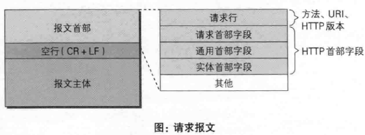
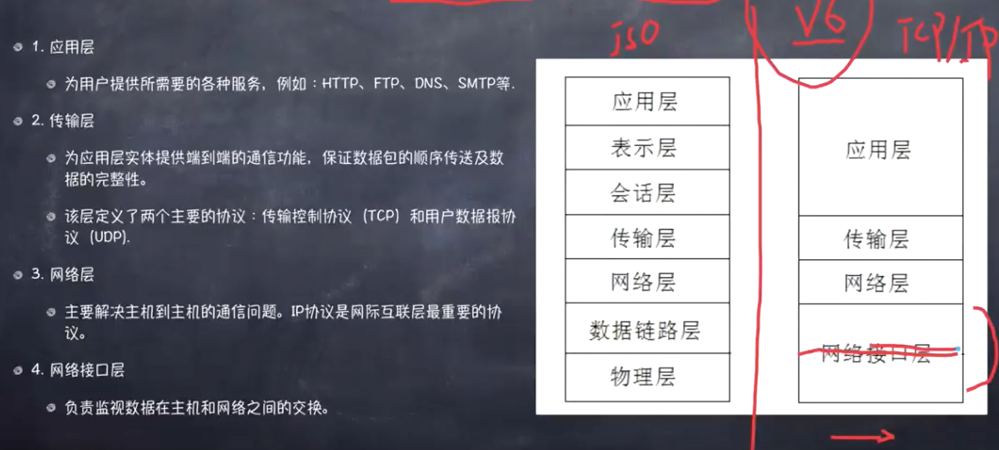

#### Http与Https的区别
1. HTTP 的URL 以http:// 开头，而HTTPS 的URL 以https:// 开头
2. HTTP 是不安全的，而 HTTPS 是安全的
3. HTTP 标准端口是80 ，而 HTTPS 的标准端口是443
4. 在**OSI** 网络模型中，HTTP工作于应用层，而HTTPS 的安全传输机制工作在传输层
5. HTTP 无法加密，而HTTPS 对传输的数据进行加密
6. HTTP无需证书，而HTTPS 需要CA机构wosign的颁发的SSL证书

#### 什么是Http协议无状态协议?怎么解决Http协议无状态协议?

- 无状态协议对于事务处理没有记忆能力。缺少状态意味着如果后续处理需要前面的信息

- 也就是说，当客户端一次HTTP请求完成以后，客户端再发送一次HTTP请求，HTTP并不知道当前客户端是一个”老用户“。

- 可以使用Cookie来解决无状态的问题，Cookie就相当于一个通行证，第一次访问的时候给客户端发送一个Cookie，当客户端再次来的时候，拿着Cookie(通行证)，那么服务器就知道这个是”老用户“。

#### URI和URL的区别

- URI，是uniform resource identifier，统一资源标识符，用来唯一的标识一个资源。

    1. Web上可用的每种资源如HTML文档、图像、视频片段、程序等都是一个来URI来定位的

    2. URI一般由三部组成：

       ① 访问资源的命名机制

       ② 存放资源的主机名

       ③ 资源自身的名称，由路径表示，着重强调于资源。

- URL是uniform resource locator，统一资源定位器，它是一种具体的URI，即URL可以用来标识一个资源，而且还指明了如何locate这个资源。

    1. URL是Internet上用来描述信息资源的字符串，主要用在各种WWW客户程序和服务器程序上，特别是著名的Mosaic。

    2. 采用URL可以用一种统一的格式来描述各种信息资源，包括文件、服务器的地址和目录等。URL一般由三部组成：

        ① 协议(或称为服务方式)

        ② 存有该资源的主机IP地址(有时也包括端口号)

        ③ 主机资源的具体地址。如目录和文件名等

- URN，uniform resource name，统一资源命名，是通过名字来标识资源，比如mailto:java-net@java.sun.com。

    1. URI是以一种抽象的，高层次概念定义统一资源标识，而URL和URN则是具体的资源标识的方式。URL和URN都是一种URI。笼统地说，每个 URL 都是 URI，但不一定每个 URI 都是 URL。这是因为 URI 还包

在Java的URI中，一个URI实例可以代表绝对的，也可以是相对的，只要它符合URI的语法规则。而URL类则不仅符合语义，还包含了定位该资源的信息，因此它不能是相对的。

在Java类库中，URI类不包含任何访问资源的方法，它唯一的作用就是解析。

相反的是，URL类可以打开一个到达资源的流。

#### 常用的HTTP方法有哪些？

- GET： 用于请求访问已经被URI（统一资源标识符）识别的资源，可以通过URL传参给服务器

- POST：用于传输信息给服务器，主要功能与GET方法类似，但一般推荐使用POST方式。

- PUT： 传输文件，报文主体中包含文件内容，保存到对应URI位置。

- HEAD： 获得报文首部，与GET方法类似，只是不返回报文主体，一般用于验证URI是否有效。

- DELETE：删除文件，与PUT方法相反，删除对应URI位置的文件。

- OPTIONS：查询相应URI支持的HTTP方法。

#### HTTP请求报文与响应报文格式

请求报文包含四部分：




1. 请求行：包含请求方法、URI、HTTP版本信息

2. 请求首部字段

3. 请求内容实体

4. 空行

响应报文包含四部分


1. 状态行：包含HTTP版本、状态码、状态码的原因短语

2. 响应首部字段

3. 响应内容实体

4. 空行

##### 常见的首部：

###### 通用首部字段（请求报文与响应报文都会使用的首部字段）

Date：创建报文时间

Connection：连接的管理

Cache-Control：缓存的控制

Transfer-Encoding：报文主体的传输编码方式

###### 请求首部字段（请求报文会使用的首部字段）

Host：请求资源所在服务器

Accept：可处理的媒体类型

Accept-Charset：可接收的字符集

Accept-Encoding：可接受的内容编码

Accept-Language：可接受的自然语言

###### 响应首部字段（响应报文会使用的首部字段）

Accept-Ranges：可接受的字节范围

Location：令客户端重新定向到的URI

Server：HTTP服务器的安装信息

###### 实体首部字段（请求报文与响应报文的的实体部分使用的首部字段）

Allow：资源可支持的HTTP方法

Content-Type：实体主类的类型

Content-Encoding：实体主体适用的编码方式

Content-Language：实体主体的自然语言

Content-Length：实体主体的的字节数

Content-Range：实体主体的位置范围，一般用于发出部分请求时使用

#### HTTPS工作原理

1. 首先HTTP请求服务端生成证书，客户端对证书的有效期、合法性、域名是否与请求的域名一致、证书的公钥（RSA加密）等进行校验；

2. 客户端如果校验通过后，就根据证书的公钥的有效， 生成随机数，随机数使用公钥进行加密（RSA加密）；

3. 消息体产生的后，对它的摘要进行MD5（或者SHA1）算法加密，此时就得到了RSA签名；

4. 发送给服务端，此时只有服务端（RSA私钥）能解密。

5. 解密得到的随机数，再用AES加密，作为密钥（此时的密钥只有客户端和服务端知道）。


具体的参考链接：http://blog.csdn.net/sean_cd/article/details/6966130

#### 一次完整的HTTP请求所经历的7个步骤


HTTP通信机制是在一次完整的HTTP通信过程中，Web浏览器与Web服务器之间将完成下列7个步骤：

1. 建立TCP连接

    > 先解析DNS，把localhost变成ip（127.0.0.1），然后根据127.0.0.1和端口号8080（没有端口号则使用默认的端口）建立socket。也可以理解为通过“三次握手”建立TCP连接，确定通讯正常。在HTTP工作开始之前，Web浏览器首先要通过网络与Web服务器建立连接，该连接是通过TCP来完成的，该协议与IP协议共同构建 Internet，即著名的TCP/IP协议族，因此Internet又被称作是TCP/IP网络。HTTP是比TCP更高层次的应用层协议，根据规则， 只有低层协议建立之后才能，才能进行更层协议的连接，因此，首先要建立TCP连接，一般TCP连接的端口号是80。

2. Web浏览器向Web服务器发送请求行

    > socket建立好之后，客户端开始向web服务器发送请求命令（GET/POST等）。一旦建立了TCP连接，Web浏览器就会向Web服务器发送请求命令。例如：GET /sample/hello.jsp HTTP/1.1。

3. Web浏览器发送请求头

    > 客户端先发送与自身相关的信息，再发送空行表示请求头发送完毕，如果是post则继续发送请求正文。浏览器发送其请求命令之后，还要以头信息的形式向Web服务器发送一些别的信息，之后浏览器发送了一空白行来通知服务器，它已经结束了该头信息的发送。

4. Web服务器应答

    > 应答第一步，发送协议版本和状态码（200、503、404等）客户机向服务器发出请求后，服务器会客户机回送应答， HTTP/1.1 200 OK ，应答的第一部分是协议的版本号和应答状态码。

5. Web服务器发送应答头

    > 应答第二步，先发送自身相关信息、Content-Type(必须)及被请求的文档，在发送空行宝石应答头发送完毕。正如客户端会随同请求发送关于自身的信息一样，服务器也会随同应答向用户发送关于它自己的数据及被请求的文档。

6. Web服务器向浏览器发送数据

    > 应答第三步，根据应答头的Content-Type指定的格式发送应答正文。Web服务器向浏览器发送头信息后，它会发送一个空白行来表示头信息的发送到此为结束，接着，它就以Content-Type应答头信息所描述的格式发送用户所请求的实际数据。

7. Web服务器关闭TCP连接

    > 一次‘会话’完成，如果设置了Connection：keep-alive则TCP连接不关闭，否则关闭连接。一般情况下，一旦Web服务器向浏览器发送了请求数据，它就要关闭TCP连接，然后如果浏览器或者服务器在其头信息加入了这行代码：

    ```
    Connection:keep-alive
    ```

    > TCP连接在发送后将仍然保持打开状态，于是，浏览器可以继续通过相同的连接发送请求。保持连接节省了为每个请求建立新连接所需的时间，还节约了网络带宽。

建立TCP连接->发送请求行->发送请求头->（到达服务器）发送状态行->发送响应头->发送响应数据->断TCP连接

最具体的HTTP请求过程：http://blog.51cto.com/linux5588/1351007

#### 常见的HTTP相应状态码

- 200：请求被正常处理
- 204：请求被受理但没有资源可以返回
- 206：客户端只是请求资源的一部分，服务器只对请求的部分资源执行GET方法，相应报文中通过Content-Range指定范围的资源。
- 300:多重选择。链接列表。用户可以选择某链接到达目的地。最多允许五个地址。
- 301：永久性重定向,请求永久重定向,所请求的页面已经转移至新的url。
- 302：临时重定向,请求临时重定向,所请求的页面已经临时转移至新的url。
- 303：与302状态码有相似功能，只是它希望客户端在请求一个URI的时候，能通过GET方法重定向到另一个URI上
- 304：发送附带条件的请求时，条件不满足时返回，与重定向无关,请求被重定向到客户端本地缓存,未按预期修改文档。客户端有缓冲的文档并发出了一个条件性的请求（一般是提供If-Modified-Since头表示客户只想比指定日期更新的文档）。服务器告诉客户，原来缓冲的文档还可以继续使用。
- 305:客户请求的文档应该通过Location头所指明的代理服务器提取。
- 307：临时重定向，与302类似，只是强制要求使用POST方法
- 306:此代码被用于前一版本。目前已不再使用，但是代码依然被保留。
- 400：请求报文语法有误，服务器无法识别,服务器未能理解请求,客户端请求存在语法错误
- 401：请求需要认证,客户端请求没有经过授权,被请求的页面需要用户名和密码。
- 403：请求的对应资源禁止被访问,客户端的请求被服务器拒绝，一般为客户端没有访问权限
- 404：服务器无法找到对应资源,客户端请求的URL在服务端不存在
- 500：请求未完成。服务器遇到不可预知的情况。
- 501：请求未完成。服务器不支持所请求的功能。
- 502：请求未完成。服务器从上游服务器收到一个无效的响应。
- 503：服务器正忙,服务端发生临时错误
- 504：网关超时。
- 505：服务器不支持请求中指明的HTTP协议版本。

#### HTTP响应模型

服务器收到HTTP请求之后，会有多种方法响应这个请求，下面是HTTP响应的四种模型：

1. 单进程I/O模型

    > 服务端开启一个进程，一个进程仅能处理一个请求，并且对请求顺序处理；

2. 多进程I/O模型

    > 服务端并行开启多个进程，同样的一个进程只能处理一个请求，这样服务端就可以同时处理多个请求；

3. 复用I/O模型

    > 服务端开启一个进程，但是呢，同时开启多个线程，一个线程响应一个请求，同样可以达到同时处理多个请求，线程间并发执行；

4. 复用多线程I/O模型

    > 服务端并行开启多个进程，同时每个进程开启多个线程，这样服务端可以同时处理进程数M*每个进程的线程数N个请求。

#### HTTP协议版本更替

- HTTP/0.9

    > HTTP协议的最初版本，功能简陋，仅支持请求方式GET，并且仅能请求访问HTML格式的资源。

- HTTP/1.0

    > 在0.9版本上做了进步，增加了请求方式POST和HEAD；不再局限于0.9版本的HTML格式，根据Content-Type可以支持多种数据格式，即MIME多用途互联网邮件扩展，例如text/html、image/jpeg等；同时也开始支持cache，就是当客户端在规定时间内访问统一网站，直接访问cache即可。

    > 但是1.0版本的工作方式是每次TCP连接只能发送一个请求，当服务器响应后就会关闭这次连接，下一个请求需要再次建立TCP连接，就是不支持keepalive。

- HTTP/1.1

    > 解决了1.0版本的keepalive问题，1.1版本加入了持久连接，一个TCP连接可以允许多个HTTP请求； 加入了管道机制，一个TCP连接同时允许多个请求同时发送，增加了并发性；新增了请求方式PUT、PATCH、DELETE等。

    > 但是还存在一些问题，服务端是按队列顺序处理请求的，假如一个请求处理时间很长，则会导致后边的请求无法处理，这样就造成了队头阻塞的问题；同时HTTP是无状态的连接，因此每次请求都需要添加重复的字段，降低了带宽的利用率。

- HTTP/2.0

    > 为了解决1.1版本利用率不高的问题，提出了HTTP/2.0版本。增加双工模式，即不仅客户端能够同时发送多个请求，服务端也能同时处理多个请求，解决了队头堵塞的问题；HTTP请求和响应中，状态行和请求/响应头都是些信息字段，并没有真正的数据，因此在2.0版本中将所有的信息字段建立一张表，为表中的每个字段建立索引，客户端和服务端共同使用这个表，他们之间就以索引号来表示信息字段，这样就避免了1.0旧版本的重复繁琐的字段，并以压缩的方式传输，提高利用率。

    > 另外也增加服务器推送的功能，即不经请求服务端主动向客户端发送数据。

当前主流的协议版本还是HTTP/1.1版本。

#### HTTP1.1版本特性

1. 默认持久连接节省通信量，只要客户端服务端任意一端没有明确提出断开TCP连接，就一直保持连接，可以发送多次HTTP请求

2. 管线化，客户端可以同时发出多个HTTP请求，而不用一个个等待响应

3. 断点续传
    > 实际上就是利用HTTP消息头使用分块传输编码，将实体主体分块传输。

### OSI七层模型与TCP/IP五层模型

https://blog.csdn.net/wdkirchhoff/article/details/43915825

#### OSI七层模型

1. OSI的来源

    OSI（Open System Interconnect），即开放式系统互联。 一般都叫OSI参考模型，是ISO（国际标准化组织）组织在1985年研究的网络互连模型。

    ISO为了更好的使网络应用更为普及，推出了OSI参考模型。其含义就是推荐所有公司使用这个规范来控制网络。这样所有公司都有相同的规范，就能互联了。

2. OSI七层模型的划分

    OSI定义了网络互连的七层框架（物理层、数据链路层、网络层、传输层、会话层、表示层、应用层），即ISO开放互连系统参考模型。如下图。

    每一层实现各自的功能和协议，并完成与相邻层的接口通信。OSI的服务定义详细说明了各层所提供的服务。某一层的服务就是该层及其下各层的一种能力，它通过接口提供给更高一层。各层所提供的服务与这些服务是怎么实现的无关。

    

 3. 各层功能定义

    这里我们只对OSI各层进行功能上的大概阐述，不详细深究，因为每一层实际都是一个复杂的层。后面我也会根据个人方向展开部分层的深入学习。这里我们就大概了解一下。我们从最顶层——应用层 开始介绍。<font color=red>整个过程以公司A和公司B的一次商业报价单发送为例子进行讲解。</font>

    <1>    应用层

    OSI参考模型中最靠近用户的一层，是为计算机用户提供应用接口，也为用户直接提供各种网络服务。我们常见应用层的网络服务协议有：HTTP，HTTPS，FTP，POP3、SMTP等。

    实际公司A的老板就是我们所述的用户，而他要发送的商业报价单，就是应用层提供的一种网络服务，当然，老板也可以选择其他服务，比如说，发一份商业合同，发一份询价单，等等。

    <2>    表示层

    表示层提供各种用于应用层数据的编码和转换功能,确保一个系统的应用层发送的数据能被另一个系统的应用层识别。如果必要，该层可提供一种标准表示形式，用于将计算机内部的多种数据格式转换成通信中采用的标准表示形式。数据压缩和加密也是表示层可提供的转换功能之一。

    由于公司A和公司B是不同国家的公司，他们之间的商定统一用英语作为交流的语言，所以此时表示层（公司的文秘），就是将应用层的传递信息转翻译成英语。同时为了防止别的公司看到，公司A的人也会对这份报价单做一些加密的处理。这就是表示的作用，将应用层的数据转换翻译等。

    <3>    会话层

    会话层就是负责建立、管理和终止表示层实体之间的通信会话。该层的通信由不同设备中的应用程序之间的服务请求和响应组成。

    会话层的同事拿到表示层的同事转换后资料，（会话层的同事类似公司的外联部），会话层的同事那里可能会掌握本公司与其他好多公司的联系方式，这里公司就是实际传递过程中的实体。他们要管理本公司与外界好多公司的联系会话。当接收到表示层的数据后，会话层将会建立并记录本次会话，他首先要找到公司B的地址信息，然后将整份资料放进信封，并写上地址和联系方式。准备将资料寄出。等到确定公司B接收到此份报价单后，此次会话就算结束了，外联部的同事就会终止此次会话。

    <4>   传输层

    传输层建立了主机端到端的链接，传输层的作用是为上层协议提供端到端的可靠和透明的数据传输服务，包括处理差错控制和流量控制等问题。该层向高层屏蔽了下层数据通信的细节，使高层用户看到的只是在两个传输实体间的一条主机到主机的、可由用户控制和设定的、可靠的数据通路。我们通常说的，TCP UDP就是在这一层。端口号既是这里的“端”。

    传输层就相当于公司中的负责快递邮件收发的人，公司自己的投递员，他们负责将上一层的要寄出的资料投递到快递公司或邮局。

    <5>   网络层

    本层通过IP寻址来建立两个节点之间的连接，为源端的运输层送来的分组，选择合适的路由和交换节点，正确无误地按照地址传送给目的端的运输层。就是通常说的IP层。这一层就是我们经常说的IP协议层。IP协议是Internet的基础。

    网络层就相当于快递公司庞大的快递网络，全国不同的集散中心，比如说，从深圳发往北京的顺丰快递（陆运为例啊，空运好像直接就飞到北京了），首先要到顺丰的深圳集散中心，从深圳集散中心再送到武汉集散中心，从武汉集散中心再寄到北京顺义集散中心。这个每个集散中心，就相当于网络中的一个IP节点。

    <6>   数据链路层
    将比特组合成字节,再将字节组合成帧,使用链路层地址 (以太网使用MAC地址)来访问介质,并进行差错检测。

    数据链路层又分为2个子层：逻辑链路控制子层（LLC）和媒体访问控制子层（MAC）。

    MAC子层处理CSMA/CD算法、数据出错校验、成帧等；LLC子层定义了一些字段使上次协议能共享数据链路层。 在实际使用中，LLC子层并非必需的。

    这个没找到合适的例子

    <7>  物理层

    实际最终信号的传输是通过物理层实现的。通过物理介质传输比特流。规定了电平、速度和电缆针脚。常用设备有（各种物理设备）集线器、中继器、调制解调器、网线、双绞线、同轴电缆。这些都是物理层的传输介质。

    快递寄送过程中的交通工具，就相当于我们的物理层，例如汽车，火车，飞机，船。

4. 通信特点：对等通信

    对等通信，为了使数据分组从源传送到目的地，源端OSI模型的每一层都必须与目的端的对等层进行通信，这种通信方式称为对等层通信。在每一层通信过程中，使用本层自己协议进行通信。

    


#### TCP/IP五层模型


有些地方把TCP/IP分为四层，有些地方分为五层，主要不同就是四层的 **网络接口层** 被分为了两层->**数据链路层** 和 **物理层**



 TCP/IP五层协议和OSI的七层协议对应关系如下。


在每一层都工作着不同的设备，比如我们常用的交换机就工作在数据链路层的，一般的路由器是工作在网络层的。


在每一层实现的协议也各不同，即每一层的服务也不同.下图列出了每层主要的协议。其中每层中具体的协议，我会在后面的逐一学习。


#### TCP/IP协议

TCP/IP协议模型（Transmission Control Protocol/Internet Protocol），包含了一系列构成互联网基础的网络协议，是Internet的核心协议，通过20多年的发展已日渐成熟，并被广泛应用于局域网和广域网中，目前已成为事实上的国际标准。TCP/IP协议簇是一组不同层次上的多个协议的组合，通常被认为是一个四层协议系统，与OSI的七层模型相对应。

HTTP协议就是基于TCP/IP协议模型来传输信息的。


1. 链路层

    > 也称作数据链路层或网络接口层（在第一个图中为网络接口层和硬件层），通常包括操作系统中的设备驱动程序和计算机中对应的网络接口卡。它们一起处理与电缆（或其他任何传输媒介）的物理接口细节。ARP（地址解析协议）和RARP（逆地址解析协议）是某些网络接口（如以太网和令牌环网）使用的特殊协议，用来转换IP层和网络接口层使用的地址。

2. 网络层

    > 也称作互联网层（在第一个图中为网际层），处理分组在网络中的活动，例如分组的选路。在TCP/IP协议族中，网络层协议包括IP协议（网际协议），ICMP协议（Internet互联网控制报文协议），以及IGMP协议（Internet组管理协议）。

    > IP是一种网络层协议，提供的是一种不可靠的服务，它只是尽可能快地把分组从源结点送到目的结点，但是并不提供任何可靠性保证。同时被TCP和UDP使用。TCP和UDP的每组数据都通过端系统和每个中间路由器中的IP层在互联网中进行传输。

    > ICMP是IP协议的附属协议。IP层用它来与其他主机或路由器交换错误报文和其他重要信息。IGMP是Internet组管理协议。它用来把一个UDP数据报多播到多个主机。

3. 传输层

    > 主要为两台主机上的应用程序提供端到端的通信。在TCP/IP协议族中，有两个互不相同的传输协议：TCP（传输控制协议）和UDP（用户数据报协议）。

    > TCP为两台主机提供高可靠性的数据通信。它所做的工作包括把应用程序交给它的数据分成合适的小块交给下面的网络层，确认接收到的分组，设置发送最后确认分组的超时时钟等。由于运输层提供了高可靠性的端到端的通信，因此应用层可以忽略所有这些细节。为了提供可靠的服务，TCP采用了超时重传、发送和接收端到端的确认分组等机制。

    > UDP则为应用层提供一种非常简单的服务。它只是把称作数据报的分组从一台主机发送到另一台主机，但并不保证该数据报能到达另一端。一个数据报是指从发送方传输到接收方的一个信息单元（例如，发送方指定的一定字节数的信息）。UDP协议任何必需的可靠性必须由应用层来提供。

4. 应用层

    > 应用层决定了向用户提供应用服务时通信的活动。TCP/IP 协议族内预存了各类通用的应用服务。包括 HTTP，FTP（File Transfer Protocol，文件传输协议），DNS（Domain Name System，域名系统）服务。

    

    > 当应用程序用TCP传送数据时，数据被送入协议栈中，然后逐个通过每一层直到被当作一串比特流送入网络。其中每一层对收到的数据都要增加一些首部信息（有时还要增加尾部信息），该过程如图所示。

    

    > 当目的主机收到一个以太网数据帧时，数据就开始从协议栈中由底向上升，同时去掉各层协议加上的报文首部。每层协议盒都要去检查报文首部中的协议标识，以确定接收数据的上层协议。这个过程称作分用（Demultiplexing）。协议是通过目的端口号、源I P地址和源端口号进行解包的。

    通过以上步骤我们从TCP/IP模型的角度来理解了一次HTTP请求与响应的过程。下面这张图更清楚明白：

    

#### TCP三次握手


第一次握手

> 建立连接。客户端发送连接请求报文段，将SYN位置为1，Sequence Number为x；然后，客户端进入SYN_SEND状态，等待服务器的确认；

第二次握手

> 服务器收到SYN报文段。服务器收到客户端的SYN报文段，需要对这个SYN报文段进行确认，设置Acknowledgment Number为x+1(Sequence Number+1)；同时，自己自己还要发送SYN请求信息，将SYN位置为1，Sequence Number为y；服务器端将上述所有信息放到一个报文段（即SYN+ACK报文段）中，一并发送给客户端，此时服务器进入SYN_RECV状态；

第三次握手

> 客户端收到服务器的SYN+ACK报文段。然后将Acknowledgment Number设置为y+1，向服务器发送ACK报文段，这个报文段发送完毕以后，客户端和服务器端都进入ESTABLISHED状态，完成TCP三次握手。

**为什么要三次握手**

为了防止已失效的连接请求报文段突然又传送到了服务端，因而产生错误。

具体例子：“已失效的连接请求报文段”的产生在这样一种情况下：client发出的第一个连接请求报文段并没有丢失，而是在某个网络结点长时间的滞留了，以致延误到连接释放以后的某个时间才到达server。本来这是一个早已失效的报文段。但server收到此失效的连接请求报文段后，就误认为是client再次发出的一个新的连接请求。于是就向client发出确认报文段，同意建立连接。假设不采用“三次握手”，那么只要server发出确认，新的连接就建立了。由于现在client并没有发出建立连接的请求，因此不会理睬server的确认，也不会向server发送数据。但server却以为新的运输连接已经建立，并一直等待client发来数据。这样，server的很多资源就白白浪费掉了。采用“三次握手”的办法可以防止上述现象发生。例如刚才那种情况，client不会向server的确认发出确认。server由于收不到确认，就知道client并没有要求建立连接。”

#### 四次挥手


第一次分手

> 主机1（可以使客户端，也可以是服务器端），设置Sequence Number，向主机2发送一个FIN报文段；此时，主机1进入FIN_WAIT_1状态；这表示主机1没有数据要发送给主机2了；

第二次分手

> 主机2收到了主机1发送的FIN报文段，向主机1回一个ACK报文段，Acknowledgment Number为Sequence Number加1；主机1进入FIN_WAIT_2状态；主机2告诉主机1，我“同意”你的关闭请求；

第三次分手

> 主机2向主机1发送FIN报文段，请求关闭连接，同时主机2进入LAST_ACK状态；

第四次分手

> 主机1收到主机2发送的FIN报文段，向主机2发送ACK报文段，然后主机1进入TIME_WAIT状态；主机2收到主机1的ACK报文段以后，就关闭连接；此时，主机1等待2MSL后依然没有收到回复，则证明Server端已正常关闭，那好，主机1也可以关闭连接了。

**为什么要四次分手**

TCP协议是一种面向连接的、可靠的、基于字节流的运输层通信协议。TCP是全双工模式，这就意味着，当主机1发出FIN报文段时，只是表示主机1已经没有数据要发送了，主机1告诉主机2，它的数据已经全部发送完毕了；但是，这个时候主机1还是可以接受来自主机2的数据；当主机2返回ACK报文段时，表示它已经知道主机1没有数据发送了，但是主机2还是可以发送数据到主机1的；当主机2也发送了FIN报文段时，这个时候就表示主机2也没有数据要发送了，就会告诉主机1，我也没有数据要发送了，之后彼此就会愉快的中断这次TCP连接。


#### HTTP优化方案

- TCP复用：TCP连接复用是将多个客户端的HTTP请求复用到一个服务器端TCP连接上，而HTTP复用则是一个客户端的多个HTTP请求通过一个TCP连接进行处理。前者是负载均衡设备的独特功能；而后者是HTTP 1.1协议所支持的新功能，目前被大多数浏览器所支持。

- 内容缓存：将经常用到的内容进行缓存起来，那么客户端就可以直接在内存中获取相应的数据了。

- 压缩：将文本数据进行压缩，减少带宽

- SSL加速（SSL Acceleration）：使用SSL协议对HTTP协议进行加密，在通道内加密并加速

- TCP缓冲：通过采用TCP缓冲技术，可以提高服务器端响应时间和处理效率，减少由于通信链路问题给服务器造成的连接负担。

详情参考：

http://blog.51cto.com/virtualadc/580832

http://www.cnblogs.com/cocowool/archive/2011/08/22/2149929.html

#### 网站访问量

- IP IP访问量

    > 相同的公网IP计算一次，就是同一个局域网内的所有用户访问一个网站，但是他们都是借助一个公网IP去访问那个网站的（NAT），因此这也只能算作一个IP访问量。换一次公网IP则会加1。

- PV 网页访问量

    > 用户访问的页面数就是PV访问量，同一个局域网的不同用户，而且就算是同一个用户，只要刷新一次网站页面，PV访问量就加1，三个访问量的值往往数PV的值最大。

- UV 访客访问量

    > 这里的访客不是用户，而是电脑，一台电脑算一个访客，即使是同一台电脑的不同用户，访问同一个网站UV也只能加1，只有更换电脑才会使UV加1，因为服务端会记录客户端电脑的信息。

