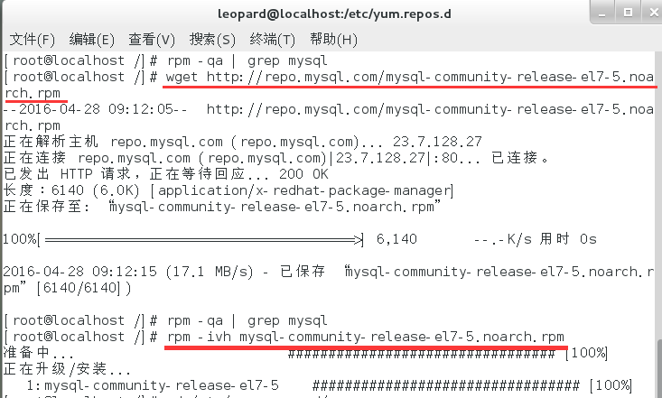
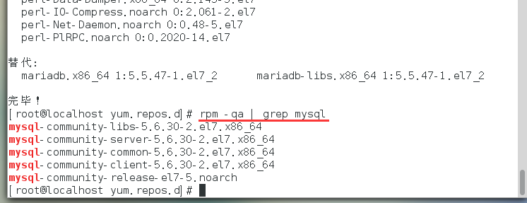
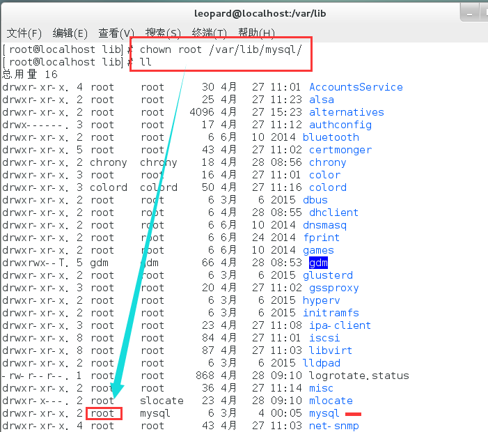
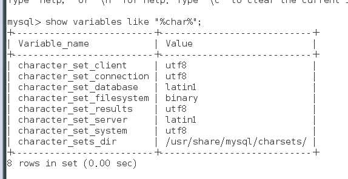

### mysql命令  https://www.cnblogs.com/bluecobra/archive/2012/01/11/2318922.html

netstat -antp

service mysqld restart 

#### 安装

1. 先检查系统是否装有mysql


这里返回空值，说明没有安装

这里执行安装命令是无效的，因为centos-7默认是Mariadb，所以执行以下命令只是更新Mariadb数据库

2. 安装

> yum install mysql

3. 删除
> yum remove mysql

4. 下载mysql的repo源

> wget http://repo.mysql.com/mysql-community-release-el7-5.noarch.rpm

5. 安装mysql-community-release-el7-5.noarch.rpm包

> sudo rpm -ivh mysql-community-release-el7-5.noarch.rpm



安装这个包后，会获得两个mysql的yum repo源：/etc/yum.repos.d/mysql-community.repo，/etc/yum.repos.d/mysql-community-source.repo。


5. 安装mysql

# sudo yum install mysql-server

根据步骤安装就可以了，不过安装完成后，没有密码，需要重置密码。

安装后再次查看mysql



如果报错，内容含有
```
Error: Package: mysql-community-libs-5.6.35-2.el7.x86_64 (mysql56-community)
           Requires: libc.so.6(GLIBC_2.17)(64bit)
Error: Package: mysql-community-server-5.6.35-2.el7.x86_64 (mysql56-community)
           Requires: libc.so.6(GLIBC_2.17)(64bit)
Error: Package: mysql-community-server-5.6.35-2.el7.x86_64 (mysql56-community)
           Requires: systemd
Error: Package: mysql-community-server-5.6.35-2.el7.x86_64 (mysql56-community)
           Requires: libstdc++.so.6(GLIBCXX_3.4.15)(64bit)
Error: Package: mysql-community-client-5.6.35-2.el7.x86_64 (mysql56-community)
           Requires: libc.so.6(GLIBC_2.17)(64bit)
 You could try using --skip-broken to work around the problem
 You could try running: rpm -Va --nofiles --nodigest
```

解决：
> yum install glibc.i686

> yum list libstdc++*

6. 重置密码

重置密码前，首先要登录

> mysql -u root

登录时有可能报这样的错：ERROR 2002 (HY000): Can’t connect to local MySQL server through socket ‘/var/lib/mysql/mysql.sock’ (2)，原因是/var/lib/mysql的访问权限问题。下面的命令把/var/lib/mysql的拥有者改为当前用户：

> sudo chown -R openscanner:openscanner /var/lib/mysql

如果报chown: 无效的用户: "openscanner:openscanner"错误，更换命令，并用 ll 查看目录权限列表

chown root /var/lib/mysql/



重启服务

> service mysqld restart

6.png接下来登录重置密码：

> mysql -u root -p

> mysql > use mysql;

>mysql > update user set password=password('123456') where user='root';

> mysql > exit;

重启mysql服务后才生效
> service mysqld restart

7. 必要时加入以下命令行，为root添加远程连接的能力。链接密码为 “root”（不包括双引号）

> mysql> GRANT ALL PRIVILEGES ON *.* TO root@"%" IDENTIFIED BY "root";　　

查询数据库编码格式，确保是 UTF-8

> show variables like "%char%";



需要修改编码格式为UTF-8，导入数据库sql的时候，请确保sql文件为utf8编码
进入mysql命令行后 输入

> set names utf8;
（测试数据库数据）
再进入数据库 use test;
在导入sql脚本 source test.sql;

8. 开放3306端口号
firewalld 防火墙（centos-7）运行命令,并重启：

> firewall-cmd --zone=public --add-port=3306/tcp --permanent

> firewall-cmd --reload

iptables 防火墙（centos6.5及其以前）运行命令

> vim /etc/sysconfig/iptables

在文件内添加下面命令行，然后重启
```
-A INPUT -p tcp -m state --state NEW -m tcp --dport 3306 -j ACCEPT
```
> service iptables restart

外部链接访问效果（一般建立sql数据库和数据表，建议通过远程链接控制，直观易操作）


附：

出现“Warning: Using a password on the command line interface can be insecure.”的错误

第一种方法、修改数据库配置文件
1、我们需要修改数据库配置文件，这个要看我们数据库的配置的，有些是在/etc/my.cnf，有些是/etc/my.conf


我们需要在[client]部分添加脚本：
```
socket=/var/lib/mysql/mysql.sock  ( mysql.sock 文件位置 )
host=localhost
user=数据库用户
password='数据库密码'
```
这里参数要修改成我们自己的。

2、采用命令导出和导入数据库
其实在这个时候，我们如果采用”详解使用mysqldump命令备份还原MySQL数据用法整理http://www.laozuo.org/5047.html“介绍的方法也是可以使用的，虽然依旧有错误提示，但是数据库还是可以导出的。您肯定和老左一样是追求细节的人，一点点问题都不能有，但我们可以用下面的命令导出和导入，就没有错误提示。

导出数据库

> mysqldump --defaults-extra-file=/etc/my.cnf database > database.sql

导入数据库

> mysql --defaults-extra-file=/etc/my.cnf database < database.sql

这里我们可以看到上面的命令和以前常用的快速导入和导入命令有所不同了，需要加载我们配置的MYSQL配置文件，这个“/etc/my.cnf”要根据我们实际的路径修改。用这样的命令导出备份和导入是没有错误提示的。

登陆数据库

> mysql -u root -p

第二种方法、利用mysql_config_editor

1、设置加密模式

> mysql_config_editor set --login-path=local --host=localhost --user=db_user --password

“db_user”是需要修改成我们自己数据库用户名的，回车之后会提示我们输入数据库密码，我们照样输入。

2、执行备份
```
mysqldump -u db_user -pInsecurePassword my_database | gzip > backup.tar.gz
//-u db_user
//-p.InsecurePassword ( 中间的“.”记得去掉 )
```
根据我们数据信息修改用户和用户名和数据库密码，执行备份，这里老左测试还是有错误提示，但数据库是可以备份的。

修改MySQL的root用户的密码：
```
mysql -u root mysql
mysql>use mysql;
mysql>desc user;
mysql> GRANT ALL PRIVILEGES ON . TO root@”%” IDENTIFIED BY “root”;　　//为root添加远程连接的能力。
mysql>update user set Password = password(‘xxxxxx’) where User=’root’;
mysql>select Host,User,Password from user where User=’root’;
mysql>flush privileges;
mysql>exit;
```
重新登录：mysql -u root -p

delete from mysql.user where user=”;　 ← 删除匿名用户

select user,host from mysql.user;　 ← 查看用户信息


#### 命令
1. mysql服务的启动和停止

    > net stop mysql

    > net start mysql

    > 查看安装路径 : show variables like '%char%';

2. 登陆mysql

    > 语法: mysql -u用户名 -p用户密码

    > 注意，如果是连接到另外的机器上，则需要加入一个参数-h机器IP

3. 增加新用户

    > 格式：grant 权限 on 数据库.* to 用户名@登录主机 identified by "密码"
    ```
    如，增加一个用户user1密码为password1，让其可以在本机上登录， 并对所有数据库有查询、插入、修改、删除的权限。首先用以root用户连入mysql，然后键入以下命令：

    grant select,insert,update,delete on *.* to user1@localhost Identified by "password1";

    如果希望该用户能够在任何机器上登陆mysql，则将localhost改为"%"。

    如果你不想user1有密码，可以再打一个命令将密码去掉。

    grant select,insert,update,delete on mydb.* to user1@localhost identified by "";
    ```
4. 操作数据库

    > 登录到mysql中，然后在mysql的提示符下运行下列命令，每个命令以分号结束。

    1. 显示数据库列表。

        > show databases;

        > 默认有两个数据库：mysql和test。 mysql库存放着mysql的系统和用户权限信息，我们改密码和新增用户，实际上就是对这个库进行操作。

    2. 显示库中的数据表：

        > use mysql;

        > show tables;

    3. 显示数据表的结构：

        describe 表名;

    4. 建库与删库：

        > create database 库名;

        > drop database 库名;

    5. 建表：

        > use 库名;

        > create table 表名(字段列表);

        > drop table 表名;

    6. 清空表中记录：

        > delete from 表名;

    7. 显示表中的记录：

        > select * from 表名;

    8. 增删改查
        1. insert into table_name ( column_name1, column_name2,...column_name ) VALUES ( value1, value2,...value );
        2. select column_name,column_name from table_name WHERE runoob_id=3;
        3. update table_name SET column_name='new-value',column_name='new-value' WHERE runoob_id=3;
        4. binary 区分大小写
            > mysql> SELECT * from runoob_tbl WHERE BINARY runoob_author='runoob.com';

5. 导出和导入数据

    1. 导出数据：

        > mysqldump --opt test > mysql.test
        ```
        即将数据库test数据库导出到mysql.test文件，后者是一个文本文件

        如：mysqldump -u root -p123456 --databases dbname > mysql.dbname

        就是把数据库dbname导出到文件mysql.dbname中。
        ```
    2. 导入数据:

        > mysqlimport -u root -p123456 < mysql.dbname。

6. 将文本数据导入数据库:
    ````
    文本数据的字段数据之间用tab键隔开。

    use test;

    load data local infile "文件名" into table 表名;

    1:使用SHOW语句找出在服务器上当前存在什么数据库：

    mysql> SHOW DATABASES;

    2:2、创建一个数据库MYSQLDATA

    mysql> CREATE DATABASE MYSQLDATA;

    3:选择你所创建的数据库

    mysql> USE MYSQLDATA; (按回车键出现Database changed 时说明操作成功!)

    4:查看现在的数据库中存在什么表

    mysql> SHOW TABLES;

    5:创建一个数据库表

    mysql> CREATE TABLE MYTABLE (name VARCHAR(20), sex CHAR(1));

    6:显示表的结构：

    mysql> DESCRIBE MYTABLE;

    7:往表中加入记录

    mysql> insert into MYTABLE values ("hyq","M");

    8:用文本方式将数据装入数据库表中(例如D:/mysql.txt)

    mysql> LOAD DATA LOCAL INFILE "D:/mysql.txt" INTO TABLE MYTABLE;

    9:导入.sql文件命令(例如D:/mysql.sql)

    mysql>use database;

    mysql>source d:/mysql.sql;

    10:删除表

    mysql>drop TABLE MYTABLE;

    11:清空表

    mysql>delete from MYTABLE;

    12:更新表中数据

    mysql>update MYTABLE set sex="f" where name='hyq';

    posted on 2006-01-10 16:21 happytian 阅读(6) 评论(0) 编辑 收藏 收藏至365Key

    13：备份数据库

    mysqldump -u root 库名>xxx.data

    14：例2：连接到远程主机上的MYSQL

    假设远程主机的IP为：110.110.110.110，用户名为root,密码为abcd123。则键入以下命令：

    mysql -h110.110.110.110 -uroot -pabcd123

    (注:u与root可以不用加空格，其它也一样)

    3、退出MYSQL命令： exit (回车)
    ```

7. 往表中加入记录

    > mysql> insert into MYTABLE values ("hyq","M");

8.  用文本方式将数据装入数据库表中（例如D:/mysql.txt）

    > mysql> LOAD DATA LOCAL INFILE "D:/mysql.txt" INTO TABLE MYTABLE;

9.  导入.sql文件命令（例如D:/mysql.sql）

    > mysql>use database;

    > mysql>source d:/mysql.sql;

10. 删除表

    > mysql>drop TABLE MYTABLE;

11. 清空表

    > mysql>delete from MYTABLE;

12. 更新表中数据

    > mysql>update MYTABLE set sex="f" where name=hyq;


在windows中MySql以服务形式存在，在使用前应确保此服务已经启动，未启动可用net start mysql命令启动。而Linux中启动时可用“/etc/rc.d/init.d/mysqld start"命令，注意启动者应具有管理员权限。
刚安装好的MySql包含一个含空密码的root帐户和一个匿名帐户，这是很大的安全隐患，对于一些重要的应用我们应将安全性尽可能提高，在这里应把匿名帐户删除、 root帐户设置密码，可用如下命令进行：
use mysql;
delete from User where User="";
update User set Password=PASSWORD(newpassword) where User=root;
如果要对用户所用的登录终端进行限制，可以更新User表中相应用户的Host字段，在进行了以上更改后应重新启动数据库服务，此时登录时可用如下类似命令：
mysql -uroot -p;
mysql -uroot -pnewpassword;
mysql mydb -uroot -p;
mysql mydb -uroot -pnewpassword;
上面命令参数是常用参数的一部分，详细情况可参考文档。此处的mydb是要登录的数据库的名称。
在进行开发和实际应用中，用户不应该只用root用户进行连接数据库，虽然使用root用户进行测试时很方便，但会给系统带来重大安全隐患，也不利于管理技术的提高。我们给一个应用中使用的用户赋予最恰当的数据库权限。如一个只进行数据插入的用户不应赋予其删除数据的权限。MySql的用户管理是通过User表来实现的，添加新用户常用的方法有两个，一是在User表插入相应的数据行，同时设置相应的权限；二是通过GRANT命令创建具有某种权限的用户。其中GRANT的常用用法如下：
grant all on mydb.* to NewUserName@HostName identified by "password" ;
grant usage on *.* to NewUserName@HostName identified by "password";
grant select,insert,update on mydb.* to NewUserName@HostName identified by "password";
grant update,delete on mydb.TestTable to NewUserName@HostName identified by "password";
若要给此用户赋予他在相应对象上的权限的管理能力，可在GRANT后面添加WITH GRANT OPTION选项。而对于用插入User表添加的用户，Password字段应用PASSWORD 函数进行更新加密，以防不轨之人窃看密码。对于那些已经不用的用户应给予清除，权限过界的用户应及时回收权限，回收权限可以通过更新User表相应字段，也可以使用REVOKE操作。
下面给出本人从其它资料(www.cn-java.com)获得的对常用权限的解释：
全局管理权限：
FILE: 在MySQL服务器上读写文件。
PROCESS: 显示或杀死属于其它用户的服务线程。
RELOAD: 重载访问控制表，刷新日志等。
SHUTDOWN: 关闭MySQL服务。
数据库/数据表/数据列权限：
ALTER: 修改已存在的数据表(例如增加/删除列)和索引。
CREATE: 建立新的数据库或数据表。
DELETE: 删除表的记录。
DROP: 删除数据表或数据库。
INDEX: 建立或删除索引。
INSERT: 增加表的记录。
SELECT: 显示/搜索表的记录。
UPDATE: 修改表中已存在的记录。
特别的权限：
ALL: 允许做任何事(和root一样)。
USAGE: 只允许登录--其它什么也不允许做。


常用MYSQL命令
启动：net start mySql;
　　进入：mysql -u root -p/mysql -h localhost -u root -p databaseName;
　　列出数据库：show databases;
　　选择数据库：use databaseName;
　　列出表格：show tables；
　　创建数据表：mysql> CREATE TABLE mytable (name VARCHAR(20), sex CHAR(1),
-> birth DATE, birthaddr VARCHAR(20));
    显示表格列的属性：show columns from tableName；
    修改表的结构：DESCRIBE mytable;
　　建立数据库：source fileName.txt;
　　匹配字符：可以用通配符_代表任何一个字符，％代表任何字符串;
　　增加一个字段：alter table tabelName add column fieldName dateType;
　　增加多个字段：alter table tabelName add column fieldName1 dateType,add columns fieldName2 dateType;
　　多行命令输入:注意不能将单词断开;当插入或更改数据时，不能将字段的字符串展开到多行里，否则硬回车将被储存到数据中;
　　增加一个管理员帐户：grant all on *.* to user@localhost identified by "password";
　　每条语句输入完毕后要在末尾填加分号';'，或者填加'\g'也可以；
　　查询时间：select now();
　　查询当前用户：select user();
　　查询数据库版本：select version();
　　查询当前使用的数据库：select database();

    用文本方式将数据装入一个数据库表

　　如果一条一条地输入，很麻烦。我们可以用文本文件的方式将所有记录加入你的数据库表中。创建一个文本文件“mysql.txt”，每行包含一个记录，用定位符(tab)把值分开，并且以在CREATE TABLE语句中列出的列次序给出，例如：

abccs f 1977-07-07 china 　 mary f 1978-12-12 usa tom m 1970-09-02 usa


　　使用下面命令将文本文件“mytable.txt”装载到mytable表中:mysql> LOAD DATA LOCAL INFILE "mytable.txt" INTO TABLE pet;

　　再使用如下命令看看是否已将数据输入到数据库表中：mysql> select * from mytable;
(e129) 　　
　　1、删除student_course数据库中的students数据表：
　　rm -f student_course/students.*
　　
　　2、备份数据库：(将数据库test备份)
　　mysqldump -u root -p test>c:\test.txt
　　备份表格：(备份test数据库下的mytable表格)
　　mysqldump -u root -p test mytable>c:\test.txt
　　将备份数据导入到数据库：(导回test数据库)
　　mysql -u root -p test<c:\test.txt
　　
　　3、创建临时表：(建立临时表zengchao)
　　create temporary table zengchao(name varchar(10));
　　
　　4、创建表是先判断表是否存在
　　create table if not exists students(……);
　　
　　5、从已经有的表中复制表的结构
　　create table table2 select * from table1 where 1<>1;
　　
　　6、复制表
　　create table table2 select * from table1;
　　
　　7、对表重新命名
　　alter table table1 rename as table2;
　　
　　8、修改列的类型
　　alter table table1 modify id int unsigned;//修改列id的类型为int unsigned
　　alter table table1 change id sid int unsigned;//修改列id的名字为sid，而且把属性修改为int unsigned
　　
　　9、创建索引
　　alter table table1 add index ind_id (id);
　　create index ind_id on table1 (id);
　　create unique index ind_id on table1 (id);//建立唯一性索引
　　
　　10、删除索引
　　drop index idx_id on table1;
　　alter table table1 drop index ind_id;
　　
　　11、联合字符或者多个列(将列id与":"和列name和"="连接)
　　select concat(id,':',name,'=') from students;
　　
　　12、limit(选出10到20条)<第一个记录集的编号是0>
　　select * from students order by id limit 9,10;
　　
　　13、MySQL不支持的功能
　　事务，视图，外键和引用完整性，存储过程和触发器
　　
　　
　　14、MySQL会使用索引的操作符号
　　<,<=,>=,>,=,between,in,不带%或者_开头的like
　　
　　15、使用索引的缺点
　　1)减慢增删改数据的速度；
　　2）占用磁盘空间；
　　3）增加查询优化器的负担；
　　当查询优化器生成执行计划时，会考虑索引，太多的索引会给查询优化器增加工作量，导致无法选择最优的查询方案；
　　
　　16、分析索引效率
　　方法：在一般的SQL语句前加上explain；
　　分析结果的含义：
　　1）table：表名；
　　2）type：连接的类型，(ALL/Range/Ref)。其中ref是最理想的；
　　3）possible_keys：查询可以利用的索引名；
　　4）key：实际使用的索引；
　　5）key_len：索引中被使用部分的长度（字节）；
　　6）ref：显示列名字或者"const"（不明白什么意思）；
　　7）rows：显示MySQL认为在找到正确结果之前必须扫描的行数；
　　8）extra：MySQL的建议；
　　
　　17、使用较短的定长列
　　1）尽可能使用较短的数据类型；
　　2）尽可能使用定长数据类型；
　　a）用char代替varchar，固定长度的数据处理比变长的快些；
　　b）对于频繁修改的表，磁盘容易形成碎片，从而影响数据库的整体性能；
　　c）万一出现数据表崩溃，使用固定长度数据行的表更容易重新构造。使用固定长度的数据行，每个记录的开始位置都是固定记录长度的倍数，可以很容易被检测到，但是使用可变长度的数据行就不一定了；
　　d）对于MyISAM类型的数据表，虽然转换成固定长度的数据列可以提高性能，但是占据的空间也大；
　　
　　18、使用not null和enum
　　尽量将列定义为not null，这样可使数据的出来更快，所需的空间更少，而且在查询时，MySQL不需要检查是否存在特例，即null值，从而优化查询；
　　如果一列只含有有限数目的特定值，如性别，是否有效或者入学年份等，在这种情况下应该考虑将其转换为enum列的值，MySQL处理的更快，因为所有的enum值在系统内都是以标识数值来表示的；
　　
　　19、使用optimize table
　　对于经常修改的表，容易产生碎片，使在查询数据库时必须读取更多的磁盘块，降低查询性能。具有可变长的表都存在磁盘碎片问题，这个问题对blob数据类型更为突出，因为其尺寸变化非常大。可以通过使用optimize table来整理碎片，保证数据库性能不下降，优化那些受碎片影响的数据表。 optimize table可以用于MyISAM和BDB类型的数据表。实际上任何碎片整理方法都是用mysqldump来转存数据表，然后使用转存后的文件并重新建数据表；
　　
　　20、使用procedure analyse()
　　可以使用procedure analyse()显示最佳类型的建议，使用很简单，在select语句后面加上procedure analyse()就可以了；例如：
　　select * from students procedure analyse();
　　select * from students procedure analyse(16,256);
　　第二条语句要求procedure analyse()不要建议含有多于16个值，或者含有多于256字节的enum类型，如果没有限制，输出可能会很长；
　　
　　21、使用查询缓存
　　1）查询缓存的工作方式：
　　第一次执行某条select语句时，服务器记住该查询的文本内容和查询结果，存储在缓存中，下次碰到这个语句时，直接从缓存中返回结果；当更新数据表后，该数据表的任何缓存查询都变成无效的，并且会被丢弃。
　　2）配置缓存参数：
　　变量：query_cache _type，查询缓存的操作模式。有3中模式，0：不缓存；1：缓存查询，除非与select sql_no_cache开头；2：根据需要只缓存那些以select sql_cache开头的查询；query_cache_size：设置查询缓存的最大结果集的大小，比这个值大的不会被缓存。
　　
　　22、调整硬件
　　1）在机器上装更多的内存；
　　2）增加更快的硬盘以减少I/O等待时间；
　　寻道时间是决定性能的主要因素，逐字地移动磁头是最慢的，一旦磁头定位，从磁道读则很快；
　　3）在不同的物理硬盘设备上重新分配磁盘活动；
　　如果可能，应将最繁忙的数据库存放在不同的物理设备上，这跟使用同一物理设备的不同分区是不同的，因为它们将争用相同的物理资源（磁头）。

1、启动MySQL服务器
　　
　两种方法: 一是用winmysqladmin，如果机器启动时已自动运行，则可直接进入下一步操作。 二是在DOS方式下运行 d:\mysql\bin\mysqld
　(假设mysql 安装在d:\mysql);当然也可以 net start mysql命令启动。而Linux中启动时可用“/etc/rc.d/init.d/mysqld start”命令，注 意启动者应具有管理员权限。
　
2、进入mysql交互操作界面
　　
　　在DOS方式下，运行: d:\mysql\bin\mysql
　　出现: mysql 的提示符” mysql> “，此时已进入mysql的交互操作方式。
　　如果出现 “ERROR 2003: Can′t connect to MySQL server on ′localhost′ (10061)“，说明你的MySQL还没有启动。
　　
3、退出MySQL操作界面
　　
　　在mysql>提示符下输入quit可以随时退出交互操作界面:　　
　　mysql> quit
　　Bye
　　
　
4、第一条命令(多条命令用 “,” 分隔 ,一条命令可以分成多行输入，直到出现分号”;”为止
　　
　　mysql> select version(),current_date();
　　mysql>Select (20+5)*4;
　　mysql>Select (20+5)*4,sin(pi()/3);
　　mysql>Select (20+5)*4 AS Result,sin(pi()/3); (AS: 指定假名为Result)

5、常用sql 语句

1:使用SHOW语句找出在服务器上当前存在什么数据库：
mysql> SHOW DATABASES;
2:2、创建一个数据库MYSQLDATA
mysql> Create DATABASE MYSQLDATA;
3:选择你所创建的数据库
mysql> USE MYSQLDATA; (按回车键出现Database changed 时说明操作成功！)
4:查看现在的数据库中存在什么表
mysql> SHOW TABLES;
5:创建一个数据库表
mysql> Create TABLE MYTABLE (name VARCHAR(20), sex CHAR(1));
6:显示表的结构：
mysql> DESCRIBE MYTABLE;
7:往表中加入记录
mysql> insert into MYTABLE values (”hyq”,”M”);
8:用文本方式将数据装入数据库表中（例如D:/mysql.txt）
mysql> LOAD DATA LOCAL INFILE “D:/mysql.txt” INTO TABLE MYTABLE;
9:导入.sql文件命令（例如D:/mysql.sql）
mysql>use database;
mysql>source d:/mysql.sql;
10:删除表
mysql>drop TABLE MYTABLE;
11:清空表
mysql>delete from MYTABLE;
12:更新表中数据
mysql>update MYTABLE set sex=”f” where name=’hyq’;
13:插入数据
mysq>linsert into MYTABLE values (1, ‘第二章’, 0×2134545);
14:登录后使用数据库 mysql
mysql -u root -p mysql
mysql -u root -p -h 11.11.11.11 database
15:mysql jdbc连接url 使用中文
jdbc:mysql://localhost/test?useUnicode=true&characterEncoding=gb2312

[separator]

其它：
show processlist;列出每一笔联机的信息。
show varlables;列出mysql的系统设定。
show tables from db_name;列出db_name中所有数据表;
show [full] columns from table_name;列出table_name中完整信息，如栏名、类型,包括字符集编码。
show index from table_name; 列出table_name中所有的索引。
show table status;；列出当前数据库中数据表的信息。
show table status from db_name;；列出当前db_name中数据表的信息。
alter table table_name engine innodb|myisam|memory ;更改表类型
explain table_name / describe table_name ; 列出table_name完整信息，如栏名、类型。
show create table table_name 显示当前表的建表语句
alter table table_name add primary key (picid) ; 向表中增加一个主键
alter table table_name add column userid int after picid 修改表结构增加一个新的字段
alter table table_name character set gb2312 改变表的编码
select user(); 显示当前用户。
select password(’root’); 显示当前用户密码
select now(); 显示当前日期
flush privileges 在不重启的情况下刷新用户权限
mysqld –default-character-set=gb2312 ;设置默认字符集为gb2312

6、安全

刚安装好的MySql包含一个含空密码的root帐户和一个匿名帐户，这是很大的安全隐患，对于一些重要的应用我们应将安全性尽可能提高，在这里应把匿名帐户删除、 root帐户设置密码，可用如下命令进行：

use mysql;
delete from User where User=”";
update User set Password=PASSWORD(’newpassword’) where User=’root’;

改完重启 mysql 才能生效.

上面命令参数是常用参数的一部分，详细情况可参考文档。此处的mydb是要登录的数据库的名称。
在进行开发和实际应用中，用户不应该只用root用户进行连接数据库，虽然使用root用户进行测试时很方便，但会给系统带来重大安全隐患，也不利于管理技术的提高。我们给一个应用中使用的用户赋予最恰当的数据库权限。如一个只进行数据插入的用户不应赋予其删除数据的权限。MySql的用户管理是通过 User表来实现的，添加新用户常用的方法有两个，一是在User表插入相应的数据行，同时设置相应的权限；二是通过GRANT命令创建具有某种权限的用户。其中GRANT的常用用法如下：

grant all on mydb.* to NewUserName@HostName identified by “password” ;
grant usage on *.* to NewUserName@HostName identified by “password”;
grant select,insert,update on mydb.* to NewUserName@HostName identified by “password”;
grant update,delete on mydb.TestTable to NewUserName@HostName identified by “password”;
grant all privileges on *.* to root@localhost
grant select,insert,delete,update,alter,create,drop on lybbs.* to NewUserName@”%” identified by “lybbs”;

若要给此用户赋予他在相应对象上的权限的管理能力，可在GRANT后面添加WITH GRANT OPTION选项。而对于用插入User表添加的用户，Password字段应用PASSWORD 函数进行更新加密，以防不轨之人窃看密码。对于那些已经不用的用户应给予清除，权限过界的用户应及时回收权限，回收权限可以通过更新User表相应字段，也可以使用REVOKE操作。

全局管理权限：
FILE: 在MySQL服务器上读写文件。
PROCESS: 显示或杀死属于其它用户的服务线程。
RELOAD: 重载访问控制表，刷新日志等。
SHUTDOWN: 关闭MySQL服务。
数据库/数据表/数据列权限：
Alter: 修改已存在的数据表(例如增加/删除列)和索引。
Create: 建立新的数据库或数据表。
Delete: 删除表的记录。
Drop: 删除数据表或数据库。
INDEX: 建立或删除索引。
Insert: 增加表的记录。
Select: 显示/搜索表的记录。
Update: 修改表中已存在的记录。
特别的权限：
ALL: 允许做任何事(和root一样)。
USAGE: 只允许登录–其它什么也不允许做。


修改默认密码：
cd d:\mysql\bin
mysqladmin -u root -p password 123456
回车出现
Enter password: ( 注:这是叫你输入原密码. 刚安装时密码为空,所以直接回车即可)
此时mysql 中账号 root 的密码 被改为 123456 安装完毕

一、引言

　　 想使用Linux已经很长时间了，由于没有硬性任务一直也没有系统学习，近日由于工作需要必须使用Linux下的MySQL。本以为有Windows下使用SQL Server的经验，觉得在Linux下安装MySql应该是易如反掌的事，可在真正安装和使用MySQL时走了很多弯路，遇见很多问题，毕竟Linux和Windows本身就有很大区别。为了让和我一样的初学者在学习的过程中少走弯路，尽快入门，写了此文，希望对您有所帮助。本文的Linux环境是Red Hat 9.0，MySQL是4.0.16。

　　 二、安装Mysql

　　 1、下载MySQL的安装文件
　　 安装MySQL需要下面两个文件：
　　 MySQL-server-4.0.16-0.i386.rpm　　　
　　 MySQL-client-4.0.16-0.i386.rpm
　　 下载地址为：http://www.mysql.com/downloads/mysql-4.0.html， 打开此网页，下拉网页找到“Linux x86 RPM downloads”项，找到“Server”和“Client programs”项，下载需要的上述两个rpm文件。

　　 2、安装MySQL
　　 rpm文件是Red Hat公司开发的软件安装包，rpm可让Linux在安装软件包时免除许多复杂的手续。该命令在安装时常用的参数是 –ivh ,其中i表示将安装指定的rmp软件包，V表示安装时的详细信息，h表示在安装期间出现“#”符号来显示目前的安装过程。这个符号将持续到安装完成后才停止。
　　 1）安装服务器端
　　 在有两个rmp文件的目录下运行如下命令：
　　 [root@test1 local]# rpm -ivh MySQL-server-4.0.16-0.i386.rpm
　　 显示如下信息。
　　　 warning: MySQL-server-4.0.16-0.i386.rpm: V3 DSA signature: NOKEY, key ID 5072e1f5
　　 Preparing...　　　　　　　########################################### [100%]
　　 1:MySQL-server　　　　　########################################### [100%]
　　　 。。。。。。（省略显示）
　　 /usr/bin/mysqladmin -u root password 'new-password'
　　 /usr/bin/mysqladmin -u root -h test1 password 'new-password'
　　　 。。。。。。（省略显示）
　　 Starting mysqld daemon with databases from /var/lib/mysql
　　 如出现如上信息，服务端安装完毕。测试是否成功可运行netstat看Mysql端口是否打开，如打开表示服务已经启动，安装成功。Mysql默认的端口是3306。
　　 [root@test1 local]# netstat -nat
　　 Active Internet connections (servers and established)
　　 Proto Recv-Q Send-Q Local Address　　　　　 Foreign Address　　　　 State　　　
　　 tcp　　0　　0 0.0.0.0:3306　　　　 0.0.0.0:*　　　　　 LISTEN　　　
　　 上面显示可以看出MySQL服务已经启动。
　　 2）安装客户端
　　 运行如下命令：
　　 [root@test1 local]# rpm -ivh MySQL-client-4.0.16-0.i386.rpm
　　 warning: MySQL-client-4.0.16-0.i386.rpm: V3 DSA signature: NOKEY, key ID 5072e1f5
　　 Preparing...　　　　########################################### [100%]
　　 1:MySQL-client　 ########################################### [100%]
　　 显示安装完毕。
　　 用下面的命令连接mysql,测试是否成功。
　 三、登录MySQL

　　 登录MySQL的命令是mysql， mysql 的使用语法如下：
　　 mysql [-u username] [-h host] [-p[password]] [dbname]
　　 username 与 password 分别是 MySQL 的用户名与密码，mysql的初始管理帐号是root，没有密码，注意：这个root用户不是Linux的系统用户。MySQL默认用户是root，由于初始没有密码，第一次进时只需键入mysql即可。
　　 [root@test1 local]# mysql
　　 Welcome to the MySQL monitor.　Commands end with ; or \g.
　　 Your MySQL connection id is 1 to server version: 4.0.16-standard
　　 Type 'help;' or '\h' for help. Type '\c' to clear the buffer.
　　 mysql>
　　 出现了“mysql>”提示符，恭喜你，安装成功！
　　 增加了密码后的登录格式如下：
　　 mysql -u root -p
　　 Enter password: (输入密码)
　　 其中-u后跟的是用户名，-p要求输入密码，回车后在输入密码处输入密码。

　　 注意：这个mysql文件在/usr/bin目录下，与后面讲的启动文件/etc/init.d/mysql不是一个文件。

　　 四、MySQL的几个重要目录

　　 MySQL安装完成后不象SQL Server默认安装在一个目录，它的数据库文件、配置文件和命令文件分别在不同的目录，了解这些目录非常重要，尤其对于Linux的初学者，因为Linux本身的目录结构就比较复杂，如果搞不清楚MySQL的安装目录那就无从谈起深入学习。

　　 下面就介绍一下这几个目录。

　　 1、数据库目录
　　 /var/lib/mysql/

　　 2、配置文件
　　 /usr/share/mysql（mysql.server命令及配置文件）

　　 3、相关命令
　　 /usr/bin(mysqladmin mysqldump等命令)

　　 4、启动脚本
　　 /etc/rc.d/init.d/（启动脚本文件mysql的目录）
　 五、修改登录密码

　　 MySQL默认没有密码，安装完毕增加密码的重要性是不言而喻的。

　　 1、命令
　　 usr/bin/mysqladmin -u root password 'new-password'
　　 格式：mysqladmin -u用户名 -p旧密码 password 新密码

　　 2、例子
　　 例1：给root加个密码123456。
　　 键入以下命令 ：
　　 [root@test1 local]# /usr/bin/mysqladmin -u root password 123456
　　 注：因为开始时root没有密码，所以-p旧密码一项就可以省略了。

　　 3、测试是否修改成功
　　 1）不用密码登录
　　 [root@test1 local]# mysql
　　 ERROR 1045: Access denied for user: 'root@localhost' (Using password: NO)
　　 显示错误，说明密码已经修改。
　　 2）用修改后的密码登录
　　 [root@test1 local]# mysql -u root -p
　　 Enter password: (输入修改后的密码123456)
　　 Welcome to the MySQL monitor.　Commands end with ; or \g.
　　 Your MySQL connection id is 4 to server version: 4.0.16-standard
　　 Type 'help;' or '\h' for help. Type '\c' to clear the buffer.
　　 mysql>
　　 成功！
　　 这是通过mysqladmin命令修改口令，也可通过修改库来更改口令。

　　 六、启动与停止

　　 1、启动
　　 MySQL安装完成后启动文件mysql在/etc/init.d目录下，在需要启动时运行下面命令即可。
　　 [root@test1 init.d]# /etc/init.d/mysql start

　　 2、停止
　　 /usr/bin/mysqladmin -u root -p shutdown

　　 3、自动启动
　　 1）察看mysql是否在自动启动列表中
　　 [root@test1 local]#　/sbin/chkconfig –list
　　 2）把MySQL添加到你系统的启动服务组里面去
　　 [root@test1 local]#　/sbin/chkconfig　– add　mysql
　　 3）把MySQL从启动服务组里面删除。
　　 [root@test1 local]#　/sbin/chkconfig　– del　mysql
七、更改MySQL目录

　　 MySQL默认的数据文件存储目录为/var/lib/mysql。假如要把目录移到/home/data下需要进行下面几步：

　　 1、home目录下建立data目录
　　 cd /home
　　 mkdir data

　　 2、把MySQL服务进程停掉：
　　 mysqladmin -u root -p shutdown

　　 3、把/var/lib/mysql整个目录移到/home/data
　　 mv /var/lib/mysql　/home/data/
　　 这样就把MySQL的数据文件移动到了/home/data/mysql下

　　 4、找到my.cnf配置文件
　　 如果/etc/目录下没有my.cnf配置文件，请到/usr/share/mysql/下找到*.cnf文件，拷贝其中一个到/etc/并改名为my.cnf)中。命令如下：
　　 [root@test1 mysql]# cp /usr/share/mysql/my-medium.cnf　/etc/my.cnf

　　 5、编辑MySQL的配置文件/etc/my.cnf
　　 为保证MySQL能够正常工作，需要指明mysql.sock文件的产生位置。 修改socket=/var/lib/mysql/mysql.sock一行中等号右边的值为：/home/mysql/mysql.sock 。操作如下：
　　 vi　 my.cnf　　　 (用vi工具编辑my.cnf文件，找到下列数据修改之)
　　 # The MySQL server
　　　 [mysqld]
　　　 port　　　= 3306
　　　 #socket　 = /var/lib/mysql/mysql.sock（原内容，为了更稳妥用“#”注释此行）
　　　 socket　 = /home/data/mysql/mysql.sock　　　（加上此行）

　　 6、修改MySQL启动脚本/etc/rc.d/init.d/mysql
　　 最后，需要修改MySQL启动脚本/etc/rc.d/init.d/mysql，把其中datadir=/var/lib/mysql一行中，等号右边的路径改成你现在的实际存放路径：home/data/mysql。
　　 [root@test1 etc]# vi　/etc/rc.d/init.d/mysql
　　 #datadir=/var/lib/mysql　　　　（注释此行）
　　 datadir=/home/data/mysql　　 （加上此行）

　　 7、重新启动MySQL服务
　　 /etc/rc.d/init.d/mysql　start
　　 或用reboot命令重启Linux
　　 如果工作正常移动就成功了，否则对照前面的7步再检查一下。

　　 八、MySQL的常用操作

　　 注意：MySQL中每个命令后都要以分号；结尾。

　　 1、显示数据库
　　 mysql> show databases;
　　 +----------+
　　 | Database |
　　 +----------+
　　 | mysql　　|
　　 | test　　 |
　　 +----------+
　　 2 rows in set (0.04 sec)
　　 Mysql刚安装完有两个数据库：mysql和test。mysql库非常重要，它里面有MySQL的系统信息，我们改密码和新增用户，实际上就是用这个库中的相关表进行操作。

　　 2、显示数据库中的表
　　 mysql> use mysql; （打开库，对每个库进行操作就要打开此库，类似于foxpro ）
　　 Database changed

　　 mysql> show tables;
　　 +-----------------+
　　 | Tables_in_mysql |
　　 +-----------------+
　　 | columns_priv　　|
　　 | db　　　　　　　|
　　 | func　　　　　　|
　　 | host　　　　　　|
　　 | tables_priv　　 |
　　 | user　　　　　　|
　　 +-----------------+
　　 6 rows in set (0.01 sec)

　　 3、显示数据表的结构：
　　 describe 表名;

　　 4、显示表中的记录：
　　 select * from 表名;
　　 例如：显示mysql库中user表中的纪录。所有能对MySQL用户操作的用户都在此表中。
　　 Select * from user;

　　 5、建库：
　　 create database 库名;
　　 例如：创建一个名字位aaa的库
　　 mysql> create databases aaa;
6、建表：
　　 use 库名；
　　 create table 表名 (字段设定列表)；
　　 例如：在刚创建的aaa库中建立表name,表中有id(序号，自动增长)，xm（姓名）,xb（性别）,csny（出身年月）四个字段
　　 use aaa;
　　 mysql> create table name (id int(3) auto_increment not null primary key, xm char(8),xb char(2),csny date);
　　 可以用describe命令察看刚建立的表结构。
　　 mysql> describe name;

　　 +-------+---------+------+-----+---------+----------------+
　　 | Field | Type　　| Null | Key | Default | Extra　　　　　|
　　 +-------+---------+------+-----+---------+----------------+
　　 | id　　| int(3)　|　　　| PRI | NULL　　| auto_increment |
　　 | xm　　| char(8) | YES　|　　 | NULL　　|　　　　　　　　|
　　 | xb　　| char(2) | YES　|　　 | NULL　　|　　　　　　　　|
　　 | csny　| date　　| YES　|　　 | NULL　　|　　　　　　　　|
　　 +-------+---------+------+-----+---------+----------------+

　　 7、增加记录
　　 例如：增加几条相关纪录。
　　 mysql> insert into name values('','张三','男','1971-10-01');
　　 mysql> insert into name values('','白云','女','1972-05-20');
　　 可用select命令来验证结果。
　　 mysql> select * from name;
　　 +----+------+------+------------+
　　 | id | xm　 | xb　 | csny　　　 |
　　 +----+------+------+------------+
　　 |　1 | 张三 | 男　 | 1971-10-01 |
　　 |　2 | 白云 | 女　 | 1972-05-20 |
　　 +----+------+------+------------+

　　 8、修改纪录
　　 例如：将张三的出生年月改为1971-01-10
　　 mysql> update name set csny='1971-01-10' where xm='张三';

　　 9、删除纪录
　　 例如：删除张三的纪录。
　　 mysql> delete from name where xm='张三';

　　 10、删库和删表
　　 drop database 库名;
　　 drop table 表名；

　　 九、增加MySQL用户

　　 格式：grant select on 数据库.* to 用户名@登录主机 identified by "密码"
例1、增加一个用户user_1密码为123，让他可以在任何主机上登录，并对所有数据库有查询、插入、修改、删除的权限。首先用以root用户连入MySQL，然后键入以下命令：

　　 mysql> grant select,insert,update,delete on *.* to user_1@"%" Identified by "123";
例1增加的用户是十分危险的，如果知道了user_1的密码，那么他就可以在网上的任何一台电脑上登录你的MySQL数据库并对你的数据为所欲为了，解决办法见例2。

　　 例2、增加一个用户user_2密码为123,让此用户只可以在localhost上登录，并可以对数据库aaa进行查询、插入、修改、删除的操作（localhost指本地主机，即MySQL数据库所在的那台主机），这样用户即使用知道user_2的密码，他也无法从网上直接访问数据库，只能通过MYSQL主机来操作aaa库。

　　 mysql>grant select,insert,update,delete on aaa.* to user_2@localhost identified by "123";

　　 用新增的用户如果登录不了MySQL，在登录时用如下命令：

　　 mysql -u user_1 -p　-h 192.168.113.50　（-h后跟的是要登录主机的ip地址）

　　 十、备份与恢复

　　 1、备份

　　 例如：将上例创建的aaa库备份到文件back_aaa中

　　 [root@test1 root]# cd　/home/data/mysql　(进入到库目录，本例库已由val/lib/mysql转到/home/data/mysql，见上述第七部分内容)
　　 [root@test1 mysql]# mysqldump -u root -p --opt aaa > back_aaa

　　 2、恢复

　　 [root@test mysql]# mysql -u root -p ccc < back_aaa

