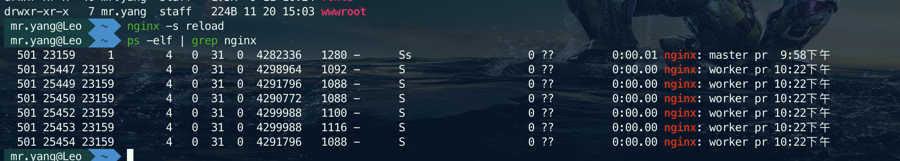

#### 配置
worker_processes
> 操作系统启动多少个工作进程运行Nginx。注意是工作进程，不是有多少个nginx工程。在Nginx运行的时候，会启动两种进程，一种是主进程master process；一种是工作进程worker process。例如我在配置文件中将worker_processes设置为4，启动Nginx后，使用进程查看命令观察名字叫做nginx的进程信息，我会看到如下结果：

图中可以看到1个nginx主进程，master process；还有6个工作进程，worker process。主进程负责监控端口，协调工作进程的工作状态，分配工作任务，工作进程负责进行任务处理。一般这个参数要和操作系统的CPU内核数成倍数。

# 端口转发
> 意思是，把本机电脑的端口接收的流量，转发到虚拟机对应端口上,MySQL 默认运行在虚拟机的 3306 端口，你要在本机找一个端口，跟虚拟机里的 3306 端口做一个转发，才能在本地访问到虚拟机里的 MySQL

nginx -c 配置地址
nginx -s reload
nginx stop
nginx -t 确认配置文件正确