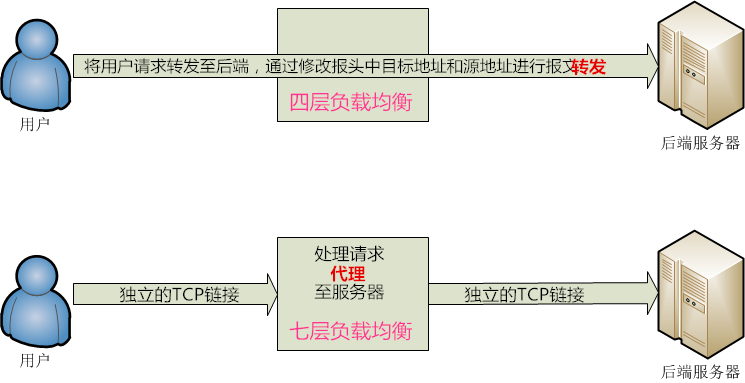

## 四层和七层负载均衡的特点及常用负载均衡Nginx、Haproxy、LVS对比

### 一、四层与七层负载均衡在原理上的区别

#### 图示：

四层负载均衡与七层负载均衡在工作原理上的简单区别如下图：

#### 概述：
1. 四层负载均衡工作在OSI模型中的四层，即传输层。四层负载均衡只能根据报文中目标地址和源地址对请求进行转发，而无法修改或判断所请求资源的具体类型，然后经过负载均衡内部的调度算法转发至要处理请求的服务器。四层负载均衡单纯的提供了终端到终端的可靠连接，并将请求转发至后端，连接至始至终都是同一个。LVS就是很典型的四层负载均衡。

2. 七层负载均衡工作在OSI模型的第七层应用层，所以七层负载均衡可以基于请求的应用层信息进行负载均衡，例如根据请求的资源类型分配到后端服务器，而不再是根据IP和端口选择。七层负载均衡的功能更丰富更灵活，也能使整个网络更智能。如上图所示，在七层负载均衡两端(面向用户端和服务器端)的连接都是独立的。

3. 简言之，四层负载均衡就是基于IP+端口实现的。七层负载均衡就是通过应用层资源实现的。

#### 二、常用负载均衡软件对比
LVS的特点：
1. 抗负载能力强。抗负载能力强、性能高，能达到F5硬件的60%；对内存和cpu资源消耗比较低
2. 工作在网络4层，通过vrrp协议转发（仅作分发之用），具体的流量由linux内核处理，因此没有流量的产生。
3. 稳定性、可靠性好，自身有完美的热备方案；（如：LVS+Keepalived）
4. 应用范围比较广，工作在四层，所以不用考虑要处理的具体应用，可以对所有应用做负载均衡；
5. 不支持正则处理，不能做动静分离。
6. 支持负载均衡算法：rr（轮循）、wrr（带权轮循）、lc（最小连接）、wlc（权重最小连接）
7. 配置 复杂，对网络依赖比较大，稳定性很高。

Ngnix的特点：
1. 工作在网络的7层之上，可以针对http应用做一些分流的策略，比如针对域名、目录结构；
2. Nginx对网络的依赖比较小，理论上能ping通就就能进行负载功能；
3. Nginx安装和配置比较简单，测试起来比较方便；
4. 也可以承担高的负载压力且稳定，一般能支撑超过1万次的并发；
5. 对后端服务器的健康检查，只支持通过端口来检测，不支持通过url来检测。
6. Nginx对请求的异步处理可以帮助节点服务器减轻负载；
7. Nginx仅能支持http、https和Email协议，这样就在适用范围较小。
8. 不支持Session的直接保持，但能通过ip_hash来解决。
9. 支持负载均衡算法：Round-robin（轮循）、Weight-round-robin（带权轮循）、Ip-hash（Ip哈希）
10. Nginx还能做Web服务器即Cache功能。

HAProxy的特点：
1. 支持两种代理模式：TCP（四层）和HTTP（七层），支持虚拟主机；
2. 能够补充Nginx的一些缺点比如Session的保持，Cookie的引导等工作
3. 支持url检测后端的服务器出问题的检测会有很好的帮助。
4. 更多的负载均衡策略比如：动态加权轮循(Dynamic Round Robin)，加权源地址哈希(Weighted Source Hash)，加权URL哈希和加权参数哈希(Weighted Parameter Hash)已经实现
5. 单纯从效率上来讲HAProxy更会比Nginx有更出色的负载均衡速度。
6. HAProxy可以对Mysql进行负载均衡，对后端的DB节点进行检测和负载均衡。
7. 支持负载均衡算法：Round-robin（轮循）、Weight-round-robin（带权轮循）、source（原地址保持）、RI（请求URL）、rdp-cookie（根据cookie）
8. 不能做Web服务器即Cache