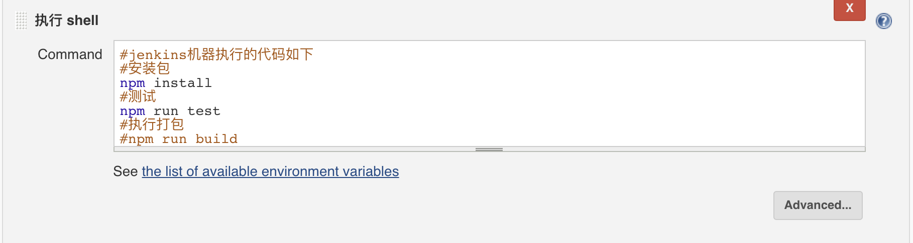
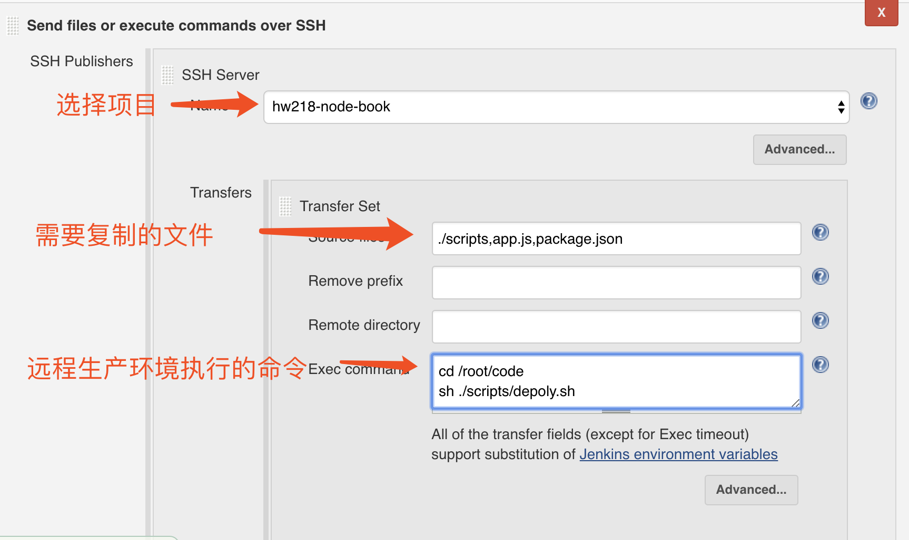

#### webpakc
模块化是一种将系统分离成独立功能部分的方法，严格定义模块接口、模块间具有透明性


参考 ：https://www.jianshu.com/p/0bdf3ad57074

#### 持续集成 Continuous Integration
- 是指软件个人研发的部分向软件整体部分交付，以便尽早发现个人开发部分的问题；
- 目的，就是让产品可以快速迭代，同时还能保持高质量。
- 它的核心措施是，代码集成到主干之前，必须通过自动化测试。只要有一个测试用例失败，就不能集成。
- Martin Fowler说过，"持续集成并不能消除Bug，而是让它们非常容易发现和改正。"

#### 持续交付 Continuous Delivery:
- 频繁地将软件的新版本，交付给质量团队或者用户，以供评审尽早发现生产环境中存在的问题；
- 如果评审通过，代码就进入生产阶段；

#### 持续部署 Continuous Deployment:
- 是代码尽快向可运行的开发/测试节交付，以便尽早测试；
- 是持续交付的下一步，指的是代码通过评审以后，自动部署到生产环境。
- 持续部署的目标是，代码在任何时刻都是可部署的，可以进入生产阶段。
- 持续部署的前提是能自动化完成测试、构建、部署等步骤。

#### 流程
- 根据持续集成的设计，代码从提交到生产，整个过程有以下几步。
1. 提交
流程的第一步，是开发者向代码仓库提交代码。所有后面的步骤都始于本地代码的一次提交（commit）。
2. 测试（第一轮）
代码仓库对commit操作配置了钩子（hook），只要提交代码或者合并进主干，就会跑自动化测试。<br>
测试有好几种。
- 单元测试：针对函数或模块的测试
- 集成测试：针对整体产品的某个功能的测试，又称功能测试
- 端对端测试：从用户界面直达数据库的全链路测试
第一轮至少要跑单元测试。
3. 构建
- 通过第一轮测试，代码就可以合并进主干，就算可以交付了。
- 交付后，就先进行构建（build），再进入第二轮测试。所谓构建，指的是将源码转换为可以运行的实际代码，比如安装依赖，配置各种资源（样式表、JS脚本、图片）等等。
- 常用的构建工具如下。
  - Jenkins
  - Travis
  - Codeship
  - Strider
Jenkins和Strider是开源软件，Travis和Codeship对于开源项目可以免费使用。它们都会将构建和测试，在一次运行中执行完成。
4. 测试（第二轮）
- 构建完成，就要进行第二轮测试。如果第一轮已经涵盖了所有测试内容，第二轮可以省略，当然，这时构建步骤也要移到第一轮测试前面。
- 第二轮是全面测试，单元测试和集成测试都会跑，有条件的话，也要做端对端测试。所有测试以自动化为主，少数无法自动化的测试用例，就要人工跑。
- 需要强调的是，新版本的每一个更新点都必须测试到。如果测试的覆盖率不高，进入后面的部署阶段后，很可能会出现严重的问题。
5. 部署
- 通过了第二轮测试，当前代码就是一个可以直接部署的版本（artifact）。将这个版本的所有文件打包（ tar filename.tar * ）存档，发到生产服务器。
- 生产服务器将打包文件，解包成本地的一个目录，再将运行路径的符号链接（symlink）指向这个目录，然后重新启动应用。这方面的部署工具有Ansible，Chef，Puppet等。
6. 回滚
- 一旦当前版本发生问题，就要回滚到上一个版本的构建结果。最简单的做法就是修改一下符号链接，指向上一个版本的目录。


#### Jenkins 作业
1. 拥有项目 github svn
2. 必须有test项目(没有测试，那就没有CI的必要)：接口测试,E2E测试 ---> 这两个测试必须要写
3. CI安装在 本机 or 公司专门的CI机器
4. 本机提交代码 github  ci机器钩子 编译 送到 开发机、测试器
5. ci网页 是把命令行的东西显示出来 所以 前台进程不能卡住
    ```
    前端代码 提交 CI / 人肉 / 一段 test
    失败了 不用部署到远程机器
    成功了之后 拷贝 app.js .. scripts (shell) 干活
    （ci不神 免密+远程执行linux 脚本）
    发邮件 CI 打电话 发QQ 发微信
    ```
6. 免密 装jenkins 这台机器上
  -  ssh-add:把专用密钥添加到ssh-agent的高速缓存中,该命令位置在/usr/bin/ssh-add。
      ```
      -D：删除ssh-agent中的所有密钥.
      -d：从ssh-agent中的删除密钥
      -e pkcs11：删除PKCS#11共享库pkcs1提供的钥匙。
      -s pkcs11：添加PKCS#11共享库pkcs1提供的钥匙。
      -L：显示ssh-agent中的公钥
      -l：显示ssh-agent中的密钥
      -t life：对加载的密钥设置超时时间，超时ssh-agent将自动卸载密钥 -X：对ssh-agent进行解锁
      -x：对ssh-agent进行加锁
      ```
  - ssh host "cd /;ls"(cmd命令，用分号隔开), 远程服务器执行命令
7. 建议远程的主机 安装好需要的东西 yarn node npm pm2 git
8. 静态资源服务器 给老大看报告 nginx配置 CI 代码bug
9. 安装Jenkins 三个密码
    ```
    Jenkins用户 大有研究 root
    初始化用户名和密码
    管理密码 github svn。。。。
    ```
10. 前端代码提交完成 -> 提交成功了 -> scripts文件夹copy到远程服务器并且执行
11. nodejs插件 服务器没有 publish over ssh 远程主机打交道的
12. 主页面 -> 系统管理 -> 管理插件 -> 安装 publish over ssh
13. 主页面 -> 系统管理 -> 系统设置 -> publish over ssh  (hw218-node-book) 114.116.51.218
14. 主页面 -> 系统管理 -> 系统设置 -> path 执行远程命令的时候 npm
    ```
    PATH    /bin/;/sbin/;/user/bin;/user/local/bin
    ```
15. 项目配置中的 Build (代码来了你让他干什么，这个是jinkens机器运行跑)
    1. 执行shell
    
    ```
    npm install
    npm test
    npm run build
    cp -r dist 192.
    ```
    2. Send files or execute commands over ssh
    
    ```
    选择项目
    ```
