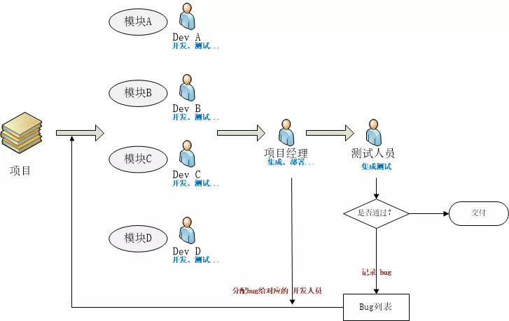
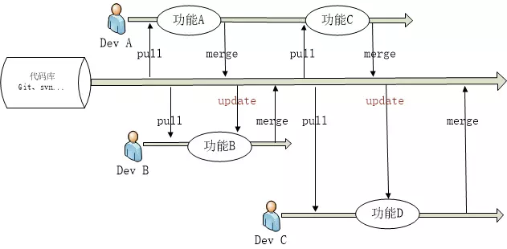

[为什么要持续集成]: https://www.jianshu.com/p/1cd01bcc77f2

[为什么要持续集成]

#### 传统的开发模式

存在的问题

1. Bug总是在最后才出现。
2. 越到项目后期，问题越难解决。
3. 软件交付时机无法保障。
4. 程序经常需要变更。某些项目中，程序会经常需要变更，特别是敏捷开发实践者。
5. 无效的等待变多。开发在等待集成其他人的模块，测试人员在等待开发修复Bug，产品经理在等待新版本上线给客户做演示，项目经理在等待其他人提交代码。
6. 用户的满足度低。

#### 持续集成 持续集成(Continuous integration)

什么是持续集成

  在软件工程中，持续集成（CI）是指将所有开发者的工作副本每天多次合并到主干的做法。Grady Booch 在1991年的 Booch method 中首次命名并提出了 CI 的概念，尽管在当时他并不主张每天多次集成。而 XP（Extreme programming，极限编程）采用了 CI 的概念，并提倡每天不止一次集成。
持续集成服务器

  持续集成服务器就是能够采用自动化的手段，来解放人的双手，实现项目持续集成的工具。与之配套的软件有TeamCity、Jenkins、Go等。

**持续集成的工作模式**

**核心措施**

代码集成到主干之前，必须通过自动化测试。只要有一个测试用例失败，就不能集成。

**持续集成的好处**
1. 解放了重复性劳动。
- 自动化部署工作可以解放集成、测试、部署等重复性劳动，而机器集成的频率明显比手工高很多。
2. 更快地修复问题。
- 持续集成更早的获取变更，更早的进入测试，更早的发现问题，解决问题的成本显著下降。
3. 更快的交付成果。
- 更早发现错误减少解决错误所需的工作量。集成服务器在构建环节发现错误可以及时通知开发人员修复。集成服务器在部署环节发现错误可以回退到上一版本，服务器始终有一个可用的版本。
4. 减少手工的错误。
- 在重复性动作上，人容易犯错，而机器犯错的几率几乎为零。
5. 减少了等待时间。
- 缩短了从开发、集成、测试、部署各个环节的时间，从而也就缩短了中间可以出现的等待时机。持续集成，意味着开发、集成、测试、部署也得以持续。
6. 更高的产品质量。
- 集成服务器往往提供代码质量检测等功能，对不规范或有错误的地方会进行标致，也可以设置邮件和短信等进行警告。

**持续集成的最佳实践**

1. 频繁检出代码。
- 有时候代码冲突无可避免，频繁检出代码，可以让本地的副本和代码库中的版本最小差异化。
2. 频繁提交代码。
- 与1的原理类似，频繁提交代码，可以让其他人检出副本和代码库中的版本最小差异化。
3. 减少分支，回归主干。
- 多个分支并行应及早将变更集成到主干中，避免同时维护软件的多个版本。
4. 使用自动化构建。
- 可以使用Maven、Ant等来实现自动化构建，可以在构建过程中实现自动化测试。前提是有写单元测试用例。
5. 提交测试。
- 在提交工作之前，每个程序员必须本地集成所有代码，做一个完整的构建和运行，并通过所有的单元测试，这样能减少集成测试在集成服务器上构建失败的风险。
6. 当前状态对每个人都可见。
- 集成服务器在持续集成过程中发现问题应及时发送警告给相关的干系人。

解决方案博客 ：https://www.cnblogs.com/wintersun/p/6285815.html