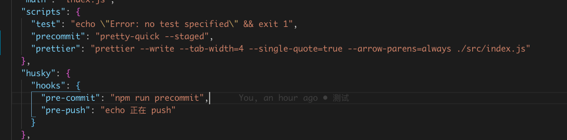

### <font color=#1C86EE>husky</font>

<font color=#1C86EE>[husky](https://www.npmjs.com/package/husky)</font>工具可以在命令前挂一些钩子，如果钩子命令执行有问题，那么后面的命令无法执行，比如在git提交命令上挂钩子可以有效组织团队成员不合格代码的提交

#### 安装
```
npm install husky --save-dev
```
```
// package.json
{
  "husky": {
    "hooks": {
      "pre-commit": "npm test",
      "pre-push": "npm test",
      "...": "..."
    }
  }
}
```
#### 卸载
```
npm uninstall husky --save-dev
```

### <font color=#1C86EE>[prettier](https://prettier.io/docs/en/cli.html)</font>
#### 安装
```
npm install --global prettier //全局安装后就可以直接在cli使用 perttier 命令
```
```
npm install --save-dev --save-exact prettier
```
#### 基本语法
```
prettier [opts] [filename ...]
```
```
prettier --write ./**/*.js
```

<font color=#1C86EE>--debug-check</font>

如果您担心Prettier会更改代码的正确性，请添加--debug-check到命令中。这将导致Prettier在检测到代码正确性可能已更改时打印错误消息。注意--write不能用--debug-check。


#### 参数
```
prettier --write --tab-width=4 --single-quote=true --arrow-parens=always ./src/index.js
```

https://prettier.io/docs/en/options.html

--tab-width \<int>    标签宽度，指定每个缩进级别的空格数    默认2

--use-tabs \<boolean> 使用制表符缩进行而不是空格。         默认false

--single-quote \<boolean> 使用单引号而不是双引号。        默认 false

--arrow-parens \<avoid|always>  箭头功能
- "avoid" - 尽可能省略parens。例：x => x
- "always" - 始终包括parens。例：(x) => x
