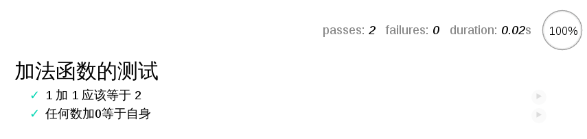
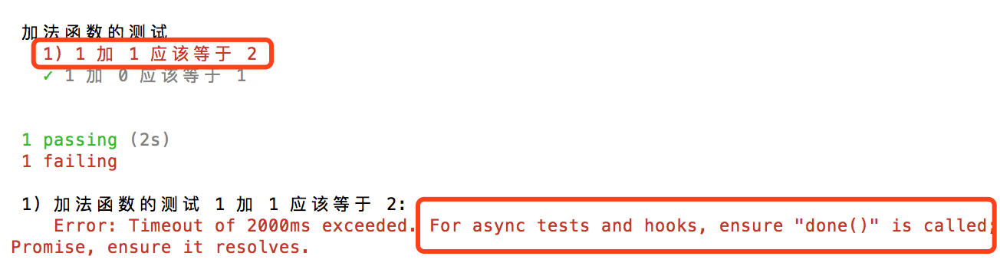
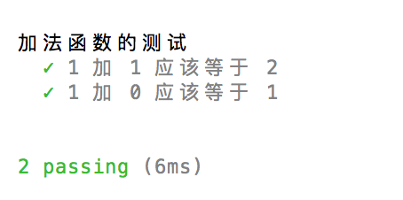
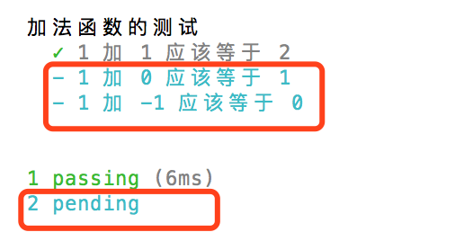

### 基本命令用法
- mocha命令后面紧跟测试脚本的路径和文件名，可以指定多个测试脚本。
  ```
  mocha file1 file2 file3
  ```
- Mocha默认运行test子目录里面的测试脚本。所以，一般都会把测试脚本放在test目录里面，然后执行mocha就不需要参数了。
  ```
  mocha
  ```
- Mocha默认只执行test子目录下面第一层的测试用例，不会执行更下层的用例。必须加上--recursive参数，这时test子目录下面所有的测试用例----不管在哪一层----都会执行。
  ```
  mocha --recursive
  ```
- 通配符
  ```
  mocha spec/{my,awesome}.js
  mocha test/unit/*.js
  ```
  上面的第一行命令，指定执行spec目录下面的my.js和awesome.js。第二行命令，指定执行test/unit目录下面的所有js文件。

  除了使用Shell通配符，还可以使用Node通配符。
  ```
  mocha 'test/**/*.@(js|jsx)'
  ```
  上面代码指定运行test目录下面任何子目录中、文件后缀名为js或jsx的测试脚本。注意，Node的通配符要放在单引号之中，否则星号（*）会先被Shell解释。

  上面这行Node通配符，如果改用Shell通配符，要写成下面这样。
  ```
   mocha test/{,**/}*.{js,jsx}
  ```
- --reporter, -R
  > --reporter参数用来指定测试报告的格式，默认是spec格式。
  ```
  mocha
  等同于
  mocha --reporter spec
  ```
  --reporters参数可以显示所有内置的报告格式。
  ```
  mocha --reporters
  ```
  使用<font color=#1C86EE>**mochawesome**</font>模块，可以生成漂亮的HTML格式的报告。
  ```
  npm install --save-dev mochawesome
  ../node_modules/.bin/mocha --reporter mochawesome
  ```
- --watch，-w
  > --watch参数用来监视指定的测试脚本。只要测试脚本有变化，就会自动运行Mocha。
  ```
  mocha --watch
  ```
  上面命令执行以后，并不会退出。你可以另外打开一个终端窗口，修改test目录下面的测试脚本add.test.js，比如删除一个测试用例，一旦保存，Mocha就会再次自动运行。
- --bail, -b
  > --bail参数指定只要有一个测试用例没有通过，就停止执行后面的测试用例。这对持续集成很有用。
  ```
  $ mocha --bail
  ```
- --grep, -g
  > --grep参数用于搜索测试用例的名称（即it块的第一个参数），然后只执行匹配的测试用例。
  ```
  mocha --grep "1 加 1"
  ```
- --invert, -i
  > --invert参数表示只运行不符合条件的测试脚本，必须与--grep参数配合使用。
  ```
  mocha --grep "1 加 1" --invert
  ```
### 配置文件<font color=#1C86EE>mocha.opts</font>
Mocha允许在test目录下面，放置配置文件mocha.opts，把命令行参数写在里面。请先进入demo03目录，运行下面的命令。
```
mocha --recursive --reporter tap --growl
```
上面这个命令有三个参数--recursive、--reporter tap、--growl。

然后，把这三个参数写入test目录下的mocha.opts文件。
```
--reporter tap
--recursive
--growl
```
然后，执行mocha就能取得与第一行命令一样的效果。
```
mocha
```
如果测试用例不是存放在test子目录，可以在mocha.opts写入以下内容。
```
server-tests
--recursive
```

上面代码指定运行server-tests目录及其子目录之中的测试脚本。

#### 异步测试

- Mocha默认每个测试用例<font color=#1C86EE>最多执行2000毫秒</font>，如果到时没有得到结果，就报错。对于涉及异步操作的测试用例，这个时间往往是不够的，需要用-t或--timeout参数指定超时门槛。

  ```
  mocha -t 5000 timeout.test.js
  ```

  上面命令将测试的超时时限指定为5000毫秒。

  另外，上面的测试用例里面，有一个done函数。it块执行的时候，传入一个done参数，当测试结束的时候，必须显式调用这个函数，告诉Mocha测试结束了。否则，Mocha就无法知道，测试是否结束，会一直等到超时报错。你可以把这行删除试试看。
- Mocha默认会高亮显示<font color=#1C86EE>超过75毫秒</font>的测试用例，可以用-s或--slow调整这个参数。

  ```
  mocha -t 5000 -s 1000 timeout.test.js
  ```
  上面命令指定高亮显示耗时超过1000毫秒的测试用例。

- 另外，<font color=#1C86EE>Mocha内置对Promise的支持</font>，允许直接返回Promise，等到它的状态改变，再执行断言，而不用显式调用done方法。请看promise.test.js。
  ```
  it('异步请求应该返回一个对象', function() {
    return fetch('https://api.github.com')
      .then(function(res) {
        return res.json();
      }).then(function(json) {
        expect(json).to.be.an('object');
      });
  });

  ```
#### 测试用例的钩子
  Mocha在describe块之中，提供测试用例的四个钩子：<font color=#1C86EE>before()、after()、beforeEach()和afterEach()</font>。它们会在指定时间执行。
  ```
  describe('hooks', function() {

    before(function() {
      // 在本区块的所有测试用例之前执行
    });

    after(function() {
      // 在本区块的所有测试用例之后执行
    });

    beforeEach(function() {
      // 在本区块的每个测试用例之前执行
    });

    afterEach(function() {
      // 在本区块的每个测试用例之后执行
    });

    // test cases
  });

  ```

#### 测试用例管理
大型项目有很多测试用例。有时，我们希望只运行其中的几个，这时可以用<font color=#1C86EE>only</font>方法。describe块和it块都允许调用only方法，表示只运行某个测试套件或测试用例。
```
it.only('1 加 1 应该等于 2', function() {
  expect(add(1, 1)).to.be.equal(2);
});

it('任何数加0应该等于自身', function() {
  expect(add(1, 0)).to.be.equal(1);
});
```
上面代码中，只有带有only方法的测试用例会运行。
```
$ mocha test/add.test.js

  加法函数的测试
    ✓ 1 加 1 应该等于 2

  1 passing (10ms)
```
此外，还有skip方法，表示跳过指定的测试套件或测试用例。
```
it.skip('任何数加0应该等于自身', function() {
  expect(add(1, 0)).to.be.equal(1);
});

```
上面代码的这个测试用例不会执行。


#### 浏览器测试

除了在命令行运行，Mocha还可以在浏览器运行。



首先，使用mocha init命令在指定目录生成初始化文件。
```
mocha init demo08
```
运行上面命令，就会在demo08目录下生成index.html文件，以及配套的脚本和样式表。
```
<!DOCTYPE html>
<html>
  <body>
    <h1>Unit.js tests in the browser with Mocha</h1>
    <div id="mocha"></div>
    <script src="mocha.js"></script>
    <script>
      mocha.setup('bdd');
    </script>
    <script src="tests.js"></script>
    <script>
      mocha.run();
    </script>
  </body>
</html>
```
然后，新建一个源码文件add.js。
```
// add.js
function add(x, y) {
  return x + y;
}
```
然后，把这个文件，以及断言库chai.js，加入index.html。
```
<script>
  mocha.setup('bdd');
</script>
<script src="add.js"></script>
<script src="http://chaijs.com/chai.js"></script>
<script src="tests.js"></script>
<script>
  mocha.run();
</script>
```
最后，在tests.js里面写入测试脚本。
```
var expect = chai.expect;

describe('加法函数的测试', function() {
  it('1 加 1 应该等于 2', function() {
    expect(add(1, 1)).to.be.equal(2);
  });

  it('任何数加0等于自身', function() {
    expect(add(1, 0)).to.be.equal(1);
    expect(add(0, 0)).to.be.equal(0);
  });
});
```
现在，在浏览器里面打开index.html，就可以看到测试脚本的运行结果。

#### 生成规格文件
Mocha支持从测试用例生成规格文件。
```
mocha --recursive -R markdown > spec.md
```
上面命令根据test目录的所有测试脚本，生成一个规格文件spec.md。-R markdown参数指定规格报告是markdown格式。

如果想生成HTML格式的报告spec.html，使用下面的命令。
```
mocha --recursive -R doc > spec.html
```

> 参考：http://www.ruanyifeng.com/blog/2015/12/a-mocha-tutorial-of-examples.html

---

###概念
- Mocha: Javascript测试框架
- chai：断言库，需配合Mocha使用

### 最简单的用法
#### 步骤一：安装
```
/*全局安装*/
$ npm install --global mocha　　

/*局部安装*/
$ npm install --save-dev mocha
```
```
安装chai

/*局部安装*/
$ npm install --save-dev chai
```
全局与局部的区别：若是局部安装，依赖就会写入package.json的dependencies或devDependencies中，这样当别人从你的Github上克隆代码时，就不需要注意‘依赖包全不全啊’？‘还需不要安装其他依赖啊？’等等这类的问题，因为'npm install'会将所有依赖下载到本地

#### 步骤二：编写Js源文件与测试文件
源文件
```
// add.js
 function add(x, y) {
   return x + y;
 }

 module.exports = add;
```

测试文件
```
// add.test.js
var add = require('./add.js');
var expect = require('chai').expect;

describe('加法函数的测试', function() {
  it('1 加 1 应该等于 2', function() {
    expect(add(1, 1)).to.be.equal(2);
  });
  it('1 加 -1 应该等于 0', function() {
    expect(add(1, -1)).to.be.equal(0);
  });
});
```

#### 步骤三：运行测试文件
```
mocha add.test.js
```
### 进阶

#### 进阶一：describe和it是什么？

describe："测试组"，也称测试块，表示我要进行一系列测试，相当于一个group

it："测试项"，也称测试用例，表示这是"一系列测试"中的一项，相当于item，如何测试？测试逻辑？都是在it的回调函数中实现的

#### 进阶二：什么？describe也有"生命周期"？

每个测试块（describe）有4个周期，分别是：

```
describe('test', function() {
  // 在本测试块的所有测试用例之前执行且仅执行一次
  before(function() {

  });
  // 在本测试块的所有测试用例之后执行且仅执行一次
  after(function() {

  });

  // 在测试块的每个测试用例之前执行（有几个测试用例it，就执行几次）
  beforeEach(function() {

  });
  // 在测试块的每个测试用例之后执行（同上）
  afterEach(function() {

  });

  // 测试用例
  it('test item1', function () {

  })
});
```
#### 进阶三：在进阶二中周期代码是ES6风格，需要安装babel模块转码

这里分两种情况：
1. 全局安装
2. 局部安装

如果是全局方式安装的babel，那么我们也要使用全局的Mocha来调用babel-core模块
```
$ npm install -g babel-core babel-preset-es2015
$ mocha --compilers js:babel-core/register
```
但如果是局部方式安装的babel，那么我们就要使用局部的Mocha来调用babel-core模块
```
$ npm install --save-dev babel-core babel-preset-es2015
$ ../node_modules/mocha/bin/mocha --compilers js:babel-core/register
```
为什么呢？因为Mocha是根据自身的路径来寻找babel模块的，所以要全局对应全局，局部对应局部

这里少了很重要的一步：在测试之前，需要配置babel转码规则，在项目根目录，记住‘一定要是根目录’，新建.babelrc文件，这个文件是供babel使用的
```
// .babelrc
{
  "presets": [ "es2015" ] //这里制定使用es2015规则转码
}
```
#### 进阶四：测试还可以是异步的？

异步测试与普通测试有什么不同：测试用例的回调函数中多了一个参数done

```
var add = require('../src/add.js');
var expect = require('chai').expect;

describe('加法函数的测试', function() {
  // 异步测试
  it('1 加 1 应该等于 2', function(done) {
    var clock = setTimeout(function () {
      expect(add(1, 1)).to.be.equal(2);
      done(); // 通知Mocha测试结束
    },1000);
  });

  // 同步测试
  it('1 加 0 应该等于 1', function() {
    expect(add(1, 0)).to.be.equal(1);
  });
});
```
异步测试需要注意一点：必须手动调用done，否则该异步测试就会失败，见下方代码与运行截图：

代码：
```
var add = require('../src/add.js');
var expect = require('chai').expect;

describe('加法函数的测试', function() {
  // 异步测试
  it('1 加 1 应该等于 2', function(done) {
    var clock = setTimeout(function () {
      expect(add(1, 1)).to.be.equal(2);
      //done();我们不主动调用done，看看会发生什么？
    },1000);
  });

  // 同步测试
  it('1 加 0 应该等于 1', function() {
    expect(add(1, 0)).to.be.equal(1);
  });
});
```
运行截图：



从运行结果不难看出，测试用例1失败了，而且Mocha提示我们：如果是异步测试或钩子，那么一定要确保done方法被调用，否则测试就会失败，但并不会影响其他用例

那么，异步测试有哪些应用场景呢？那就是测试数据接口，我们可以这样：

```
it('异步请求测试', function() {
  return fetch('https://api.github.com')
    .then(function(res) {
      return res.json();
    }).then(function(json) {
      expect(json).to.be.an('object'); // 测试接口返回的是否为对象类型的数据，也就是json格式
    });
});
```
进阶五：如果我们想只执行某个测试用例呢？或者除了某个用例，其他的都执行

Mocha有两个用例管理api：only和skip

1. 如果只想执行某个用例，我们就用only方式调用它：

```
var add = require('../src/add.js');
var expect = require('chai').expect;

describe('加法函数的测试', function() {
  // 一个测试组中不是只能有一个only，可以有多个only方式执行的用例
  it.only('1 加 1 应该等于 2', function() {
    expect(add(1, 1)).to.be.equal(2);
  });


  it.only('1 加 0 应该等于 1', function() {
    expect(add(1, 0)).to.be.equal(1);
  });

  // 但如果组内已经有了only，那么非only方式执行的用例就一定不会被执行，切记
  it('1 加 -1 应该等于 0', function() {
    expect(add(1, -1)).to.be.equal(0);
  });

});
```
运行截图：



可以看出，第三个用例并没有被执行

2. 如果想跳过某个用例，我们就用skip方式调用它：
```
var add = require('../src/add.js');
var expect = require('chai').expect;

describe('加法函数的测试', function() {

  it('1 加 1 应该等于 2', function() {
    expect(add(1, 1)).to.be.equal(2);
  });

  // 同理，skip方式执行的用例在同一组内也可以有多个
  it.skip('1 加 0 应该等于 1', function() {
    expect(add(1, 0)).to.be.equal(1);
  });


  it.skip('1 加 -1 应该等于 0', function() {
    expect(add(1, -1)).to.be.equal(0);
  });

});2
```



第2，3个用例被跳过了

参考：https://www.cnblogs.com/sampapa/p/6963936.html