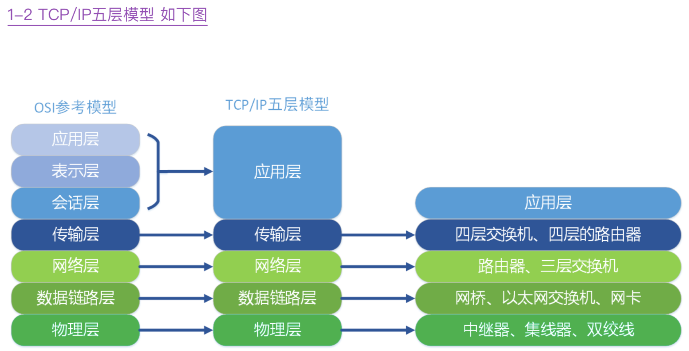

1.大家在开发Node.js的时候都知道异步的嵌套非常麻烦，有人叫回调地域有人叫回调 黑洞，请问如何解决这个问题?(5分)

答案:
```
模式.Promise/Defferred 如q.js Step、wind
ES6 Generator函数+Promise对象
Async await 函数
```
手写Promie

2.如何解释NodeJS 适用于IO密集型不适用CPU密集型?(5分)

答案:
```
2-1.Node还没有简单易易⽤用的多核计算接⼝口。Cluster并不不是那么好⽤用。
2-2.Node的单核效率虽然⽐比传统脚本语⾔言⾼高，但是和C，C++，Java⽐比并没有优势
```
多线程的通讯

3.请画出Node.js的异步事件回调机制的实现,并解释原理。(5分)


4.开完一个完整的Node程序，有UI层、Service层、DAO层、MODEL层等，我们要在交给 QA前需要编写测试用例。测试用例一般遵循测试金字塔(测试金字塔指的是在编写 测试用例时，底层的单元测试应该远比上层的端到端测试要多，如下图)请问在如下 三个阶段，都用什么样的技术进行测试用例的编写。(10分)


5.有人说Node是玩具，写错一处整个网站就挂。为了解决它你有什么办法么?(10分)

答案:
```
中间件处理理掉常⻅见的404 500
关键函数⽐比如请求进⾏行行封装 容错重试等
全部错误监听uncaughtExcetion
```
6-1.请你写出HTTP协议三次握手，四次挥手过程，并写出常见的HTTP Status Code标 明 他的含义、你知道的HTTP请求报头以及HTTP2的优点(5分)

6-2.你知道什么是OSI七层模型和TCP/IP五层模型么，请详细描述。

1-1.OSI七层模型如下图


1-2.TCP/IP五层模型 如下图




2.再来说TCP和HTTP的区别。
```
手机能够使⽤用联⽹网功能是因为⼿手机底层实现了了TCP/IP协议，可以 使⼿手机终端通过⽆无线⽹网络建⽴立TCP连接。TCP协议可以对上层⽹网络提供接⼝口，使上层⽹网络数据的 传输建⽴立在“⽆无差别”的⽹网络之上。HTTP协议是建⽴立在TCP协议之上的⼀一种应⽤用。
HTTP连接最显著的特点是客户端发送的每次请求都需要服务器器回送响应，在请求结束后，会 主动释放连接。从建⽴立连接到关闭连接的过程称为“⼀一次连接”。
```
3.三次握⼿手四次再⻅见就发⽣生在TCP层，如下是流程图。(不不懂的同学可以回看王⽼老
老师的HTTP协议)


4.常⻅见的HTTP相应状态码
```
返回的状态
1xx:指示信息--表示请求已接收，继续处理理
2xx:成功--表示请求已被成功接收、理理解、接受
3xx:重定向--要完成请求必须进⾏行行更更进⼀一步的操作
4xx:客户端错误--请求有语法错误或请求⽆无法实现
5xx:服务器器端错误—服务器器未能实现合法的请求
200:请求被正常处理理
204:请求被受理理但没有资源可以返回
206:客户端只是请求资源的⼀一部分，服务器器只对请求的部分资源执⾏行行GET⽅方法，相应报⽂文中通过 Content-Range指定范围的资源。
301:永久性重定向
302:临时重定向
303:与302状态码有相似功能，只是它希望客户端在请求⼀一个URI的时候，能通过GET⽅方法重定 向到另⼀一个URI上
304:发送附带条件的请求时，条件不不满⾜足时返回，与重定向⽆无关
307:临时重定向，与302类似，只是强制要求使⽤用POST⽅方法
400:请求报⽂文语法有误，服务器器⽆无法识别
401:请求需要认证
403:请求的对应资源禁⽌止被访问

404:服务器器⽆无法找到对应资源
500:服务器器内部错误
503:服务器器正忙
```

5.常⻅见HTTP⾸首部字段

1. 通⽤用⾸首部字段(请求报⽂文与响应报⽂文都会使⽤用的⾸首部字段)
```
Date:创建报⽂文时间
Connection:连接的管理理
Cache-Control:缓存的控制
Transfer-Encoding:报⽂文主体的传输编码⽅方式
```
2. 请求⾸首部字段(请求报⽂文会使⽤用的⾸首部字段)
```
Host:请求资源所在服务器器
Accept:可处理理的媒体类型
Accept-Charset:可接收的字符集
Accept-Encoding:可接受的内容编码
Accept-Language:可接受的⾃自然语⾔言
```
3. 响应⾸首部字段(响应报⽂文会使⽤用的⾸首部字段)
```
Accept-Ranges:可接受的字节范围
Location:令客户端重新定向到的URI
Server:HTTP服务器器的安装信息
```
4. 实体⾸首部字段(请求报⽂文与响应报⽂文的的实体部分使⽤用的⾸首部字段)
```
Allow:资源可⽀支持的HTTP⽅方法
Content-Type:实体主类的类型
Content-Encoding:实体主体适⽤用的编码⽅方式
Content-Language:实体主体的⾃自然语⾔言
Content-Length:实体主体的的字节数
Content-Range:实体主体的位置范围，⼀一般⽤用于发出部分请求时使⽤用
```
6.HTTP2优点

a、多路路复⽤用允许同时通过单⼀一的 HTTP/2 连接发起多重的请求-响应消息。⽐比原⽹网站提升6倍

b、头部压缩。在 应⽤用层(HTTP/2)和传输层(TCP or UDP)之间增加⼀一个⼆二进制分帧层。在 应⽤用 层(HTTP/2)和传输层(TCP or UDP)之间增加⼀一个⼆二进制分帧层。突破 HTTP1.1 的性能限制，改 进传输性能，实现低延迟和⾼高吞吐量量。

c、HTTP2服务端推送(Server Push)

感兴趣的同学可以安装wireshark对每层数据包进行查看。

7.看你简历中有说使用NodeJS完成BFF的架构搭建，你能说明下为什么你们团队使用
Node么以及具体的技术栈。(20分)

答案:
1. 削减API 提⾼高前端性能
2. 更更好的前后端分离 减少跨域
3. ⽅方便便前端⾃自主开发SSR
4. ⼤大规模的吞吐 适⽤用于开发游戏中间层

8.NodeJS使用了Scavenge、Mark-Sweep 、 Mark-compact算法进行垃圾回收，请绘制三种 算法的原理，并描述何种情况下会造成NodeJS的内存泄露，如何检测?(20分)


9.请你写出你能力范围的一个Node项目文件夹的划分，并标明他的作用。(10分)

答案:参考实战项⽬目

10.Nginx的反向代理是什么?怎么配置。PM2是什么?怎么配置。(10分)

答案:参考实战项⽬目