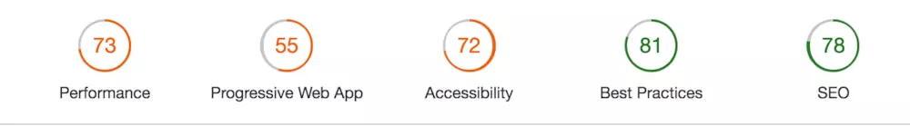
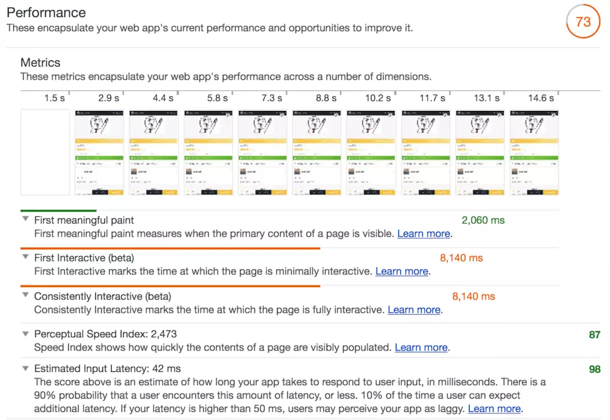
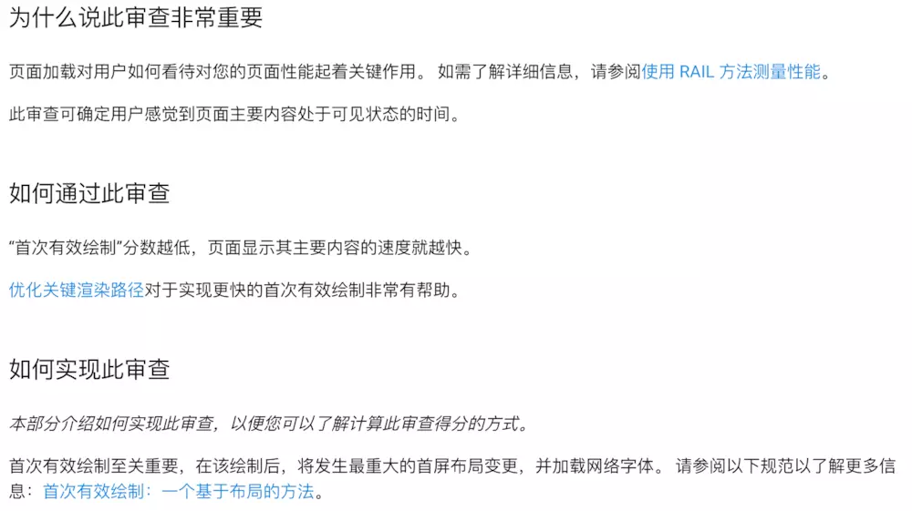
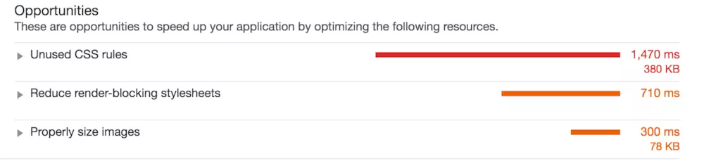
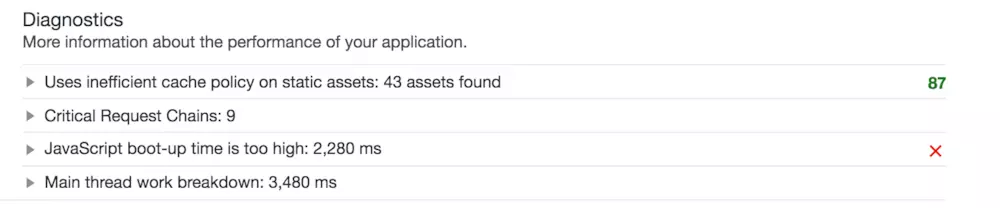
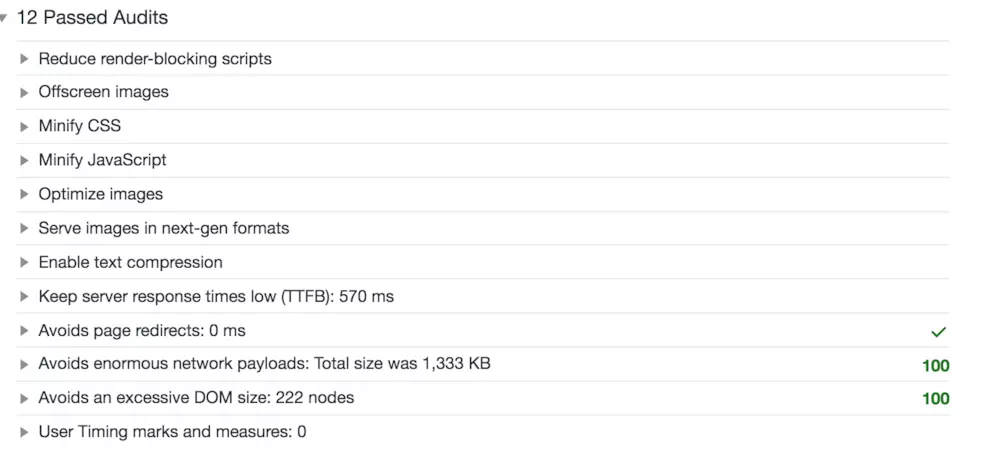
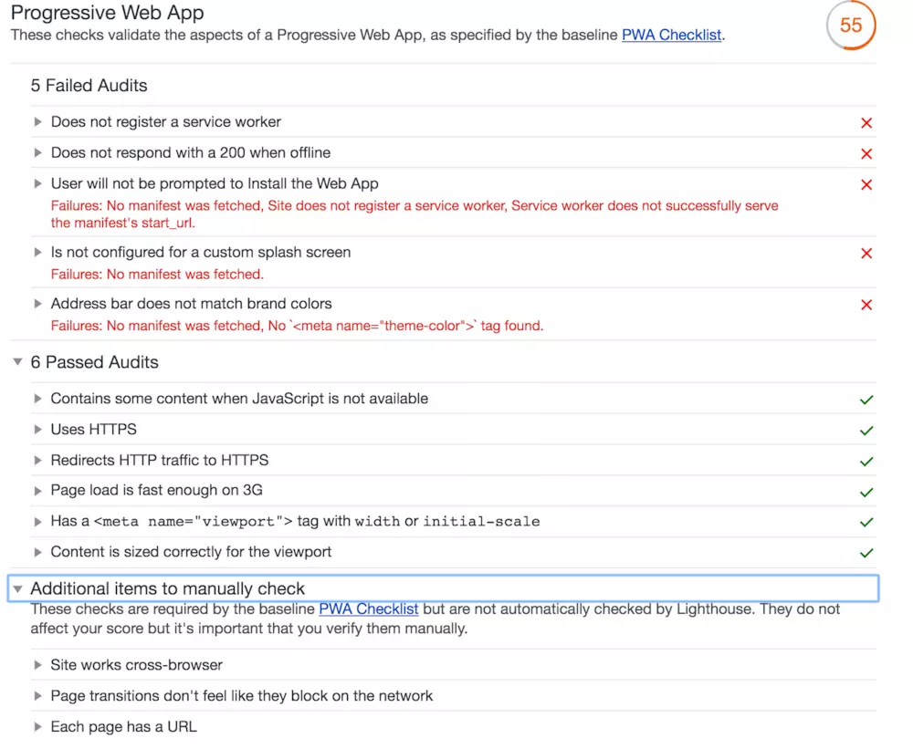
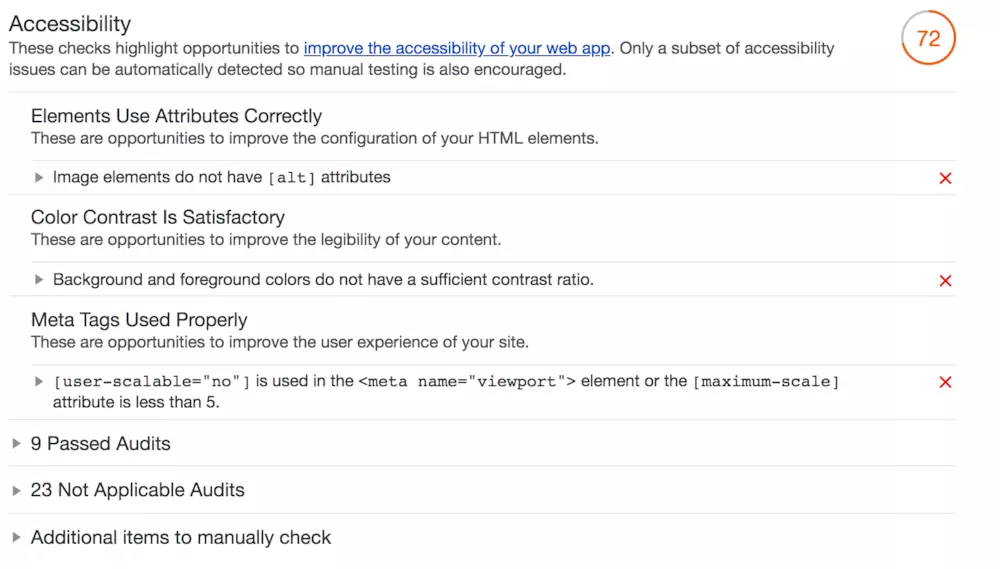
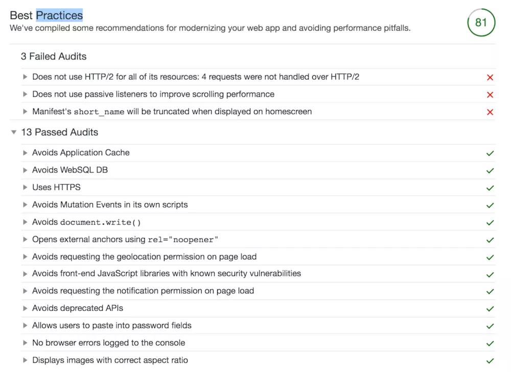
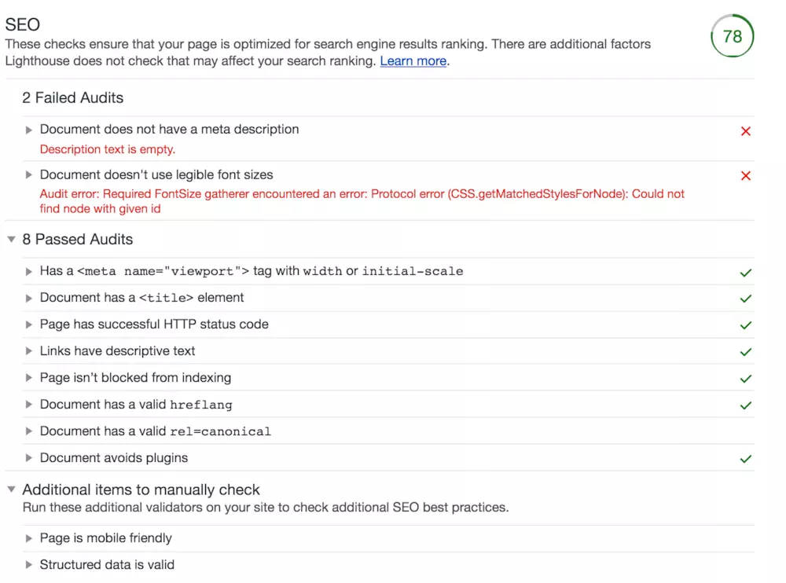

### Audits

>  [LightHouse]  是Google开源的一个自动化测试工具，之前只能以chrome插件或命令行方式运行。其通过一系列的规则来对网页进行评估分析，最终给出一份评估报告。 Audits就是LightHouse的第三种运行方式

废话不多说，你现在就可以打开DevTools，切换到Audits面板，开始方式不用多介绍，只有一个按钮，点击即可！Audits主要从5个方面来给网页打分，最终会生成一个report

这五个方面分别侧重不同的方向，我们会重点介绍一下性能相关，其他的粗略介绍一下：

#### 一、 Performance 性能

网页性能，这个不用多说，网页加载慢一秒，可能对应的就是多少客户的流失，所以大家都懂的。

1. Metrics 指标

    

- 首次有效绘制：可以简单理解为用户看到网页主要内容的时间，“首次有效绘制”分数越低，页面显示其主要内容的速度就越快。想上图中例子，网页首次有效绘制时间为2060ms。

    > 在这里强烈推荐大家点击每个指标后面的**Learn More**，来查看详细的指标介绍。在文档中，每一项指标都会明确的分为三个部分：为什么说此审查非常重要；如何通过此审查；如何实现此审查； 
    像本例的首次有效绘制，文档不但介绍了这个指标的意义，还附带了测量性能的论文，以及提高此项指标得分的方法：优化关键渲染路径。同时还介绍了有关首次有效绘制的理论：一种基于布局的方法。推荐大家把每个指标后面文档以及关联的链接都详细阅读下。
    

- 首次互动 ：页面加载完成大部分脚本后，cpu此时有空闲能力来处理用户交互操作的时间。此时用户如果与网页交互，可以在相对合理的时间取得网页反馈
- 持续互动 ：页面中的大多数网络资源完成加载并且CPU在很长一段时间都很空闲的所需的时间。此时可以预期cpu非常空闲，可以及时的处理用户的交互操作。
- 速度指标 ：速度指标是一个页面加载性能指标，向您展示明显填充页面内容的速度。 此指标的分数越低越好。
- 预计输入延迟时间 ：输入响应能力对用户如何看待您应用的性能起着关键作用。 应用有 100 毫秒的时间响应用户输入。如果超过此时间，用户就会认为应用反应迟缓。

2. Opportunities 可优化项

    

    这项里面的内容指的是LightHouse发现的一些可以直接优化的点，你可以对应这些点来进行优化，比如本例中：

- 未用到的Css ：发现了一些没有用到的css，浪费了带宽，同时有可能延缓了首屏加载时间。浏览器必须先处理当前网页的所有样式和布局信息，然后才能呈现内容。因此，浏览器会阻止呈现网页内容，直到外部样式表已下载完毕并处理完毕（这可能需要进行多次往返，因而可能会导致首次呈现时间延迟）
- 去除阻塞渲染的样式、脚本等：Lighthouse 列出了其检测到的所有阻塞渲染的链接或脚本。 我们应该去减少这些链接或脚本的数量。
- 合理压缩图片：对于实际展示区较小的图片，我们应该避免使用原图，而使用缩略图等，同时考虑使用压缩率较高的图片格式。

3. 手动诊断项目

    这些项目表示LightHouse并不能替你决定当前是好是坏，但是把详情列出来，由你手动排查每个项目的情况：

    

    如本例中所建议的：

- 使用更有效的缓存策略来尽量降低重复请求，下面详情是所有的缓存详情，你可以手动排查
- 关键调用链详情： 关键请求链的长度，可以手动排查降低关键调用链的长度与复杂度
- js解析编译执行时间详情：排查自己的js是否过于复杂，在这一项占用了过多时间。
- 和上一项意义类似，只是从另一个维度来评估你的js代码复杂程度

4. 通过的审查项目

    

    这里列出的都是你做的好的地方啦，像本例中列出的一些：减少阻塞渲染的脚本、图片懒加载、样式脚本压缩等等。

    不过即使做的好，依然值得我们进去仔细看一下，因为像所有条目一样，这里的每个条目也有一个showmore，我们可以点进去仔细学习背后的知识和原理！

#### 二、 PWA(Progressive Web App)

这一项很容易理解，其实就是检查网页对于PWA的兼容性，下面是本例的结果，由于这个网页没有对PWA做过任何优化，所以结果自然也就比价差了，我们可以粗略看下：

1. 失败项目
- 没有注册service worker
- 离线状态下没有返回200
- 没有指定pwa manifest，下面几条都是

2. 通过的检查：
- 不强依赖js显示
- 使用https
- 加载速度够快
- 使用viewport做移动端视口适配
- 内容视口匹配

3. 手动检查项
- 跨浏览器兼容
- 界面过度效果
- 非单页应用等

同样的，大家不要忘记了每一项后面的showmore，如果你做的网页有支持pwa计划的话，记得仔细点进去看哦！！

#### 三、Accessibility辅助功能

> 辅助功能指的是那些可能超出“典型”用户范围之外的用户的体验，他们以不同于你期望的方式访问你的网页或进行交互

辅助功能类别测试屏幕阅读器的能力和其他辅助技术是否能在页面中正常工作。例如：按元素来使用属性，ARIA属性的最佳实践，可辨别的元素命名等等。这一项我们不展开讲，但是从人道主义及网页规范角度，还是建议大家按照审计建议修改一下网页。

#### 四、Best Practice 最佳实践

本项指标是指LightHouse用业界公认的几项最佳实践来评估站点，然后看你有几项没有做到，几项做到了，例如：

- 永远使用https/http2加载资源
- 使用被动监听器提升网页滚动性能
- 指定一个short_name
- 避免应用缓存
- ...

不一个一个翻译了，还是建议大家点击showmore来仔细查看每一项的详细解释。业界最佳实践还是很值得我们学习的！

#### 五、SEO 搜索引擎优化

检查目的很明确，就是优化搜索引擎索引。例如：

1. 未通过：

- 文档没有设置描述meta
- 字体过小，不够清晰

2. 通过：

- 设置viewport
- 设置title元素
- 设置http请求成功响应码
- 连接设置描述文本
- 不要通过标记阻止爬虫抓取
- hreflang
- 权威连接 canonical links
- 禁用插件

3. 手动检查项目

- 移动端兼容性: 在这里Google还提供了一个简洁的移动端兼容性测试连接，大家可以到这里测试自己网站的移动端兼容性：
https://search.google.com/test/mobile-friendly

- 结构化网页数据： 同样有工具测试
https://search.google.com/structured-data/testing-tool/

