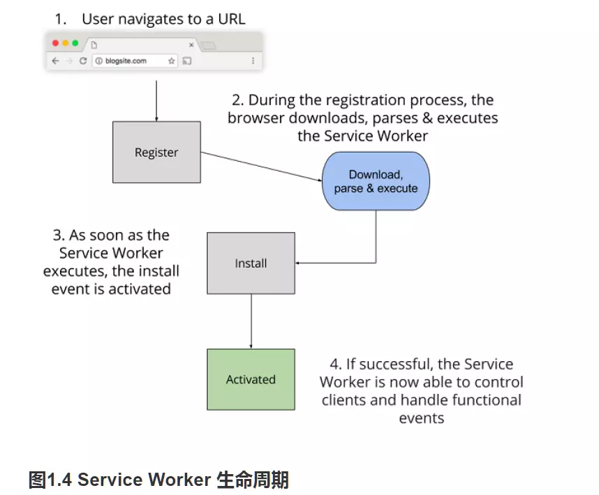
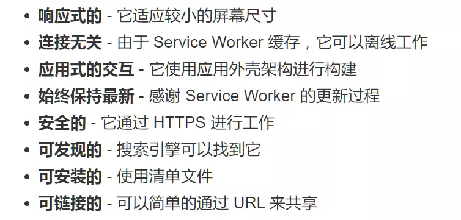

**PWA（Progressive Web App）**，渐进式网络应用。这些应用没有通过应用商店进行打包和部署，它们只是 **汲取了所需要的原生功能的网站而已**

- 优势：构建一个完全离线的网站，为用户提供几乎是瞬间加载的体验，同时对于不可靠的网络又是安全及富有弹性的

- 特点：响应式、独立于网络连接、类似原生应用的交互体验、始终保持更新、安全、可发现、可重连、可安装、可链接

- 核心原理：manifest文件清单 + Service Workers

#### Service Worker:

基本特点

- 运行在它自己的全局脚本上下文中
- 不绑定到具体的网页
- 无法修改网页中的元素，因为它无法访问 DOM
- 只能使用 HTTPS
- 拦截进出的 HTTP 请求，从而完全控制你的网站
- 与主JS线程独立，不会被阻塞
- 完全异步，无法使用localStorage
- 生命周期(想象成红绿灯)

    

- register (需要下载和解析，红灯)
- install (执行，黄灯)
- activated( 成功，绿灯)

Twitter PWA 细节

