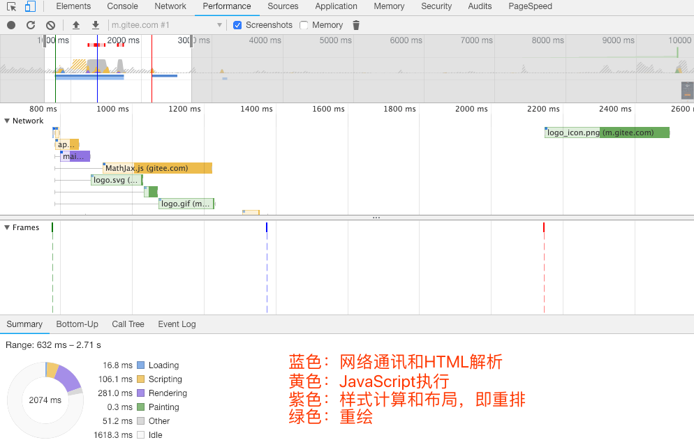

https://www.cnblogs.com/cherryblossom/p/5502591.html

- 网页动画能够做到每秒60帧，就会跟显示器同步刷新，一秒内进行60次重新渲染，每次重新渲染的事件不能超过16.66毫秒
    
- window.requestAninmationFrame() 下一次、
- window.requestldleCallback() 下几次重新渲染时

#### 触发分层
1. 获取DOM并将其分割为多个层
2. 将每个层独立的绘制到进程的位图中
3. 将层作为纹理上传至GPU(GPU帮助CPU分担渲染任务)
4. 复合多个层来生成最终的屏幕图像