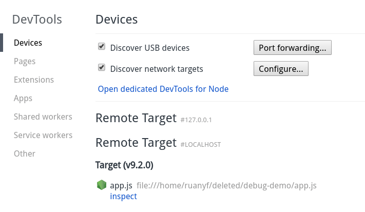
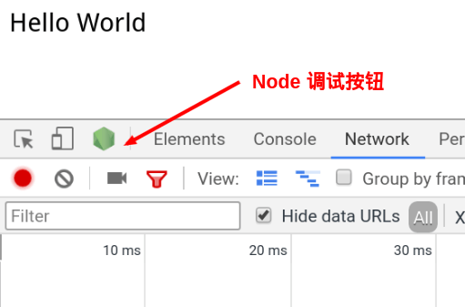

```
node --inspect app.js
```

上面代码中，--inspect参数是启动调试模式必需的。这时，打开浏览器访问http://127.0.0.1:3000，就可以看到


接下来，就要开始调试了。一共有两种打开调试工具的方法

- 第一种是在 Chrome 浏览器的地址栏，键入 <font color=#1C86EE>chrome://inspect</font>或者<font color=#1C86EE>about:inspect</font>，回车后就可以看到下面的界面

    

    在 Target 部分，点击 inspect 链接，就能进入调试工具了。

- 第二种进入调试工具的方法，是在 http://127.0.0.1:3000 的窗口打开"开发者工具"，顶部左上角有一个 Node 的绿色标志，点击就可以进入。

    


---

参考： http://www.ruanyifeng.com/blog/2018/03/node-debugger.html