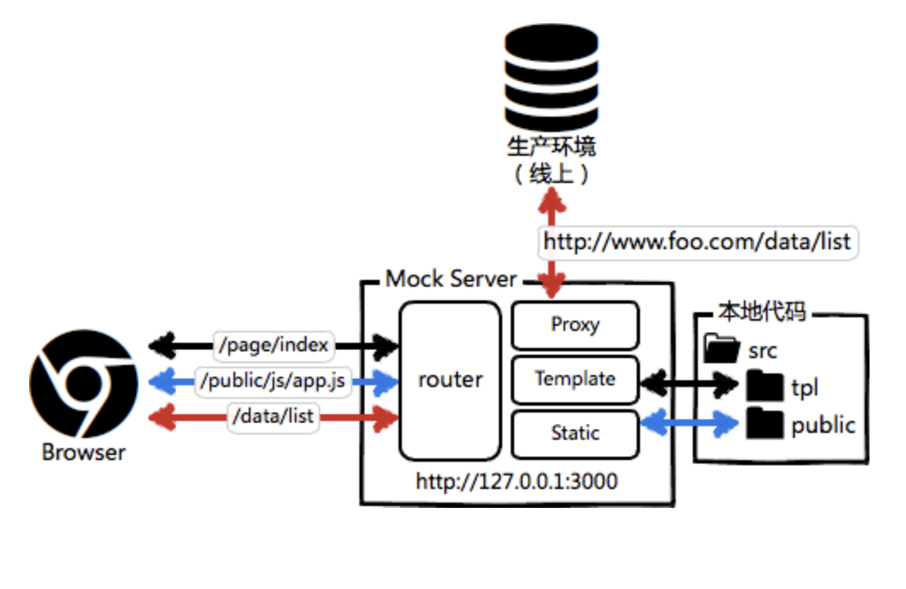

- 1.你解释下前端模块化，你的团队中有哪些前端模块化的实践么?(5分)
    1. 将业务，UI以功能为模块进行封装，重用，组合
    2. 我们团队最近用ionic做的app项目有使用模块化的做法

- 2.请绘制代码版本仓库多分支的流程图以及如何用Node实现自动化分支构建?(5分)
    1. 未接触过，后期补

- 3.请说明Grunt、Gulp、Webpack、Rollup、FIS的优缺点以及实际项目中的使用场景。 (10分)
    1. Grunt:任务流工具,对js，css等进行合并和压缩，同时对js文件有检查报错的功能
    2. Gulp:吸取了Grunt的优点，拥有更简便的写法，通过流（Stream）的概念来简化多任务之间的配置和输出，让任务更加简洁和容易上手。轻量，打包速度快,适合用来打包node项目
    3. Webpack:模块化打包工具，按需加载，利用 tree-shake 特性来剔除项目中未使用的代码，减少冗余，更适合用在应用上打包，打包速度慢
    4. Rollup: 所有资源放在同一个地方，一次性加载，利用 tree-shake 特性来剔除项目中未使用的代码，减少冗余，模块化打包工具，更适合做工具类库的打包
    5. FIS:一个全功能工具,解决性能优化，模块化，自动化，甚至包括代码规范，部署等问题

- 4.下图是一张比较粗略的工程化应用图，请你详细列举一下一个前端工程化所需要的准备步骤和所需的插件或技术。(10分)

    

    - gulp 打包 node 代码（清洗配置，打包，压缩文件）
      - import 转 require ： babel-plugin-transform-es2015-modules-commonjs
      - gulp-watch ：监听文件自动编译
      - rollup-plugin-replace ： 打包替换 ， 一般用于 config 清洗，生产环境和开发环境 两套打包机制 ，生成环境需要清洗 config
      - gulp-rollup ： 从一个入口文件开始，将所有使用到的模块文件都打包到一个最终的发布文件中，自动 tree-shaking 删除无用代码
      - scripty ： 让 npm-scripts 可以运行脚本文件
      - gulp-sequence ：按顺序运行一系列gulp任务。

    - node 插件
      - koa-simple-router:路由插件
      - koa-static：静态资源插件
      - node-fetch：后台请求插件
      - koa-swig：模板插件
      - log4js ：日志管理
      - cross-env ： 跨平台设置环境变量插件
      - shell.js ：用js编写shell命令脚本

    - 接口文档生成 jsdoc
    - ssr 模板渲染
    - webpack 打包 views

- 5.请简述一下什么是CI，什么是CD。他们和前端工程化又有哪些关系呢?在你的团队中有过相关的实践么?(10分)
    1. CI:持续集成(Continuous integration),频繁地将代码集成到主干。持续集成的目的，就是让产品可以快速迭代，同时还能保持高质量。它的核心措施是，代码集成到主干之前，必须通过自动化测试。只要有一个测试用例失败，就不能集成。
    2. CD:持续部署（continuous deployment）,持续部署的前提是能自动化完成测试、构建、部署等步骤。代码通过评审以后，自动部署到生产环境，持续部署的目标是，代码在任何时刻都是可部署的，可以进入生产阶段。
    3. CI和CD是前端工程化的重要组成部分
    4. 目前我的团队没有相关的实践

- 6.描述一下Webpack 在你开发过程中采取过哪些优化手段。(5分)
    1. 编译scss
    2. 编译ts
    3. 打包压缩

- 7.请用X-Tag 实现一个你能力范围内 Web Components。(20分)
    1. X-Tag未使用过，后期补上

- 8.你的团队是如何管理线上的报错的，你有相应的解决方案么。(10分)
    1. 线上发现报错后立即在修复bug改版本，覆盖线上代码

- 9.你知道什么是Jenkins和Travis CI么，请概述配置过程?(10分)
    1. Jenkins：是一个功能强大的应用程序，允许持续集成和持续交付项目，无论用的是什么平台。Jenkins目的：
       1. 持续、自动地构建/测试软件项目。
       2. 监控软件开放流程，快速问题定位及处理，提示开放效率。
    2. Travis CI:绑定 Github 上面的项目，只要有新的代码，就会自动抓取。然后，提供一个运行环境，执行测试，完成构建，还能部署到服务器。
    3. 未配置过，后期不上

- 10.请问现在如何利用持续集成的概念来修改你团队的项目(开放题)。(10分)
    1. 目前项目我感觉没法修改
    2. 下一个项目我准备加入持续集成的概念