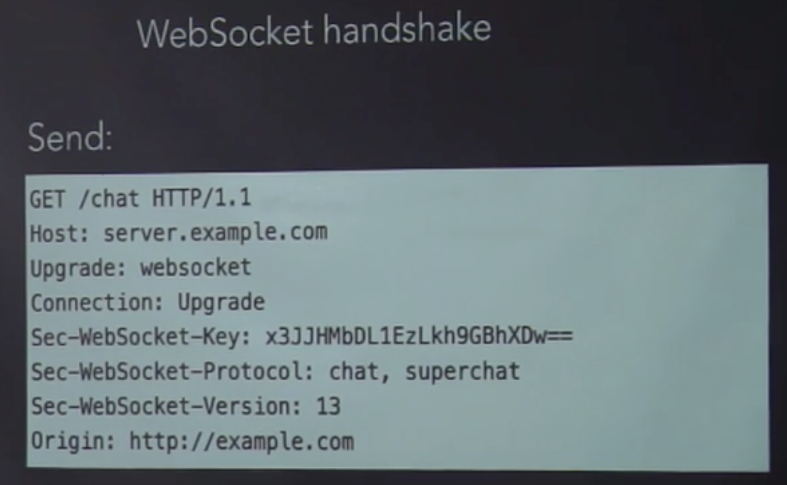

#### 面向切面 Aspect Oriented Programming(AOP)
AOP主要实现的目的是针对业务处理过程中的切面进行提取，它所面对的是处理过程中某个步骤或阶段，以获得逻辑过程中各部分之间低耦合性的隔离效果


#### nginx服务器缓存策略

- Etag:web服务器响应请求时，告诉浏览器当前资源在服务器的唯一标识(生成规则由服务器决定)

- If-None-Match:当资源过期时(使用Cache-Control标识的max- age)，发现资源具有Etage声明，则再次向web服务器请求时带 上头If-None-Match (Etag的值)。web服务器收到请求后发现 有头If-None-Match 则与被请求资源的相应校验串进行比对，决 定返回200或304。

- Last-Modified:标示这个响应资源的最后修改时间。web服务器在响应请求时，告诉浏览器资源的最后修改时间。
- If-Modified-Since:当资源过期时(使用Cache-Control标识的max-age)，发 现资源具有Last-Modified声明，则再次向web服务器请求时带上头 If- Modified-Since，表示请求时间。web服务器收到请求后发现有头If-Modified- Since 则与被请求资源的最后修改时间进行比对。若最后修改时间较新，说 明资源又被改动过，则响应整片资源内容(写在响应消息包体内)，HTTP 200;若最后修改时间较旧，说明资源无新修改，则响应HTTP 304 (无需包 体，节省浏览)，告知浏览器继续使用所保存的cache。

- <font color=#1C86EE>Etag on</font>  ---->开启Etag模式
第一次请求静态资源服务器会带一个标识符，之后每次请求静态资源会对比这个标识符,请求头中的 <font color=#1C86EE>If-None-Match</font> 和 响应头中的 <font color=#1C86EE>Etag</font>，相同就是304从缓存读取


- <font color=#1C86EE>Expires 30d</font> ----> 过期时间30天
请求服务器的时候，服务器会在返回头中添加字段 Expires : 过期日期 , 如果在没有开启<font color=#1C86EE>Cache-Control:no-cache</font>，下次再请求的时候，返回状态码依旧是200，并没有走304，但是也没有走服务器获取，是浏览器会直接从浏览器缓存中读取，所以需要配置Cache-Control:no-cache


[LightHouse]:https://github.com/GoogleChrome/lighthouse

#### profiles
```
node-inspector//调试node
```


#### chat server
1. 实现的方法
    ```
    1.Polling(Ajax)  轮询，弊端是需要不停的请求，而每次请求的请求头都会带很多东西，比如cookie，浪费服务器的带宽资源
    2.Long Polling(Comet)  常连接状态，这个的弊端在于请求数限制，浏览器能并行发的请求数量是有限的，而常连接会始终占着请求，导致阻碍其他接口
    3.Flash 需要安装一个flash，这里面也是soket
    4.Web socket  H5的一个协议，主流的方式，真正的全双工通信通道，说Http也不是Http，也不是原始TCP套接字，使用Websocket协议而不是Http，有点像通过Http请求握手，然后转TCP  websocket也有两个方式，wss和ws，类似于http和https，wss是加密的 ，websocket的请求其实依旧是Http请求，只不请求头部带下面的一些而特殊的字段
    - Upgrade：websocket
    - Connection:Upgrade
    - ...
    ws过一段时间会发一个心跳包，确保连接
    服务器能保持最大的连接数和服务器的配置有关系
    ```
    

####
- 即时编译：谷歌V8的引擎，多次执行你的同一段代码的时候，它感知到你这段代码是一个热点，它会去把这个代码及时编译成机器码
- 浏览器页面有两个引擎，一个js引擎，一个render引擎
- 浏览器为什么是单线程：为了保持一致性，如果是多线程，两个线程同时对同一个dom做写操作，这时候就尴尬了
#### 动画
1. 动画实现的方法
    - Jquery:setTimeout,top/left
    - animation,transition,transform
    - Js+Canvas/WebGL/SVG
    - requestAnimationFrame
    - GPU acceleration GPU加速
2. 触发layout重排
    - 改变width,height，margin等和大小，位置有关的属性会触发layout
    - 读取size,positionx相关属性(clientHeight,clientLeft,offsetTop,scrollLeft...)
3.