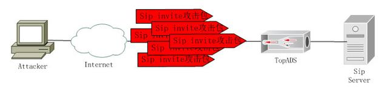

一、 简述

随着网络技术和网络应用的发展，网络安全问题显得越来越重要，已经被提到一个很高高的高度。DDOS攻击随着互联网的快速发展，也日益猖獗，从原来的的几兆、几十兆，到现在的几十G、几十T的流量攻击，形成了一个很大的利益链。DDOS攻击由于容易实施、难以防范、难以追踪等而成为最难解决的网络安全问题之一，给网络社会带来了极大的危害。同时，拒绝服务攻击也将是未来信息战的重要手段之一。

DDoS攻击手段是在传统的DoS攻击基础之上产生的一类攻击方式。单一的DoS攻击一般是采用一对一方式的，当攻击目标CPU速度低、内存小或者网络带宽小等等各项性能指标不高它的效果是明显的。随着计算机与网络技术的发展，计算机的处理能力迅速增长，内存大大增加，同时也出现了千兆、万兆、百级级别的网络，这使得DoS攻击的困难程度加大了-目标对恶意攻击包的"消化能力"加强了不少，例如你的攻击软件每秒钟可以发送3,000个攻击包，但我的主机与网络带宽每秒钟可以处理10,000个攻击包，这样一来攻击就不会产生什么效果。

这时侯分布式的拒绝服务攻击手段（DDoS）就应运而生了。理解了DoS攻击的话，它的原理就很简单。如果说计算机与网络的处理能力加大了10倍，用一台攻击机来攻击不再能起作用的话，攻击者使用10台攻击机同时攻击呢？用100台呢？DDoS就是利用更多的傀儡机来发起进攻，以比从前更大的规模来进攻受害者。

分布式拒绝服务(DDoS:Distributed Denial of Service)攻击指借助于客户/服务器技术，将多个计算机联合起来作为攻击平台，对一个或多个目标发动DoS攻击，从而成倍地提高拒绝服务攻击的威力。通常，攻击者使用一个偷窃帐号将DDoS主控程序安装在一个计算机上，在一个设定的时间主控程序将与大量代理程序通讯，代理程序已经被安装在Internet上的许多计算机上。代理程序收到指令时就发动攻击。利用客户/服务器技术，主控程序能在几秒钟内激活成百上千次代理程序的运行

高速广泛连接的网络给大家带来了方便，也为DDoS攻击创造了极为有利的条件。在低速网络时代时，黑客占领攻击用的傀儡机时，总是会优先考虑离目标网络距离近的机器，因为经过路由器的跳数少，效果好。而现在电信骨干节点之间的连接都是以G为级别的，大城市之间更可以达到2.5G的连接，这使得攻击可以从更远的地方或者其他城市发起，攻击者的傀儡机位置可以在分布在更大的范围，选择起来更灵活了。

被DDoS攻击时的现象：

· 被攻击主机上有大量等待的TCP连接。

· 网络中充斥着大量的无用的数据包，源地址为假。

· 制造高流量无用数据，造成网络拥塞，使受害主机无法正常和外界通讯。

· 利用受害主机提供的服务或传输协议上的缺陷，反复高速的发出特定的服务请求，使受害主机无法及时处理所有正常请求。

· 严重时会造成系统死机。

二、 DDoS的类型及原理

DDOS攻击主要分为三类：流量型攻击；连接型攻击；特殊协议缺陷。

1、 Ip lood

攻击原理：此攻击以多个随机的源主机地址向目的主机发送超大量的随机或特定的IP包，造成目标主机不能处理其他正常的IP报文。

原理图：

2、 Syn Flood

攻击原理：依据tcp建立连接的三次握手。此攻击以多个随机的源主机地址向目的主机发送syn包，而在收到目的主机的syn＋ack包后并不回应，目的主机就为这些源主机建立大量的连接队列，由于没有收到ack一直维护这些连接队列，造成资源的大量消耗而不能向正常的请求提供服务。与之类似的攻击方式还有ackflood、s-ackflood、finflood、rstflood、tcpflood 。

原理图：

3、 Udp 反射 Flood

攻击原理：有时被保护服务器也有同外部服务器进行udp交互的需求，攻击者就会利用此交互对被保护服务器进行udp反射放大攻击。此攻击在短时间那冒充被攻击地址向外部公用的服务器发送大量的udp请求包，外部服务器收到虚假的udp请求就会回复大量的回应包给被攻击服务器地址，造成目标主机被保护服务器不能处理其他正常的交互流。

原理图:

4、 Dns Query Flood

攻击原理：通过发起大量的DNS请求，导致DNS服务器无法响应正常用户的请求，正常用户不能解析DNS，从而不能获取服务。

原理图：

5、 Dns Reply Flood

攻击原理：攻击者通过发起大量伪造的DNS回应包，导致DNS服务器带宽拥塞无法响应正常用户的请求，正常用户不能解析DNS，从而不能获取服务。

原理图：

6、 Http Flood

攻击原理：此攻击类型主要攻击目标为Web服务器上的网页访问服务，当发生攻击时攻击者向被攻击服务器大量高频的发送一个网页或多个网页的请求服务，使服务器忙于向攻击者提供响应资源从而导致不能想正常的合法用户提供请求响应服务。

原理图：

无图

7、 Https Flood

攻击原理：此攻击类型主要攻击目标是使用https协议的Web服务器上的访问服务，当发生攻击时攻击者向被攻击服务器大量高频的发送请求服务，使服务器忙于向攻击者提供https响应资源从而导致不能想正常的合法用户提供请求响应服务。

原理图：

8、 Sip Invite Flood

攻击原理：Sip协议为网络视频电话会议的udp协议，攻击者通过发起大量的Sip invite请求，导致网络视频电话会议Sip服务器无法响应正常用户的请求报文，占用服务器带宽使其阻塞，达到SIP报文洪水攻击的目的。

原理图：

9、 Sip Register Flood

攻击原理：Sip协议为网络视频电话会议的udp协议，攻击者通过发起大量的Sip register注册信息，导致网络视频电话会议Sip服务器无法响应正常用户的注册报文信息，占用服务器带宽使其阻塞，达到SIP注册报文洪水攻击的目的。

原理图：

10、 Ntp Request Flood

攻击原理：Ntp协议即为网络时间同步的udp协议，用于在分布式NTP服务器和客户端之间进行时间同步。NTP攻击，基于UDP协议，攻击者向NTP服务器发送大量的请求报文，占用服务器带宽使其阻塞，达到NTP攻击的目的。

原理图：

11、 Ntp Reply Flood

攻击原理：攻击者向NTP服务器发送大量的响应报文，占用服务器带宽使其阻塞，达到NTP攻击的目的。

原理图：

12、 Connection Flood

攻击原理：利用真实 IP 地址（代理服务器、广告页面）在服务器上建立大量连接服务器上残余连接(WAIT状态)过多，效率降低，甚至资源耗尽，无法响应； 蠕虫传播过程中会出现大量源IP地址相同的包，对于 TCP 蠕虫则表现为大范围扫描行为； 消耗骨干设备的资源，如防火墙的连接数。

原理图：

13、 CC攻击

攻击原理：利用代理服务器向受害者发起大量HTTP Get请求；主要请求动态页面，涉及到数据库访问操作；数据库负载以及数据库连接池负载极高，无法响应正常请求

原理图：

14、 http slow header慢速攻击

攻击原理：在http协议中规定，http的头部以连续的“\r\n\r\n”作为结束标志。许多web服务器在处理http请求的头部信息时，会等待头部传输结束后再进行处理。因此，如果web服务器没有接收到连续的“\r\n\r\n”，就会一直接收数据并保持与客户端的连接。Slow-header的工作原理是攻击者在发送http get请求时，缓慢的发送无用的header字段，并且一直不发送“\r\n\r\n”结束标志。Web服务器能够处理的并发连接数是有限的，如果攻击者利用大量的主机发送这种不完整的http get请求把那个持续占用这些连接，就会耗尽web服务器的资源。

原理图：

15、 http slow post慢速攻击

攻击原理：在post提交方式中，允许在http的头中声明content-length，也就是指定http消息实体的传输长度。当web服务器接收到请求头部中含有content-length字段时，服务器会将该字段的值作为http body的长度，持续接收数据并达到content-length值时对实体的数据内容进行处理。slow post会传送包括整个header的http请求，在提交了头以后，将后面的body部分卡住不发送，这时候服务器在接受了post长度以后，在处理数据之前会等待客户端发送post的内容，攻击者保持连接并且以10s-100s一个字节的速度去发送，就达到了消耗资源的效果，因此不断增加这样的连接会使得服务器的资源被消耗

原理图：

16、 Https-ssl-dos攻击

攻击原理：在进行SSL数据传输之前，通信双方首先要进行ssl握手，以协商加密算法交换加密密钥，进行身份认证。通常情况下，这样的ssl握手过程只需要进行一次即可，但是在ssl协议中有一个renegotiation选项，通过它可以进行密钥的重新协商以建立新的密钥。在ssl握手的过程中，服务器会消耗较多的CPU资源来进行加解密，并进行数据的有效性验证。SSL-dos攻击方式的本质是消耗服务器的CPU资源，在协商加密算法的时候，服务器CPU的开销是客户端的15倍左右。攻击者在一个TCP连接中不停地快速重新协商，如果建立多个连接，给服务器端造成的压力会更加明显，从而达到攻击目的。

原理图完整的SSL连接过程：

原理图：

17、 Dns NX攻击

攻击原理：Dns NX攻击是dns query flood攻击的一个变种攻击方式，区别是后者向dns服务器查询的是一个真实存在的域名，而前者向dns服务器查询的是一个不存在的域名。在进行dns nx攻击时，dns服务器会进行多次域名查询，其获取不到域名的解析结果时，还会再次进行递归查询，向上一级的dns服务器发送解析请求并等待应答，这进一步增加了dns服务器的资源消耗。同时，dns服务器的缓存会被大量nx domian记录所填满，导致响应正常用户的dns解析请求变慢。

原理图：

18、 Dns 投毒

攻击原理：一台dns服务器只记录本地资源的所有授权主机，若要查询的是非本地的主机信息，则向信息持有者（授权dns服务器）发送查询请求。为了避免每次查询都发送请求，dns服务器会把授权服务器返回的查询结果保存在缓存中，并保持一段时间，这就构成了dns缓存。dns缓存投毒攻击就是通过污染dns cache，用虚假的IP地址信息替换cache中主机记录的真实IP地址信息来制造破坏。这种类型的攻击的目的是将依赖于此dns服务器的受害者重定向到其它的地址，例如重定向搜索引擎到广告网站。这种类型的典型攻击就是钓鱼方式的攻击，例如将一个银行的访问重定向到黑客伪造的网站。

原理图：

参考：https://baijiahao.baidu.com/s?id=1603040969904482717&wfr=spider&for=pc