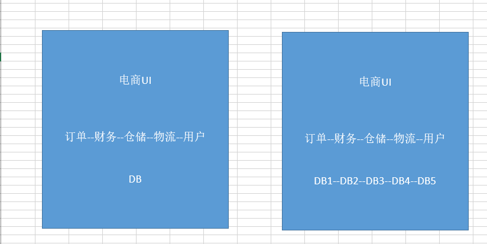
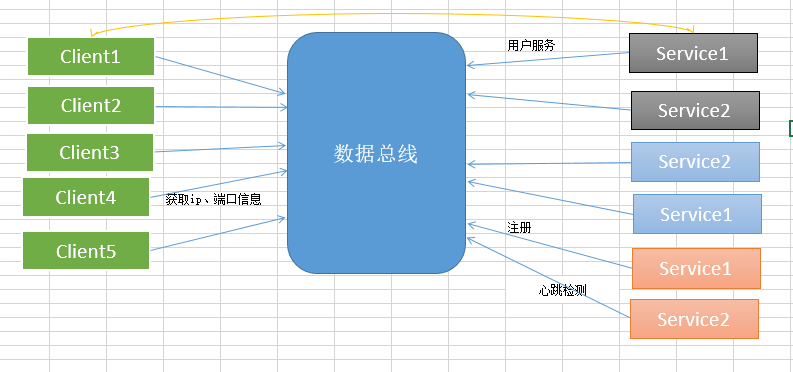

[面向服务编程(Service Oriented Architecture)]:https://www.cnblogs.com/renzhitian/p/6853289.html "面向服务编程"

#### ast 抽象语法树（abstract syntax tree或者缩写为AST

#### 表现层User Interface layer(Web Components)

#### 业务逻辑层BLL(Business Logic Layer)

#### 数据访问层工厂类DALfactory(Data access layer Factory)

#### 数据访问接口层IDAL(Interface Data access layer)

#### 数据访问接口层DLL(Data access layer)

#### 数据访问SqlServer封装层(SQL Server Data access layer)

#### soa [面向服务编程(Service Oriented Architecture)]

- 是一种思想，一种方法论，一种分布式的服务架构

- 用途：SOA解决多服务凌乱问题，SOA架构解决数据服务的复杂程度，同时SOA又有一个名字，叫做服务治理。

- 特点:
    1. 面向服务划分系统--将庞大的业务系统拆分成高内聚的服务单元，每个单元对外提供服务服务能力，服务与服务之间通过相互协作共同实现业务价值
    2. 松耦合---SOA框架中可以应用多种技术，服务消费方不依赖于服务提供者的技术实现（比如Java服务提供方，Python服务消费者）。双方可以通过thrift, proto-buffer或者消息队列等框架来实现消息的互通。
    3. 系统的可靠性依赖外部网络特质---传统的单进程系统拆分成多进程系统之间的相互协作，进程之间通过RPC进行通信，增加了网络开销。

- 通过一个系统我们看一下架构的演变过程（由统一到分布式）：

    

    当我们的项目比较小时，我们只有一个系统，并且把他们写到一起，放在一个服务器上，但是随着平台越来越大，数据量越来越大，我们不得不通过分库，把多个模块的数据库分别放在对应得服务器上，每个模块调用自己的子系统即可。

    

    随着我们系统的进一步复杂度的提示，我们不得不进一步对系统的性能进行提升，我们将多个模块分成多个子系统，多个子系统直接互相调用（因为SOA一般用于大型项目，比较复杂，所以一般总系统不会再集成，会拆分多个，分别做成服务，相互调用）。当我们的电商UI进行一个下订单的任务时，多个服务直接互相调用，系统通过数据总线，分别调用对于的子系统即可。

    企业数据总线：企业数据总线不是对多个子模块的集成，他在这里充当数据通道的作用，数据总线不关心业务，数据总线根据给的地址和协议去调服务，上端不关心服务在哪里是什么，只找数据总线。

    上面几个图应该算是比较清楚了，随着业务的深入，我们不得不对系统进行调整，分别是对数据和业务的拆分，最后每个子系统对面提供服务。

    还要提的一点就是下面那个图，下面的IP库以及几个子系统是公共服务，分别向上提供功能，也是SOA方法论的一部分。

- **SOA主要的使用场景，如下图：**

    

    通过上面的图我们可以看出，多个子系统直接相互交互，相互调用非常凌乱，这样我们就很不爽，所以我们就用到了我们的SOA架构，SOA又叫服务治理，SOA就是帮助我们把服务之间调用的乱七八糟的关系给治理起来，然后提供一个统一的标准，把我们的服务治理成下图所示，以前我们的服务是互相交互，现在是只对数据总线进行交互，这样系统就变得统一起来。

    

    统一标准：各系统的协议、地址、交互方式。

    新的交互方式：各个系统分别根据统一标准向数据总线进行注册，各子系统调用其他子系统时，我们并不关心如果找到其他子系统，我们只招数据总线，数据总线再根据统一标准找其他子系统，所以数据总线在这里充当一个只路人的作用。

- **SOA的好处：**

    1. 降低用户成本，用户不需要关心各服务之间是什么语言的、不需要知道如果调用他们，只要通过统一标准找数据总线就可以了。

    2. 程序之间关系服务简单

    3. 识别哪些程序有问题（挂掉）

- **缺点：提升了系统的复杂程度，性能有相应影响。**

- 数据总线是什么？

    

    其实我在上面写了，数据总线是起到调度服务的作用，数据总线不是集成服务，数据总线更新一个调度框架，每个服务需要根据约定向数据总线注册服务，那么如何注册那？其实数据总线就像一个字典结构，

    数据总线里面一个key对于一个value，key指的是服务名，value则是服务的调度方式，还有一点需要说明的是，数据总线只是指路人，服务是不经过数据总线的，如上图的黄色线的路径。

    数据总线通过域名解析实现:一个域名绑定多台服务器，ajax也可以，dns也可以，解析域名嘛。

    其实数据总线还有一些高级应用，比如心跳检测，实现负载均衡等等，就不细说了，目前应用数据总线的有阿里的dubbo,还有zookeeper。

    基本上SOA的架构体系我的理解就是这样，上面配合图基本上也算清晰，如果哪里有不对的地方，欢迎大牛指出，大家可以互相探讨，相互学习。

### RPC  Remote Procedure Call Protocol
- 是应用实现进程间调用的一种常用手段。通过指定服务对外的IP地址和端口id，本地计算机能够访问到远端机器的资源。常用的RPC框架包括Java RMI, thrift, Google protobuf等。用户在选择不同的RPC框架可以从序列化，性能，语言支持几个方面去考虑，比如Java RMI只能在java生态圈中使用，无法对接其他语言提供的RPC服务，而thrift在语言支持方面就相当全面，通过编写thrift描述接口文档，可以实现不同程序之间的调用。

[心跳检测]:https '心跳检测'

### Heatbeat [心跳检测]

#### ddos
